# CLM Architecture & Sequence Diagrams

> Comprehensive visual documentation of the Contract Lifecycle Management system architecture and data flows.

---

## Table of Contents

1. [System Architecture Overview](#1-system-architecture-overview)
2. [Detailed Component Architecture](#2-detailed-component-architecture)
3. [Database Schema Diagram](#3-database-schema-diagram)
4. [Sequence Diagrams](#4-sequence-diagrams)
   - [Contract Upload & Processing](#41-contract-upload--processing-flow)
   - [Contract Q&A (RAG)](#42-contract-qa-rag-flow)
   - [SLA Comparison & Alerts](#43-sla-comparison--alert-flow)
   - [Scheduled Job Execution](#44-scheduled-job-execution-flow)
   - [User Authentication](#45-user-authentication-flow)
   - [Workflow Execution](#46-workflow-execution-flow)
5. [Data Flow Diagrams](#5-data-flow-diagrams)

---

## 1. System Architecture Overview

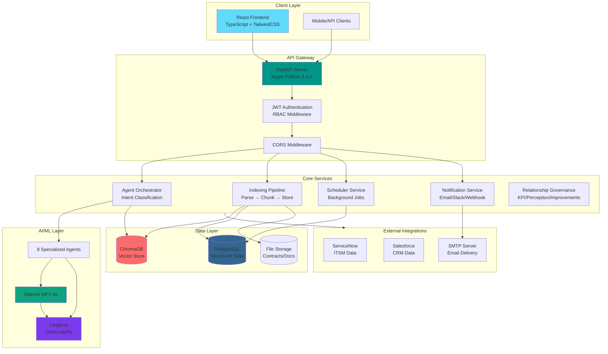

---

## 2. Detailed Component Architecture

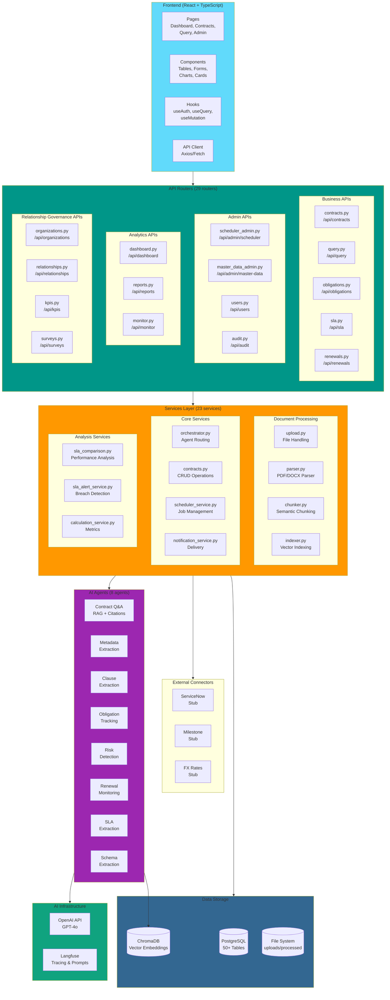

---

## 3. Database Schema Diagram

```mermaid
erDiagram
    contracts ||--o{ clauses : has
    contracts ||--o{ obligations : has
    contracts ||--o{ contract_slas : has
    contracts ||--o{ contract_financials : has
    contracts ||--o{ contract_liabilities : has
    contracts ||--o{ contract_parties : has
    contracts ||--o{ contract_key_dates : has
    contracts ||--|| contract_clause_indicators : has
    contracts ||--o{ contract_links : parent
    contracts ||--o{ contract_links : child
    contracts ||--o{ sla_comparison_results : has
    contracts ||--o{ sla_alerts : has
    contracts ||--o{ events : triggers
    contracts }o--|| business_relationships : belongs_to

    contract_slas ||--o{ sla_performances : tracks
    contract_slas ||--o{ sla_comparison_results : compared

    scheduler_jobs ||--o{ scheduler_job_history : logs

    users ||--o{ audit_logs : creates
    users ||--o{ approval_requests : requests
    users ||--o{ relationship_teams : member_of

    workflow_definitions ||--o{ workflow_steps : contains
    workflow_definitions ||--o{ action_executions : triggers

    organizations ||--o{ business_relationships : participates_in
    business_relationships ||--o{ relationship_teams : has
    business_relationships ||--o{ kpis : tracks
    business_relationships ||--o{ improvement_points : has
    business_relationships ||--o{ survey_instances : has

    kpis ||--o{ perception_scores : measures
    kpis ||--o{ perception_gaps : calculates
    kpis ||--o{ improvement_points : linked_to

    survey_templates ||--o{ survey_questions : contains
    survey_templates ||--o{ survey_instances : creates
    survey_instances ||--o{ survey_responses : collects

    contracts {
        uuid id PK
        string filename
        string file_path
        enum contract_type
        string counterparty
        date effective_date
        date expiration_date
        decimal contract_value
        string currency
        enum risk_level
        int risk_score
        boolean auto_renewal
        int notice_period_days
        jsonb schema_data
        enum status
        timestamp created_at
        timestamp updated_at
    }

    obligations {
        uuid id PK
        uuid contract_id FK
        text description
        enum obligation_type
        enum owner_type
        enum category
        enum frequency
        date deadline
        enum status
        enum rag_status
        boolean is_critical
        int priority
    }

    contract_slas {
        uuid id PK
        uuid contract_id FK
        string sla_name
        string metric_type
        decimal target_value
        decimal minimum_value
        string measurement_period
        string penalty_terms
    }

    sla_comparison_results {
        uuid id PK
        uuid contract_id FK
        uuid sla_id FK
        date comparison_date
        decimal contracted_value
        decimal actual_value
        decimal variance
        boolean is_breach
        enum breach_severity
        string source_system
    }

    sla_alerts {
        uuid id PK
        uuid contract_id FK
        uuid sla_id FK
        enum severity
        string title
        text message
        boolean is_acknowledged
        boolean is_resolved
        timestamp resolved_at
    }

    scheduler_jobs {
        uuid id PK
        string job_name UK
        string job_type
        text description
        int interval_seconds
        boolean is_enabled
        timestamp last_run_at
        timestamp next_run_at
        enum last_run_status
        int total_runs
        int successful_runs
        int failed_runs
    }

    scheduler_job_history {
        uuid id PK
        uuid job_id FK
        timestamp started_at
        timestamp completed_at
        int duration_ms
        enum status
        text error_message
        int items_processed
        jsonb run_metadata
    }

    sla_master_data {
        uuid id PK
        string reference_code UK
        string name
        decimal target_value
        decimal typical_performance
        string category
        string service_tower
        boolean is_active
    }

    milestone_master_data {
        uuid id PK
        string milestone_code UK
        string name
        int baseline_days_from_start
        jsonb dependencies
        decimal credit_at_risk
        boolean is_active
    }

    organizations {
        uuid id PK
        string name UK
        enum org_type
        string industry
        string size
        string region
        uuid relationship_owner_id FK
        boolean is_active
        timestamp created_at
    }

    business_relationships {
        uuid id PK
        uuid org_a_id FK
        uuid org_b_id FK
        enum relationship_type
        enum status
        int health_score
        uuid governance_model_id FK
        timestamp created_at
    }

    relationship_teams {
        uuid id PK
        uuid relationship_id FK
        uuid user_id FK
        string role
        jsonb responsibilities
        timestamp joined_at
    }

    kpis {
        uuid id PK
        uuid relationship_id FK
        string name
        text description
        enum measurement_type
        decimal target_value
        decimal threshold_amber
        decimal threshold_red
        boolean is_active
    }

    perception_scores {
        uuid id PK
        uuid kpi_id FK
        uuid scorer_org_id FK
        decimal score
        string period
        text comments
        uuid scored_by_user_id FK
        timestamp scored_at
    }

    perception_gaps {
        uuid id PK
        uuid kpi_id FK
        string period
        decimal internal_score
        decimal external_score
        decimal gap
        enum gap_severity
        timestamp calculated_at
    }

    improvement_points {
        uuid id PK
        uuid relationship_id FK
        uuid kpi_id FK
        uuid gap_id FK
        string title
        text description
        enum priority
        enum status
        uuid owner_id FK
        date due_date
        timestamp created_at
        timestamp completed_at
    }

    survey_templates {
        uuid id PK
        string name
        enum frequency
        boolean is_active
        timestamp created_at
    }

    survey_instances {
        uuid id PK
        uuid template_id FK
        uuid relationship_id FK
        string period
        enum status
        timestamp sent_at
        date due_date
    }

    survey_responses {
        uuid id PK
        uuid survey_id FK
        string respondent_email
        uuid respondent_org_id FK
        jsonb answers
        timestamp submitted_at
    }

    users {
        uuid id PK
        string email UK
        string hashed_password
        string full_name
        enum role
        boolean is_active
        timestamp last_login
    }

    audit_logs {
        uuid id PK
        uuid user_id FK
        enum action
        string resource_type
        uuid resource_id
        jsonb changes
        string ip_address
        timestamp created_at
    }
```

---

## 4. Sequence Diagrams

### 4.1 Contract Upload & Processing Flow

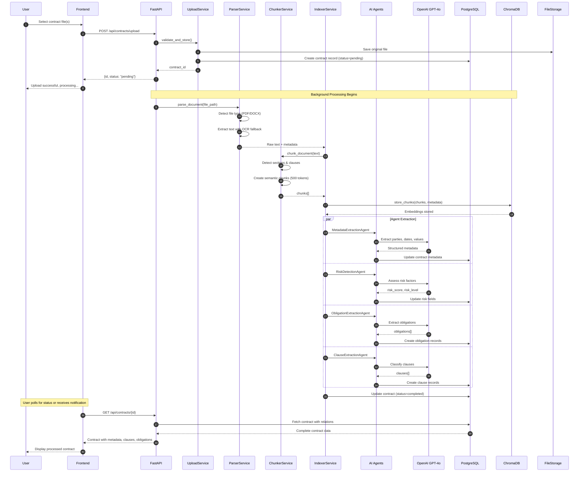

### 4.2 Contract Q&A (RAG) Flow

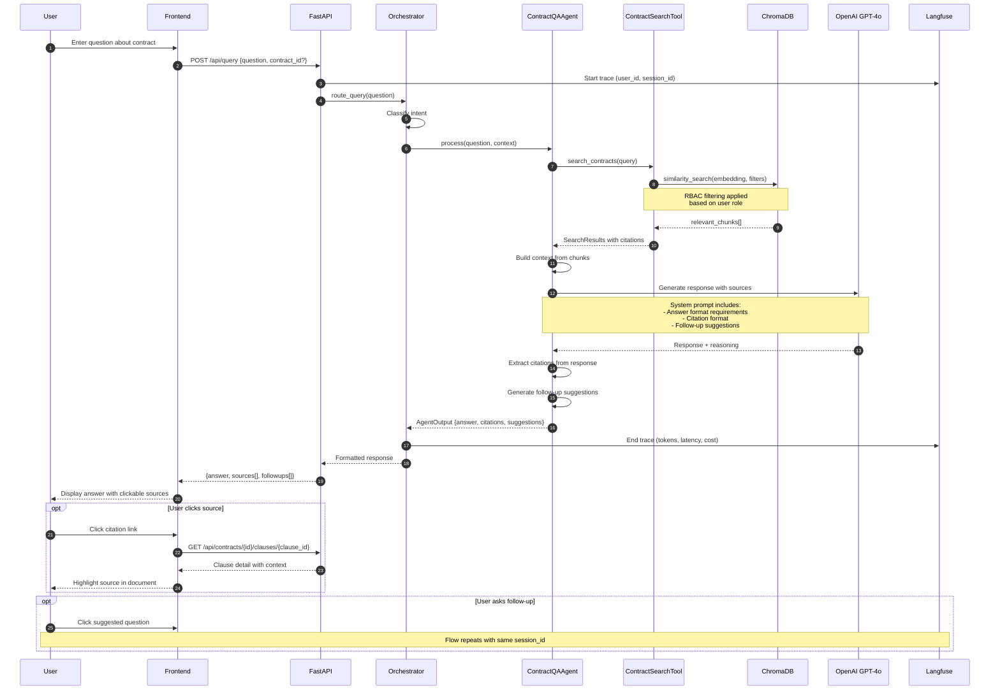

### 4.3 SLA Comparison & Alert Flow

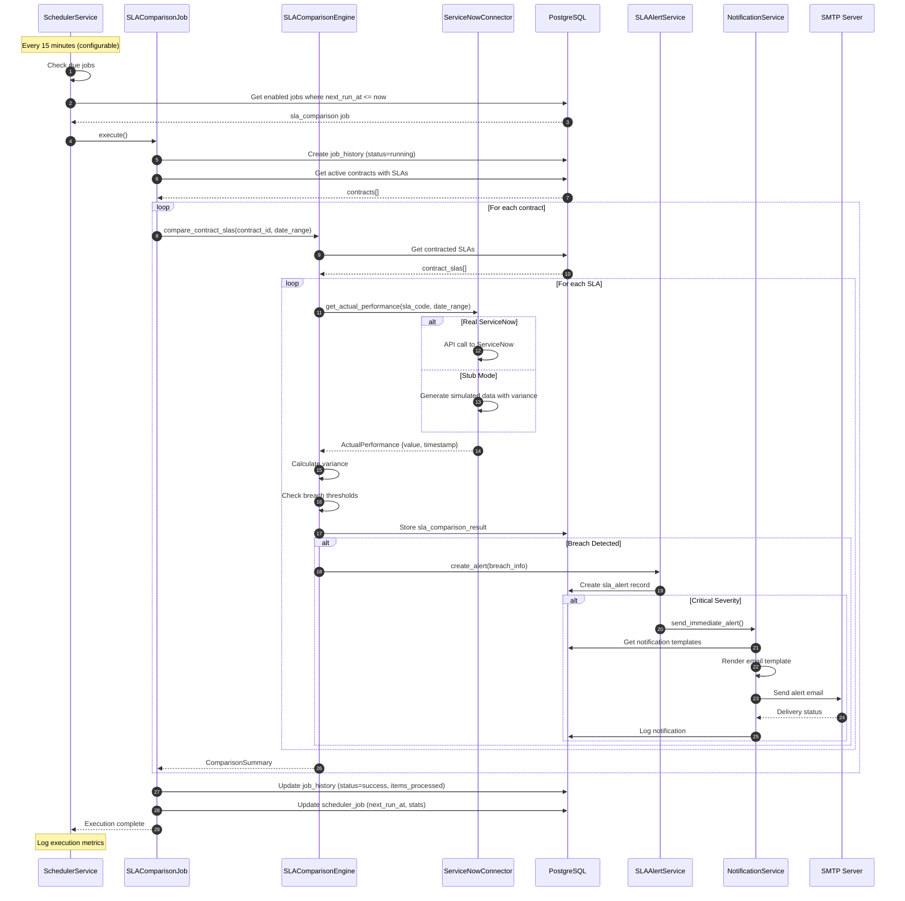

### 4.4 Scheduled Job Execution Flow

```mermaid
sequenceDiagram
    autonumber
    participant Main as FastAPI Lifespan
    participant Svc as SchedulerService
    participant Loop as Scheduler Loop
    participant DB as PostgreSQL
    participant Executor as JobExecutor
    participant SLA as SLAComparisonJob

    Note over Main: Application Startup

    Main->>Svc: get_scheduler()
    Svc->>Svc: Create singleton instance
    Main->>Svc: start()

    Svc->>DB: Ensure default jobs exist
    DB-->>Svc: Jobs created/verified

    Svc->>Svc: Set is_running = True
    Svc->>Loop: Create asyncio task

    loop Every 10 seconds
        Loop->>Loop: Check is_running
        Loop->>DB: SELECT jobs WHERE enabled=true AND next_run_at <= now
        DB-->>Loop: due_jobs[]

        alt Jobs are due
            loop For each due job
                Loop->>Executor: create_task(execute_job)

                Executor->>DB: Mark job as RUNNING
                Executor->>DB: Create history entry

                alt job_name = "sla_comparison"
                    Executor->>SLA: execute(db_session)
                    SLA-->>Executor: {items_processed, metadata}
                else Unknown job
                    Executor->>Executor: Log warning
                end

                Executor->>DB: Calculate next_run_at
                Executor->>DB: Update job status, stats
                Executor->>DB: Update history entry
            end
        end

        Loop->>Loop: asyncio.sleep(10)
    end

    Note over Main: Application Shutdown

    Main->>Svc: stop()
    Svc->>Svc: Set is_running = False
    Svc->>Loop: Cancel task
    Loop-->>Svc: CancelledError caught
    Svc-->>Main: Scheduler stopped
```

### 4.5 User Authentication Flow

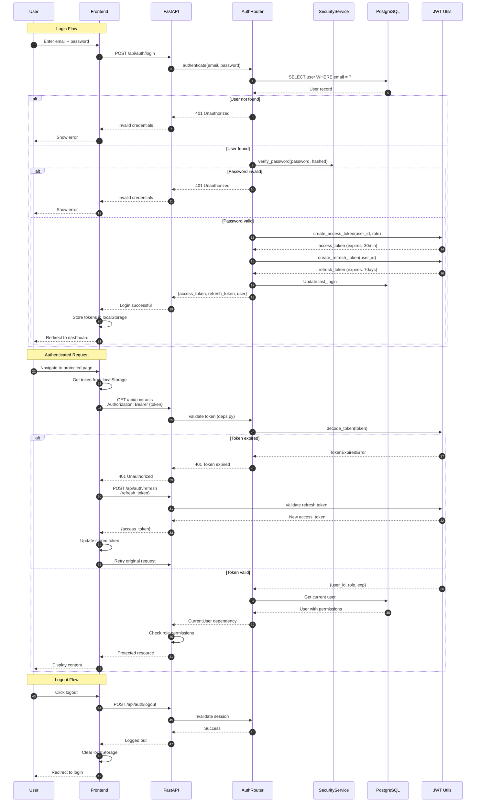

### 4.6 Workflow Execution Flow

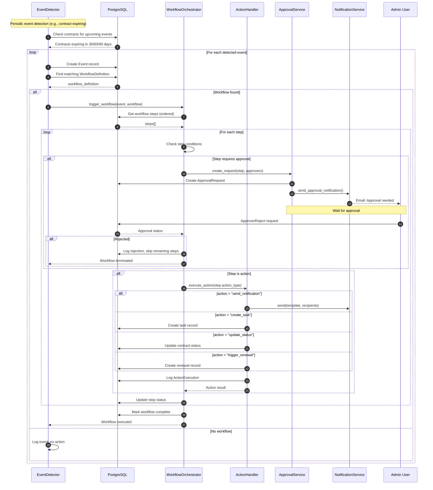

### 4.7 Perception Scoring & Gap Analysis Flow

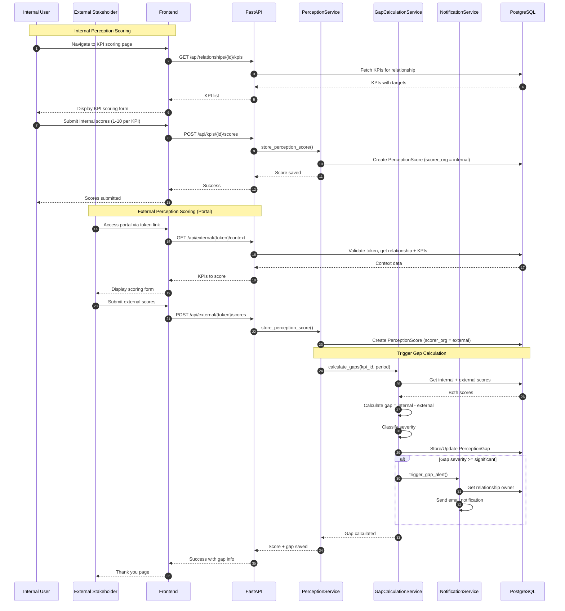

### 4.8 Improvement Point Workflow

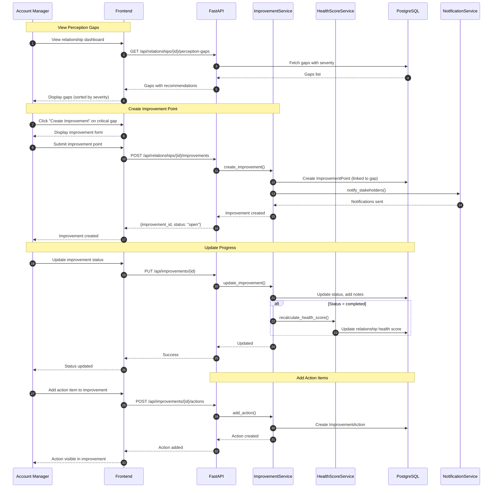

---

## 5. Data Flow Diagrams

### 5.1 Complete Data Pipeline

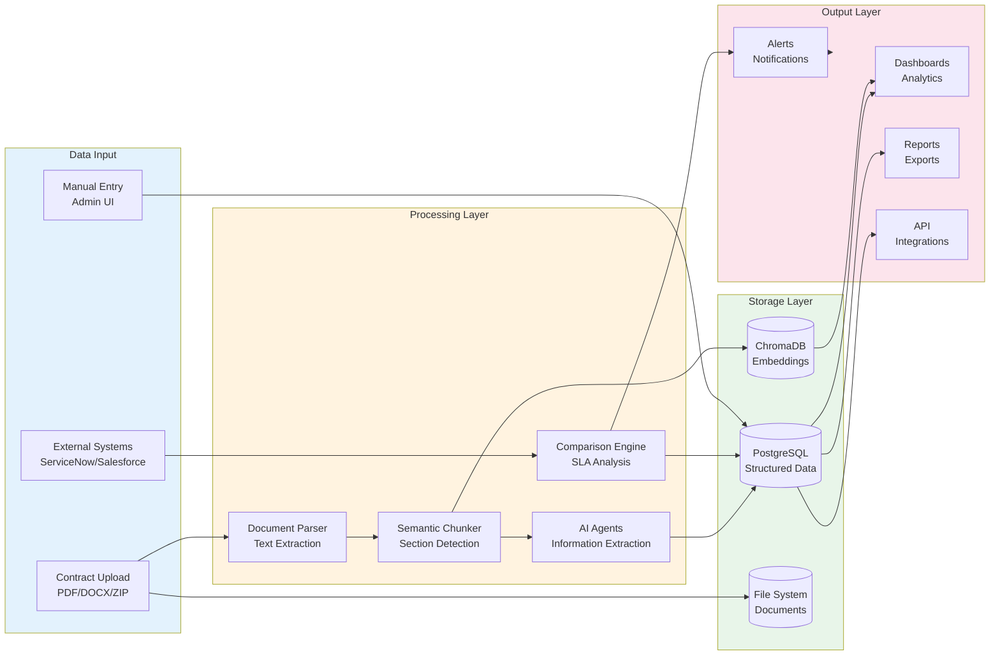

### 5.2 Agent Orchestration Flow

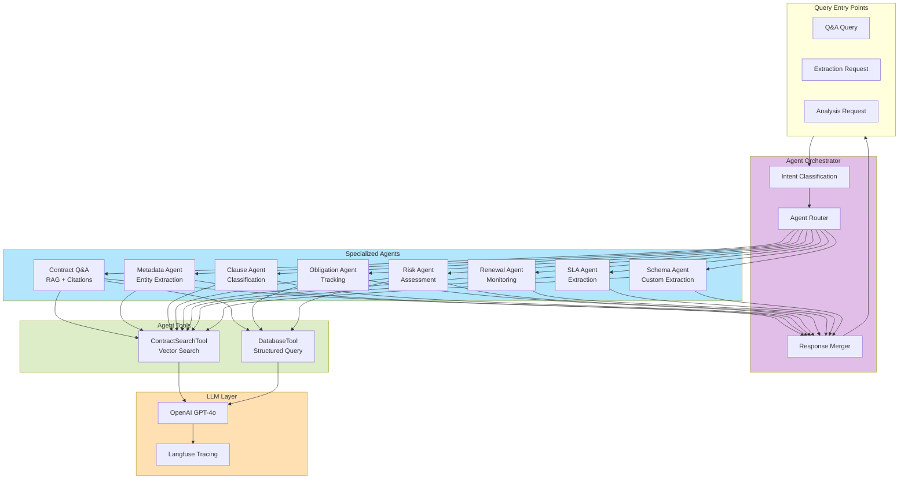

### 5.3 Notification Flow

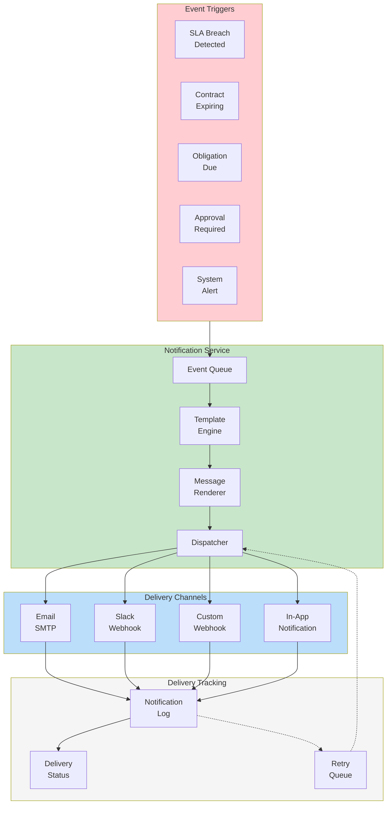

---

## 6. Deployment Architecture

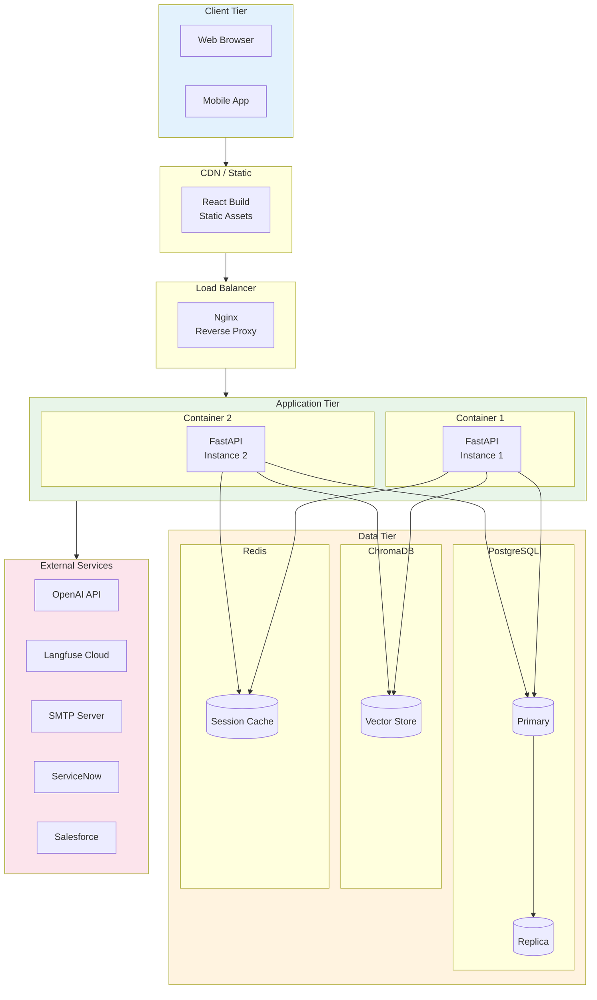

---

## 7. Security Architecture

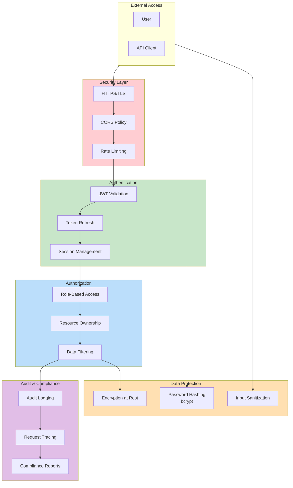

---

*Diagrams created: 2026-02-12*
*Updated: 2026-02-16 - Updated router count (29), added FX connector, added Governance API group*
*Based on CLM codebase analysis*
*Render with any Mermaid-compatible viewer (GitHub, VS Code, etc.)*
