# Evaluetor Business Plan

**AI-Powered Contract Analytics Platform**

*Version 1.0 | February 2026*

---

## Executive Summary

Evaluetor is an AI-native contract analytics platform designed to integrate with existing CLM and ITSM tools in enterprises. Unlike traditional CLM systems that require rip-and-replace implementations, Evaluetor sits as an intelligence layer on top of existing infrastructure, delivering immediate value through AI-powered insights.

**Current Status:** 20% complete (Demo: Feb 18, 2026)

**Target:** 80% product completion + 3 paying customers within 5 months (July 2026)

**Funding Model:** Bootstrap through initial customers → Self-sustaining SaaS

---

## 1. Stakeholders & Equity Structure

### Core Team

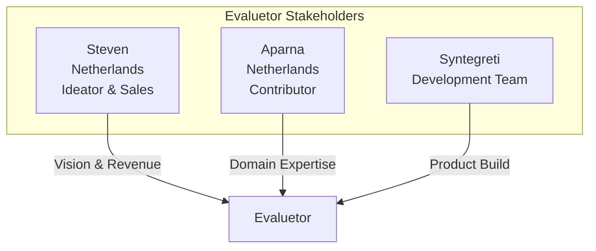

### Proposed Equity Distribution

| Stakeholder | Role | Equity | Vesting | Rationale |
|-------------|------|--------|---------|-----------|
| **Steven** | Ideator, Sales Lead | 40% | 4yr, 1yr cliff | Vision holder, revenue driver |
| **Aparna** | Contributor, Domain Expert | 20% | 4yr, 1yr cliff | Industry expertise, customer relationships |
| **Syntegreti** | Development Partner | 25% | Performance-based | Technical execution, IP creation |
| **Option Pool** | Future hires/advisors | 15% | Reserved | Sales, customer success, engineering |

### Equity Vesting Schedule

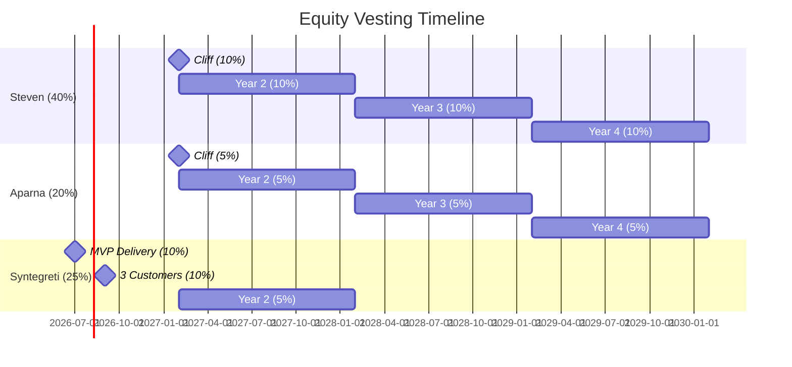

### Syntegreti Engagement Model

**Option A: Equity-Only (Recommended for cash conservation)**
- 25% equity for 5-month build
- Milestone-based vesting tied to deliverables
- Syntegreti absorbs development costs

**Option B: Hybrid (Reduced equity + deferred payment)**
- 15% equity + €50,000 deferred payment (payable from first €200K revenue)
- Lower risk for Syntegreti, more equity retained by founders

**Option C: Contract + Small Equity**
- 10% equity + €80,000 paid over 5 months
- Requires external funding or founder investment

---

## 2. Current State Assessment (20% Complete)

### What's Built

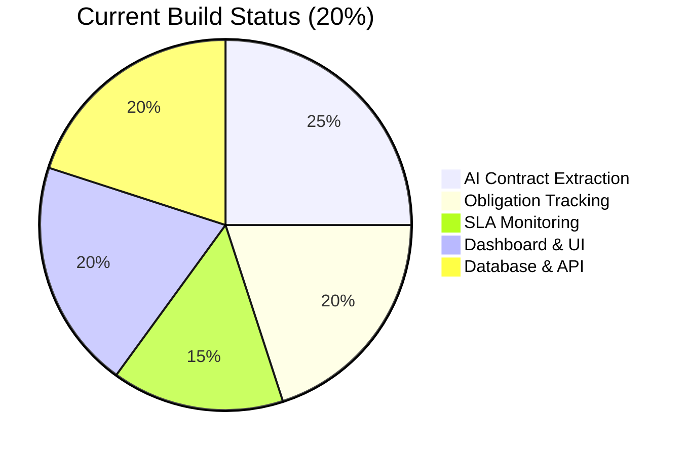

| Component | Status | Completeness |
|-----------|--------|--------------|
| Contract Upload & Storage | ✅ Complete | 100% |
| AI Metadata Extraction | ✅ Complete | 90% |
| Clause Classification | ✅ Complete | 85% |
| Obligation Extraction | ✅ Complete | 80% |
| SLA Extraction | ✅ Complete | 75% |
| Risk Scoring | ✅ Complete | 80% |
| Dashboard (Role-based) | ✅ Complete | 85% |
| RAG Q&A | ✅ Complete | 70% |
| User Authentication | ✅ Complete | 100% |
| **Integrations** | ❌ Not Started | 0% |
| **Workflow Automation** | ❌ Not Started | 0% |
| **Notifications/Alerts** | 🔄 Basic | 20% |
| **Reporting/Export** | 🔄 Basic | 30% |
| **Multi-tenancy** | ❌ Not Started | 0% |

### Demo Readiness (Feb 18, 2026)

**Demo Flow:**
1. Upload sample contract (PDF)
2. Show AI extraction (metadata, clauses, obligations, SLAs)
3. Dashboard with compliance metrics
4. Ask questions via RAG interface
5. Risk analysis view

---

## 3. Product Roadmap: 20% → 80%

### 5-Month Build Plan

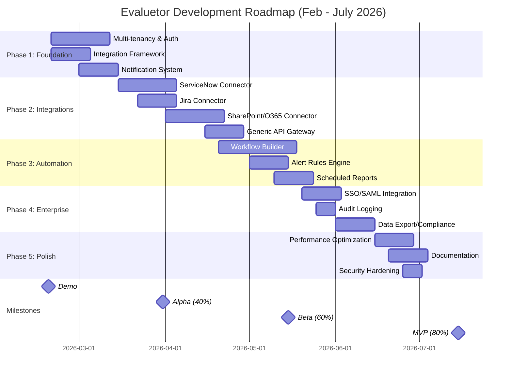

### Feature Priority Matrix

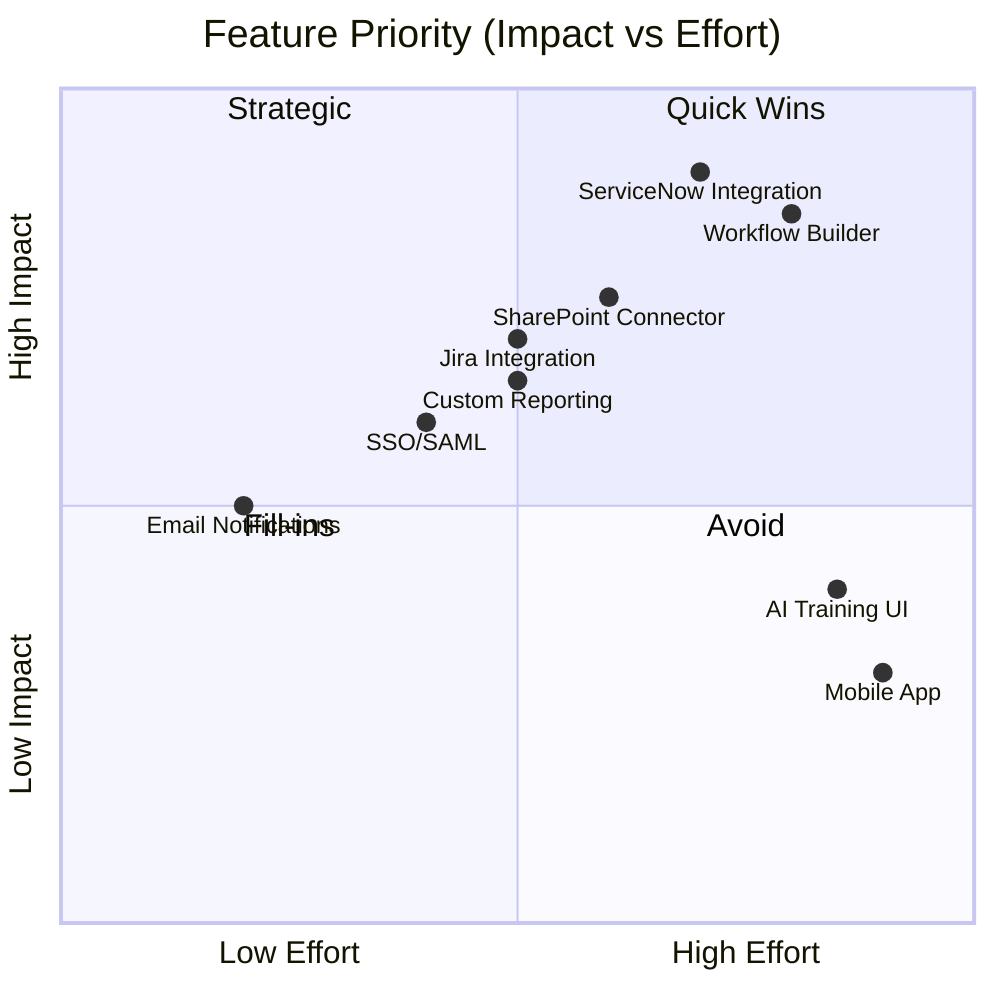

### Milestone Definitions

| Milestone | Date | Completeness | Key Deliverables |
|-----------|------|--------------|------------------|
| **Demo** | Feb 18, 2026 | 20% | Core AI extraction, basic dashboard |
| **Alpha** | Mar 31, 2026 | 40% | Multi-tenancy, notification system, 1 integration |
| **Beta** | May 15, 2026 | 60% | 3 integrations, workflow builder, SSO |
| **MVP** | Jul 15, 2026 | 80% | Production-ready, all enterprise features |

---

## 4. Go-to-Market Strategy

### Target Market

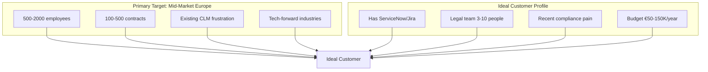

### Geographic Focus

**Phase 1 (Months 1-6): Netherlands & DACH**
- Leverage Steven & Aparna's network
- Strong legal tech adoption
- GDPR-conscious = values compliance tools

**Phase 2 (Months 7-12): UK & Nordics**
- English-speaking, similar legal frameworks
- Strong SaaS adoption

### Customer Acquisition Funnel

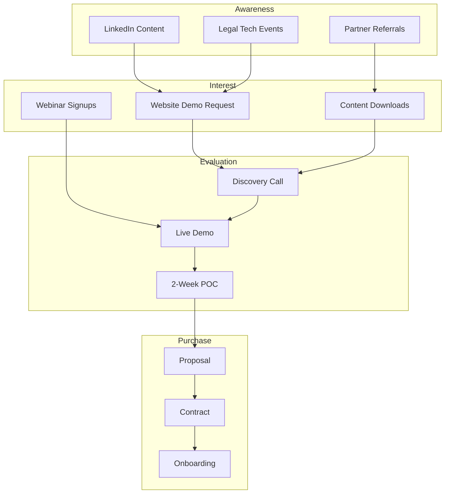

### Sales Motion (Steven-led)

| Stage | Duration | Activities | Success Criteria |
|-------|----------|------------|------------------|
| **Prospecting** | Ongoing | LinkedIn outreach, event networking | 10 qualified leads/month |
| **Discovery** | 1 week | Pain identification, stakeholder mapping | Confirmed budget & timeline |
| **Demo** | 1 call | Live platform demonstration | Technical approval |
| **POC** | 2 weeks | Customer data, measurable outcomes | 3+ actionable insights found |
| **Proposal** | 1 week | Custom pricing, implementation plan | Verbal commitment |
| **Close** | 2-4 weeks | Legal review, procurement | Signed contract |

### Target: 3 Customers by July 2026

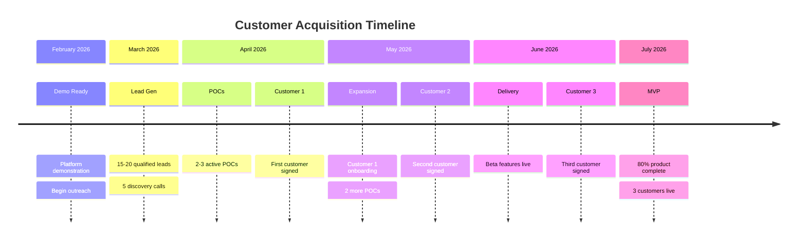

---

## 5. Pricing Strategy

### Pricing Philosophy

**Key Principles:**
1. **Value-based, not cost-based** - Price on outcomes (risk avoided, time saved)
2. **Land and expand** - Start small, grow with usage
3. **No per-seat fees** - Encourage organization-wide adoption
4. **Integration premium** - Charge more for connected value

### Pricing Tiers

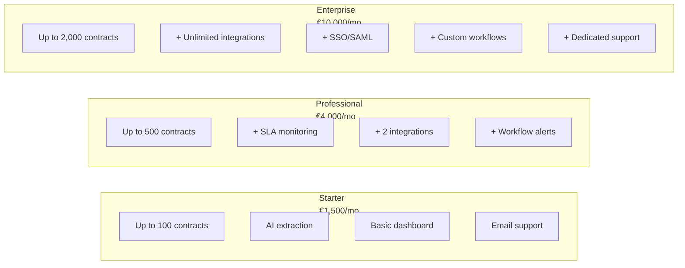

### Detailed Pricing Table

| Feature | Starter | Professional | Enterprise |
|---------|---------|--------------|------------|
| **Price (Monthly)** | €1,500 | €4,000 | €10,000 |
| **Price (Annual)** | €15,000 | €40,000 | €100,000 |
| **Contract Limit** | 100 | 500 | 2,000 |
| **Users** | Unlimited | Unlimited | Unlimited |
| **AI Extraction** | ✅ | ✅ | ✅ |
| **Obligation Tracking** | ✅ | ✅ | ✅ |
| **SLA Monitoring** | Basic | Advanced | Advanced |
| **Integrations** | 0 | 2 | Unlimited |
| **Workflow Builder** | ❌ | Basic | Advanced |
| **SSO/SAML** | ❌ | ❌ | ✅ |
| **Custom Reporting** | ❌ | ✅ | ✅ |
| **API Access** | ❌ | Limited | Full |
| **Support** | Email | Priority | Dedicated |
| **SLA** | 99.5% | 99.9% | 99.95% |

### Add-On Pricing

| Add-On | Price | Description |
|--------|-------|-------------|
| **Additional Contracts** | €5/contract/mo | Beyond tier limit |
| **Premium Integration** | €500/mo each | SAP, Oracle, Salesforce |
| **AI Training** | €10,000 one-time | Custom model fine-tuning |
| **On-Premise** | +50% | For regulated industries |
| **Implementation** | €5,000-15,000 | White-glove onboarding |

### First 3 Customers - Special Pricing

**Founding Customer Program:**

| Benefit | Value |
|---------|-------|
| **50% discount Year 1** | €2,000/mo for Professional (normally €4,000) |
| **Free implementation** | €10,000 value |
| **Direct founder access** | Roadmap input |
| **Case study rights** | Marketing asset |
| **Lock-in pricing** | Rate guaranteed 3 years |

**Target ARR from First 3 Customers:**
- Customer 1: €24,000/year (Starter, discounted)
- Customer 2: €24,000/year (Professional, discounted)
- Customer 3: €50,000/year (Enterprise, discounted)
- **Total First Year ARR: €98,000**

---

## 6. Financial Model

### 5-Month Build Phase (Feb - Jul 2026)

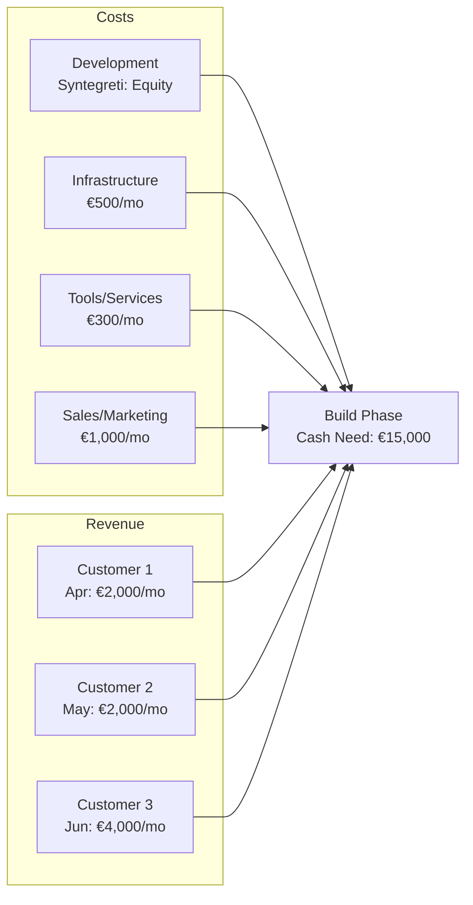

### Cash Flow Projection (Build Phase)

| Month | Dev Cost | Infra | Tools | Sales | Revenue | Net | Cumulative |
|-------|----------|-------|-------|-------|---------|-----|------------|
| Feb | €0* | €500 | €300 | €1,000 | €0 | -€1,800 | -€1,800 |
| Mar | €0* | €500 | €300 | €1,000 | €0 | -€1,800 | -€3,600 |
| Apr | €0* | €500 | €300 | €1,500 | €2,000 | -€300 | -€3,900 |
| May | €0* | €500 | €300 | €1,500 | €4,000 | +€1,700 | -€2,200 |
| Jun | €0* | €750 | €300 | €2,000 | €8,000 | +€4,950 | +€2,750 |
| Jul | €0* | €750 | €300 | €2,000 | €8,000 | +€4,950 | +€7,700 |

*Development costs covered by Syntegreti equity arrangement

### 12-Month Revenue Projection

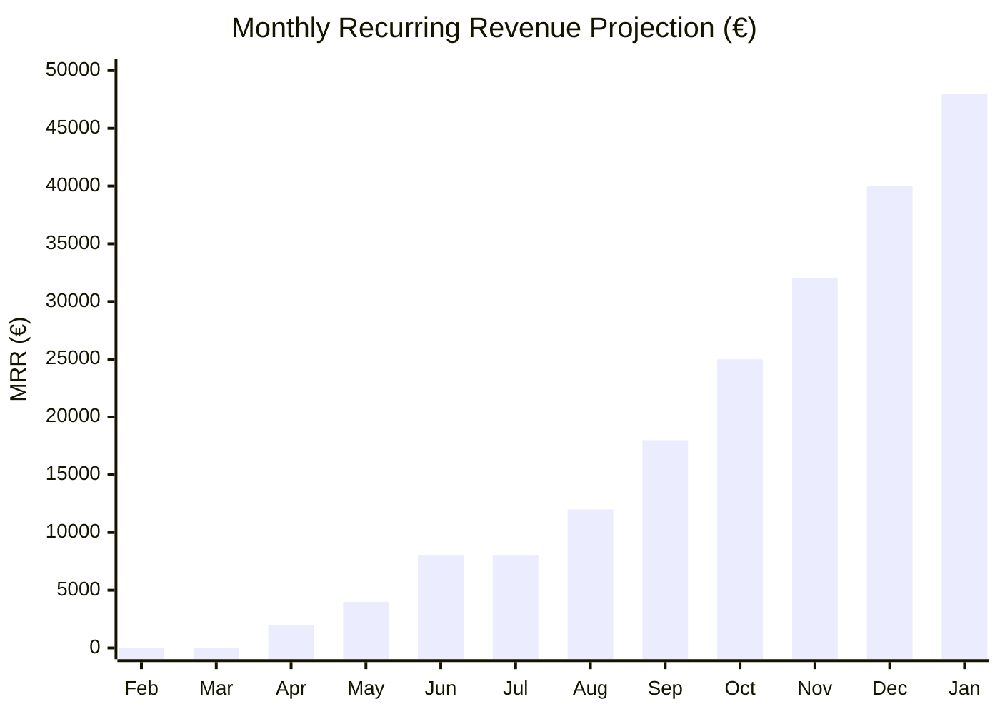

| Metric | Jul 2026 | Dec 2026 | Jul 2027 |
|--------|----------|----------|----------|
| **Customers** | 3 | 10 | 25 |
| **MRR** | €8,000 | €40,000 | €120,000 |
| **ARR** | €96,000 | €480,000 | €1,440,000 |

### Break-Even Analysis

**Monthly Fixed Costs (Post-MVP):**
- Infrastructure: €2,000
- Tools/Services: €500
- Development (ongoing): €8,000 (1 FTE contractor)
- Sales/Marketing: €5,000
- Operations: €2,000
- **Total: €17,500/month**

**Break-Even Point:** 5 Professional customers OR 2 Enterprise customers

---

## 7. Investment & Funding Strategy

### Funding Philosophy

**Bootstrap-First Approach:**
- No external funding during build phase
- Syntegreti absorbs development costs for equity
- First customer revenue funds growth
- External funding only if needed for acceleration

### Funding Scenarios

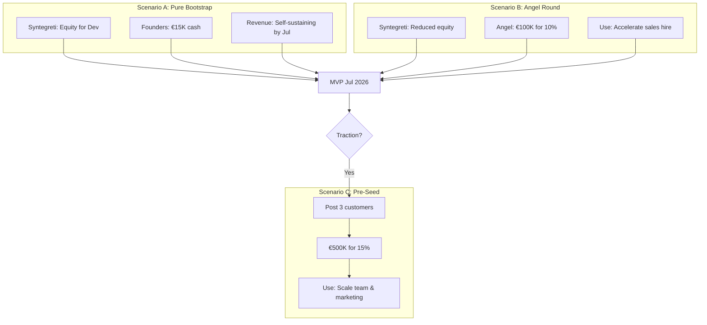

### Scenario A: Bootstrap (Recommended)

**Pros:**
- Maximum equity retention
- Forces revenue focus
- No investor pressure

**Cons:**
- Slower growth
- Personal financial risk
- Limited runway

**Cash Requirements:**
- Founders contribute: €15,000 (operations buffer)
- Syntegreti: Development in exchange for 25% equity
- Target: Cash-flow positive by Month 5

### Scenario B: Angel Investment (If Needed)

**Trigger:** Demo shows strong interest but need sales capacity

**Terms:**
- Raise: €100,000
- Valuation: €1,000,000 pre-money
- Equity: 10% (SAFE or convertible note)

**Use of Funds:**
- Sales hire (€60,000)
- Marketing (€25,000)
- Operations buffer (€15,000)

**Target Investors:**
- Legal tech angels (Netherlands, DACH)
- Former CLM executives
- B2B SaaS operators

### Scenario C: Pre-Seed (Post-Traction)

**Trigger:** 3+ customers, clear path to 10

**Terms:**
- Raise: €500,000
- Valuation: €3,000,000 pre-money (based on €100K ARR)
- Equity: 15%

**Use of Funds:**
- Engineering team (2 hires): €200,000
- Sales expansion: €150,000
- Marketing: €100,000
- Operations: €50,000

---

## 8. Risk Analysis

### Risk Matrix

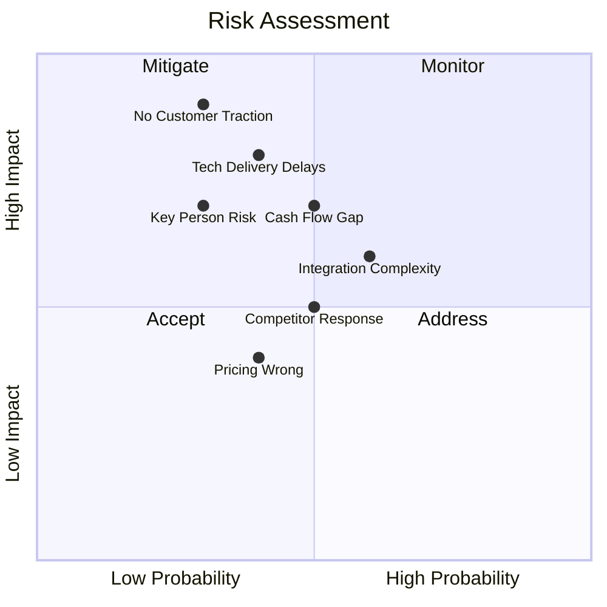

### Risk Mitigation Strategies

| Risk | Probability | Impact | Mitigation |
|------|-------------|--------|------------|
| **Tech delivery delays** | Medium | High | Milestone-based equity, weekly standups, clear specs |
| **No customer traction** | Low | Critical | Early POCs, founding customer program, pivot capability |
| **Competitor response** | Medium | Medium | Speed to market, integration moat, customer relationships |
| **Key person risk (Steven)** | Low | High | Document processes, backup contacts, incentive alignment |
| **Integration complexity** | High | Medium | Start with ServiceNow (most valuable), modular architecture |
| **Cash flow gap** | Medium | High | Conservative spend, milestone payments from customers |

### Contingency Plans

**If no customers by Month 4:**
- Extend POC period to reduce friction
- Offer 3-month free pilot
- Pivot to consulting + tool model

**If Syntegreti cannot deliver:**
- Contract fallback developers (€8K/month)
- Reduce scope to core features only
- Extend timeline to 8 months

**If competitor launches similar product:**
- Double down on integration depth
- Focus on specific vertical (legal ops)
- Compete on implementation speed, not features

---

## 9. Success Metrics & Milestones

### Key Performance Indicators

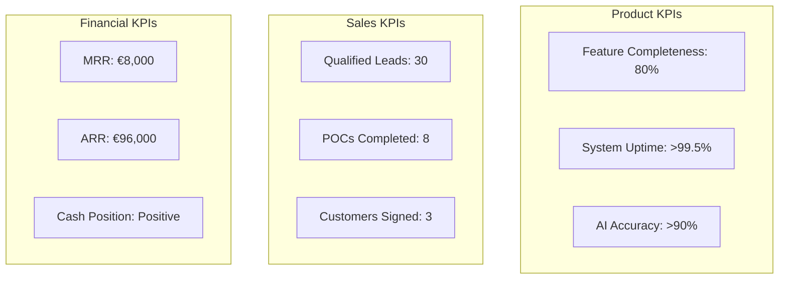

### Milestone Checklist

| Milestone | Target Date | Success Criteria | Status |
|-----------|-------------|------------------|--------|
| **Demo Ready** | Feb 18, 2026 | Successful demo, 2+ leads | ⏳ |
| **First POC** | Mar 15, 2026 | Customer using real data | ⬜ |
| **Customer #1** | Apr 15, 2026 | Signed contract, payment received | ⬜ |
| **Alpha Release** | Mar 31, 2026 | Multi-tenant, notifications | ⬜ |
| **Customer #2** | May 15, 2026 | Signed contract, payment received | ⬜ |
| **Beta Release** | May 15, 2026 | Integrations, workflows | ⬜ |
| **Customer #3** | Jun 30, 2026 | Signed contract, payment received | ⬜ |
| **MVP Release** | Jul 15, 2026 | 80% features, production-ready | ⬜ |
| **Cash Flow Positive** | Jul 31, 2026 | Revenue > Costs | ⬜ |

### Monthly Review Cadence

**Weekly (Steven + Syntegreti):**
- Development progress
- Blockers and decisions needed
- Customer/lead updates

**Monthly (All Stakeholders):**
- KPI review
- Financial position
- Roadmap adjustments
- Go/No-go decisions

---

## 10. Appendix

### A. Competitive Landscape

| Competitor | Strength | Weakness | Our Advantage |
|------------|----------|----------|---------------|
| **DocuSign CLM** | Market presence | Slow, expensive | 10x faster deployment |
| **Icertis** | Enterprise features | 12+ month implementation | Integration-first approach |
| **Ironclad** | Modern UX | Limited analytics | AI-native intelligence |
| **Agiloft** | Configurability | Complex | Simplicity, pre-built AI |
| **Sirion** | AI claims | Legacy architecture | True AI-native |

### B. Technology Stack

| Layer | Technology | Rationale |
|-------|------------|-----------|
| Frontend | React + TypeScript | Modern, maintainable |
| Backend | Python + FastAPI | AI ecosystem, async |
| Database | PostgreSQL | Reliable, scalable |
| Vector Store | ChromaDB | Simple, effective |
| AI | OpenAI GPT-4o | Best quality |
| Observability | Langfuse | LLM-specific tracing |

### C. Legal Considerations

**Entity Structure:**
- Recommend: B.V. (Netherlands) for EU market access
- Consider: US entity later for NA expansion

**Key Agreements Needed:**
1. Founders' Agreement (equity, vesting, roles)
2. Syntegreti Development Agreement (IP assignment, equity terms)
3. Customer MSA template
4. Data Processing Agreement (GDPR)

### D. Contact & Next Steps

**Immediate Actions (This Week):**
1. ✅ Complete demo preparation
2. ⬜ Finalize Syntegreti equity terms
3. ⬜ Create founding customer pitch deck
4. ⬜ Identify 10 target accounts

**Steven's Focus:**
- Lead generation and sales
- Customer relationship management
- Partnership development

**Aparna's Focus:**
- Product feedback and requirements
- Customer success support
- Industry expertise and validation

**Syntegreti's Focus:**
- Technical delivery to milestones
- Architecture decisions
- Quality and security

---

*Document prepared: February 2026*

*Next review: March 2026*
