# CLM Platform Data Model

Comprehensive data model documentation with Mermaid diagrams for the Contract Lifecycle Management platform.

---

## Table of Contents

1. [Multi-Tenancy Architecture](#1-multi-tenancy--access-control)
2. [Contract Intelligence Core](#2-contract-intelligence-core)
3. [Post-Signing Management](#3-post-signing-management)
4. [Relationship Governance](#4-relationship-governance-evaluetor-features)
5. [Compliance Module](#5-compliance-module)
6. [Chat](#6-chat)
7. [Supporting Entities](#7-supporting-entities)
8. [Complete Overview](#8-complete-entity-relationship-overview)
9. [Data Flow Diagrams](#9-data-flow-diagrams)
10. [Key Design Decisions](#10-key-design-decisions)

---

## 1. Multi-Tenancy & Access Control

### Tenant & User Model

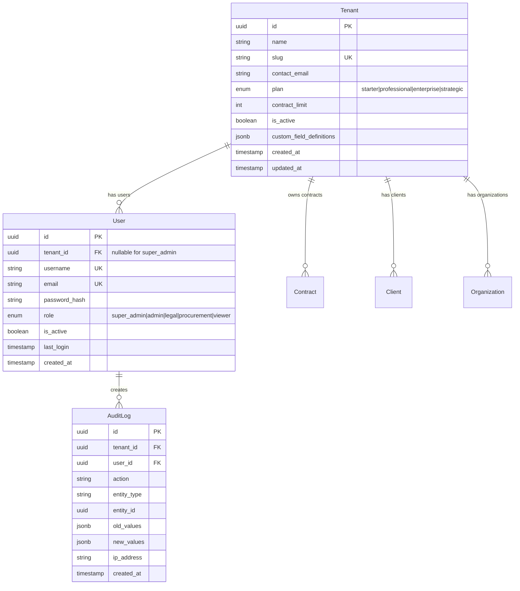
```mermaid
erDiagram
    Tenant ||--o{ User : "has users"
    Tenant ||--o{ Contract : "owns contracts"
    Tenant ||--o{ Client : "has clients"
    Tenant ||--o{ Organization : "has organizations"
    User ||--o{ AuditLog : "creates"

    Tenant {
        uuid id PK
        string name
        string slug UK
        string contact_email
        enum plan "starter|professional|enterprise|strategic"
        int contract_limit
        boolean is_active
        jsonb custom_field_definitions
        timestamp created_at
        timestamp updated_at
    }

    User {
        uuid id PK
        uuid tenant_id FK "nullable for super_admin"
        string username UK
        string email UK
        string password_hash
        enum role "super_admin|admin|legal|procurement|viewer"
        boolean is_active
        timestamp last_login
        timestamp created_at
    }

    AuditLog {
        uuid id PK
        uuid tenant_id FK
        uuid user_id FK
        string action
        string entity_type
        uuid entity_id
        jsonb old_values
        jsonb new_values
        string ip_address
        timestamp created_at
    }
```

### Role Hierarchy

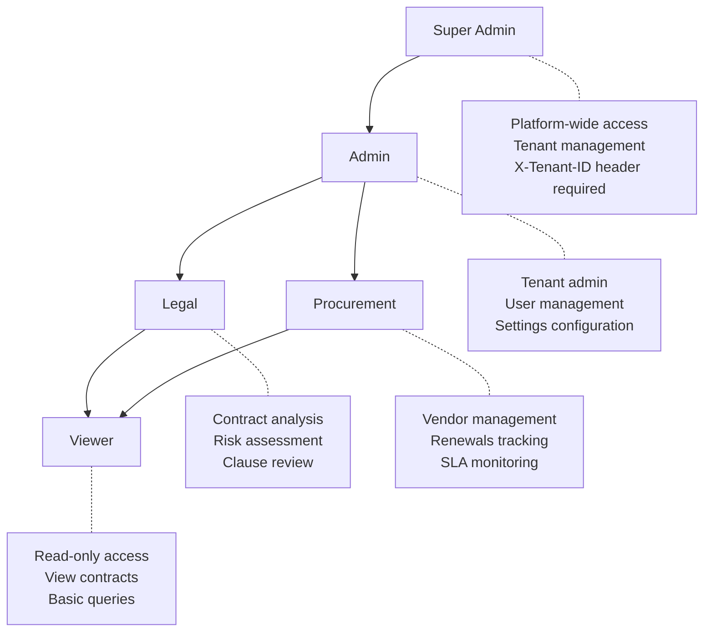
```mermaid
graph TD
    SA[Super Admin] --> A[Admin]
    A --> L[Legal]
    A --> P[Procurement]
    L --> V[Viewer]
    P --> V

    SA -.- SA_DESC["Platform-wide access<br/>Tenant management<br/>X-Tenant-ID header required"]
    A -.- A_DESC["Tenant admin<br/>User management<br/>Settings configuration"]
    L -.- L_DESC["Contract analysis<br/>Risk assessment<br/>Clause review"]
    P -.- P_DESC["Vendor management<br/>Renewals tracking<br/>SLA monitoring"]
    V -.- V_DESC["Read-only access<br/>View contracts<br/>Basic queries"]
```

### Tenant Isolation Architecture

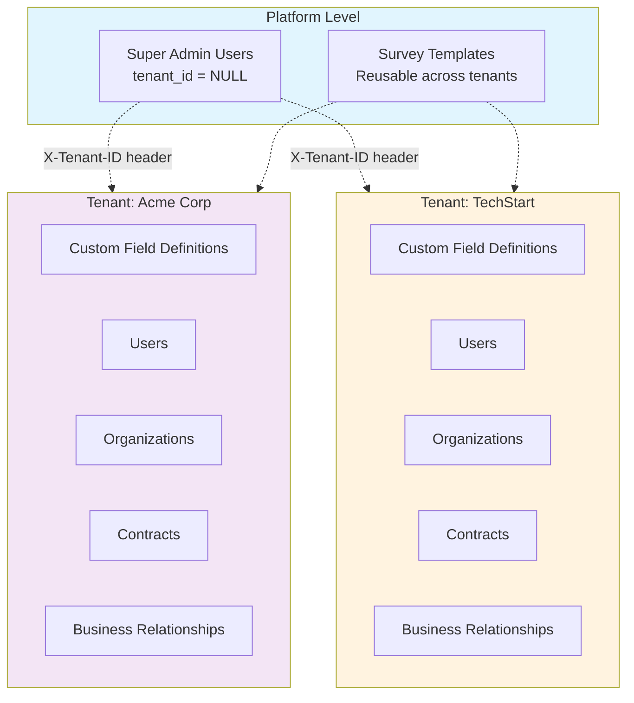
```mermaid
graph TB
    subgraph Platform["Platform Level"]
        SA[Super Admin Users<br/>tenant_id = NULL]
        ST[Survey Templates<br/>Reusable across tenants]
    end

    subgraph TenantA["Tenant: Acme Corp"]
        TA_CFD[Custom Field Definitions]
        TA_U[Users]
        TA_O[Organizations]
        TA_C[Contracts]
        TA_BR[Business Relationships]
    end

    subgraph TenantB["Tenant: TechStart"]
        TB_CFD[Custom Field Definitions]
        TB_U[Users]
        TB_O[Organizations]
        TB_C[Contracts]
        TB_BR[Business Relationships]
    end

    SA -.->|X-Tenant-ID header| TenantA
    SA -.->|X-Tenant-ID header| TenantB
    ST -.-> TenantA
    ST -.-> TenantB

    style Platform fill:#e1f5fe
    style TenantA fill:#f3e5f5
    style TenantB fill:#fff3e0
```

---

## 2. Contract Intelligence Core

### Contract & Extraction Model

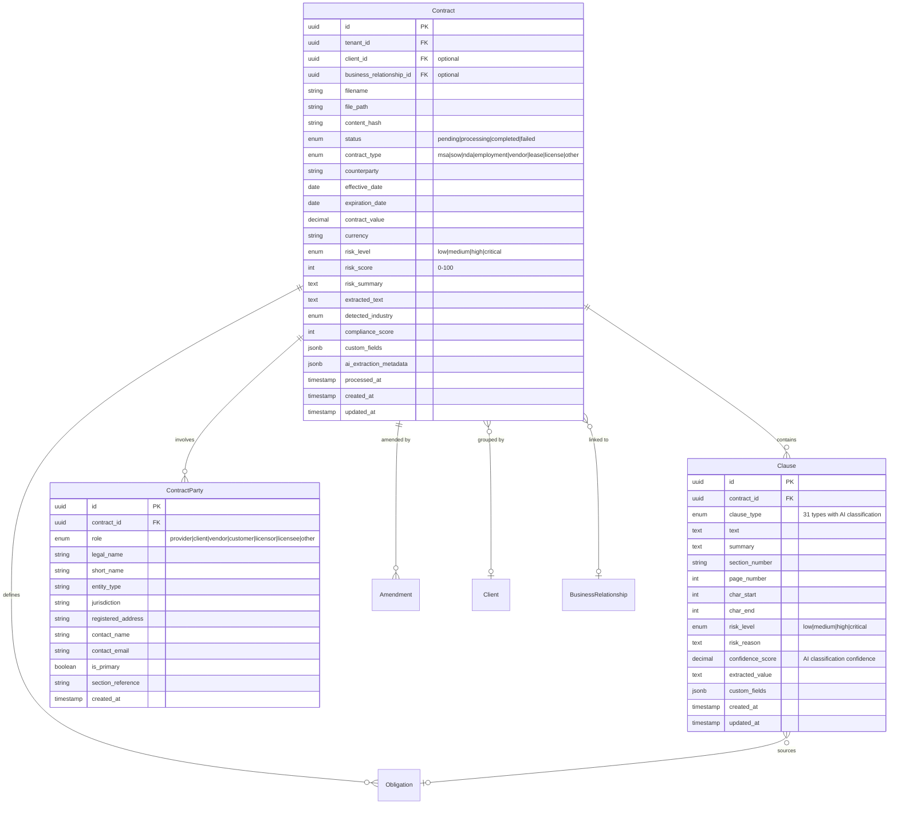
```mermaid
erDiagram
    Contract ||--o{ Clause : "contains"
    Contract ||--o{ Obligation : "defines"
    Contract ||--o{ ContractParty : "involves"
    Contract ||--o{ Amendment : "amended by"
    Contract }o--o| Client : "grouped by"
    Contract }o--o| BusinessRelationship : "linked to"
    Clause }o--o| Obligation : "sources"

    Contract {
        uuid id PK
        uuid tenant_id FK
        uuid client_id FK "optional"
        uuid business_relationship_id FK "optional"
        string filename
        string file_path
        string content_hash
        enum status "pending|processing|completed|failed"
        enum contract_type "msa|sow|nda|employment|vendor|lease|license|other"
        string counterparty
        date effective_date
        date expiration_date
        decimal contract_value
        string currency
        enum risk_level "low|medium|high|critical"
        int risk_score "0-100"
        text risk_summary
        text extracted_text
        enum detected_industry
        int compliance_score
        jsonb custom_fields
        jsonb ai_extraction_metadata
        timestamp processed_at
        timestamp created_at
        timestamp updated_at
    }

    Clause {
        uuid id PK
        uuid contract_id FK
        enum clause_type "31 types with AI classification"
        text text
        text summary
        string section_number
        int page_number
        int char_start
        int char_end
        enum risk_level "low|medium|high|critical"
        text risk_reason
        decimal confidence_score "AI classification confidence"
        text extracted_value
        jsonb custom_fields
        timestamp created_at
        timestamp updated_at
    }

    ContractParty {
        uuid id PK
        uuid contract_id FK
        enum role "provider|client|vendor|customer|licensor|licensee|other"
        string legal_name
        string short_name
        string entity_type
        string jurisdiction
        string registered_address
        string contact_name
        string contact_email
        boolean is_primary
        string section_reference
        timestamp created_at
    }
```

### Clause Types (31 Types with AI Classification)

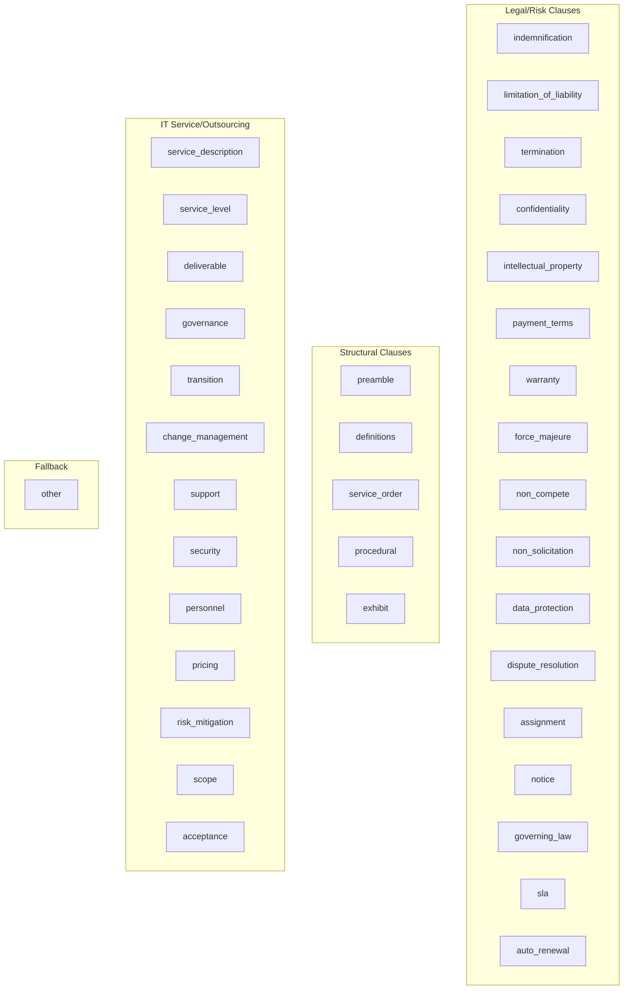
```mermaid
graph TB
    subgraph LegalRisk["Legal/Risk Clauses"]
        L1[indemnification]
        L2[limitation_of_liability]
        L3[termination]
        L4[confidentiality]
        L5[intellectual_property]
        L6[payment_terms]
        L7[warranty]
        L8[force_majeure]
        L9[non_compete]
        L10[non_solicitation]
        L11[data_protection]
        L12[dispute_resolution]
        L13[assignment]
        L14[notice]
        L15[governing_law]
        L16[sla]
        L17[auto_renewal]
    end

    subgraph Structural["Structural Clauses"]
        S1[preamble]
        S2[definitions]
        S3[service_order]
        S4[procedural]
        S5[exhibit]
    end

    subgraph ITService["IT Service/Outsourcing"]
        IT1[service_description]
        IT2[service_level]
        IT3[deliverable]
        IT4[governance]
        IT5[transition]
        IT6[change_management]
        IT7[support]
        IT8[security]
        IT9[personnel]
        IT10[pricing]
        IT11[risk_mitigation]
        IT12[scope]
        IT13[acceptance]
    end

    subgraph Fallback["Fallback"]
        O1[other]
    end
```

### AI Section Classification Mapping

Clauses are classified using GPT-4o-mini semantic analysis. The AI section types map to ClauseType as follows:

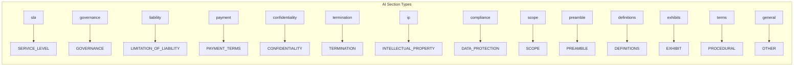
```mermaid
graph LR
    subgraph AISection["AI Section Types"]
        A1[sla] --> CT1[SERVICE_LEVEL]
        A2[governance] --> CT2[GOVERNANCE]
        A3[liability] --> CT3[LIMITATION_OF_LIABILITY]
        A4[payment] --> CT4[PAYMENT_TERMS]
        A5[confidentiality] --> CT5[CONFIDENTIALITY]
        A6[termination] --> CT6[TERMINATION]
        A7[ip] --> CT7[INTELLECTUAL_PROPERTY]
        A8[compliance] --> CT8[DATA_PROTECTION]
        A9[scope] --> CT9[SCOPE]
        A10[preamble] --> CT10[PREAMBLE]
        A11[definitions] --> CT11[DEFINITIONS]
        A12[exhibits] --> CT12[EXHIBIT]
        A13[terms] --> CT13[PROCEDURAL]
        A14[general] --> CT14[OTHER]
    end
```

### Obligation Model

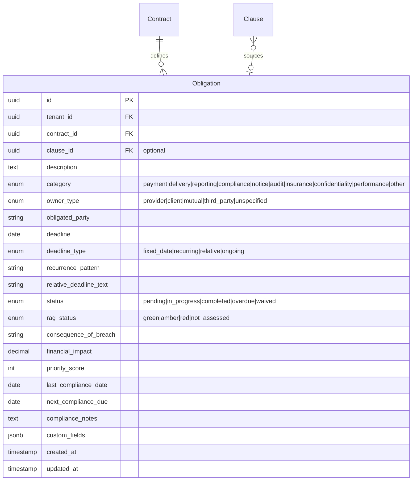
```mermaid
erDiagram
    Contract ||--o{ Obligation : "defines"
    Clause }o--o| Obligation : "sources"

    Obligation {
        uuid id PK
        uuid tenant_id FK
        uuid contract_id FK
        uuid clause_id FK "optional"
        text description
        enum category "payment|delivery|reporting|compliance|notice|audit|insurance|confidentiality|performance|other"
        enum owner_type "provider|client|mutual|third_party|unspecified"
        string obligated_party
        date deadline
        enum deadline_type "fixed_date|recurring|relative|ongoing"
        string recurrence_pattern
        string relative_deadline_text
        enum status "pending|in_progress|completed|overdue|waived"
        enum rag_status "green|amber|red|not_assessed"
        string consequence_of_breach
        decimal financial_impact
        int priority_score
        date last_compliance_date
        date next_compliance_due
        text compliance_notes
        jsonb custom_fields
        timestamp created_at
        timestamp updated_at
    }
```

### Amendment Tracking

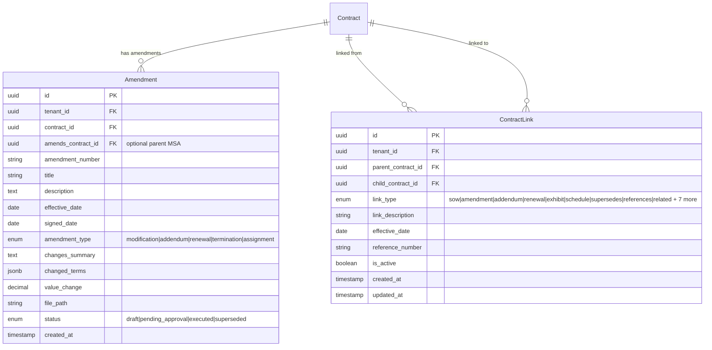
```mermaid
erDiagram
    Contract ||--o{ Amendment : "has amendments"
    Contract ||--o{ ContractLink : "linked from"
    Contract ||--o{ ContractLink : "linked to"

    Amendment {
        uuid id PK
        uuid tenant_id FK
        uuid contract_id FK
        uuid amends_contract_id FK "optional parent MSA"
        string amendment_number
        string title
        text description
        date effective_date
        date signed_date
        enum amendment_type "modification|addendum|renewal|termination|assignment"
        text changes_summary
        jsonb changed_terms
        decimal value_change
        string file_path
        enum status "draft|pending_approval|executed|superseded"
        timestamp created_at
    }

    ContractLink {
        uuid id PK
        uuid tenant_id FK
        uuid parent_contract_id FK
        uuid child_contract_id FK
        enum link_type "sow|amendment|addendum|renewal|exhibit|schedule|supersedes|references|related + 7 more"
        string link_description
        date effective_date
        string reference_number
        boolean is_active
        timestamp created_at
        timestamp updated_at
    }
```

---

## 3. Post-Signing Management

### SLA & Performance Tracking

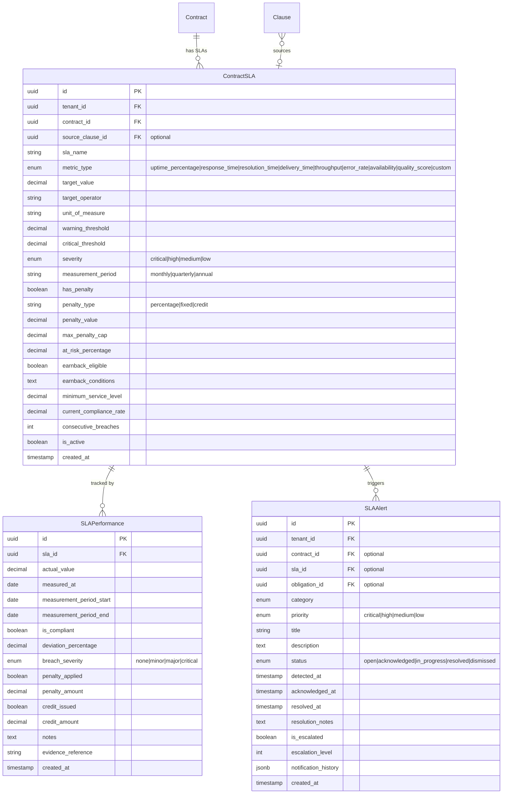
```mermaid
erDiagram
    Contract ||--o{ ContractSLA : "has SLAs"
    ContractSLA ||--o{ SLAPerformance : "tracked by"
    ContractSLA ||--o{ SLAAlert : "triggers"
    Clause }o--o| ContractSLA : "sources"

    ContractSLA {
        uuid id PK
        uuid tenant_id FK
        uuid contract_id FK
        uuid source_clause_id FK "optional"
        string sla_name
        enum metric_type "uptime_percentage|response_time|resolution_time|delivery_time|throughput|error_rate|availability|quality_score|custom"
        decimal target_value
        string target_operator
        string unit_of_measure
        decimal warning_threshold
        decimal critical_threshold
        enum severity "critical|high|medium|low"
        string measurement_period "monthly|quarterly|annual"
        boolean has_penalty
        string penalty_type "percentage|fixed|credit"
        decimal penalty_value
        decimal max_penalty_cap
        decimal at_risk_percentage
        boolean earnback_eligible
        text earnback_conditions
        decimal minimum_service_level
        decimal current_compliance_rate
        int consecutive_breaches
        boolean is_active
        timestamp created_at
    }

    SLAPerformance {
        uuid id PK
        uuid sla_id FK
        decimal actual_value
        date measured_at
        date measurement_period_start
        date measurement_period_end
        boolean is_compliant
        decimal deviation_percentage
        enum breach_severity "none|minor|major|critical"
        boolean penalty_applied
        decimal penalty_amount
        boolean credit_issued
        decimal credit_amount
        text notes
        string evidence_reference
        timestamp created_at
    }

    SLAAlert {
        uuid id PK
        uuid tenant_id FK
        uuid contract_id FK "optional"
        uuid sla_id FK "optional"
        uuid obligation_id FK "optional"
        enum category
        enum priority "critical|high|medium|low"
        string title
        text description
        enum status "open|acknowledged|in_progress|resolved|dismissed"
        timestamp detected_at
        timestamp acknowledged_at
        timestamp resolved_at
        text resolution_notes
        boolean is_escalated
        int escalation_level
        jsonb notification_history
        timestamp created_at
    }
```

### Alert Categories

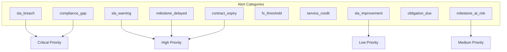
```mermaid
graph TD
    subgraph AlertCategories["Alert Categories"]
        A1[sla_breach]
        A2[sla_warning]
        A3[sla_improvement]
        A4[milestone_delayed]
        A5[milestone_at_risk]
        A6[fx_threshold]
        A7[service_credit]
        A8[contract_expiry]
        A9[obligation_due]
        A10[compliance_gap]
    end

    A1 --> CRIT[Critical Priority]
    A2 --> HIGH[High Priority]
    A3 --> LOW[Low Priority]
    A4 --> HIGH
    A5 --> MED[Medium Priority]
    A8 --> HIGH
    A10 --> CRIT
```

### Renewal Management

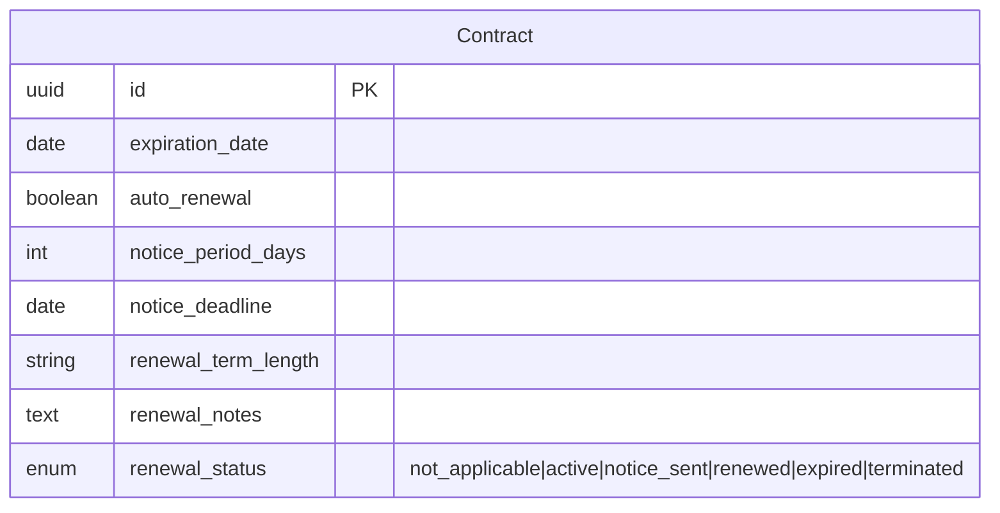
```mermaid
erDiagram
    Contract {
        uuid id PK
        date expiration_date
        boolean auto_renewal
        int notice_period_days
        date notice_deadline
        string renewal_term_length
        text renewal_notes
        enum renewal_status "not_applicable|active|notice_sent|renewed|expired|terminated"
    }
```

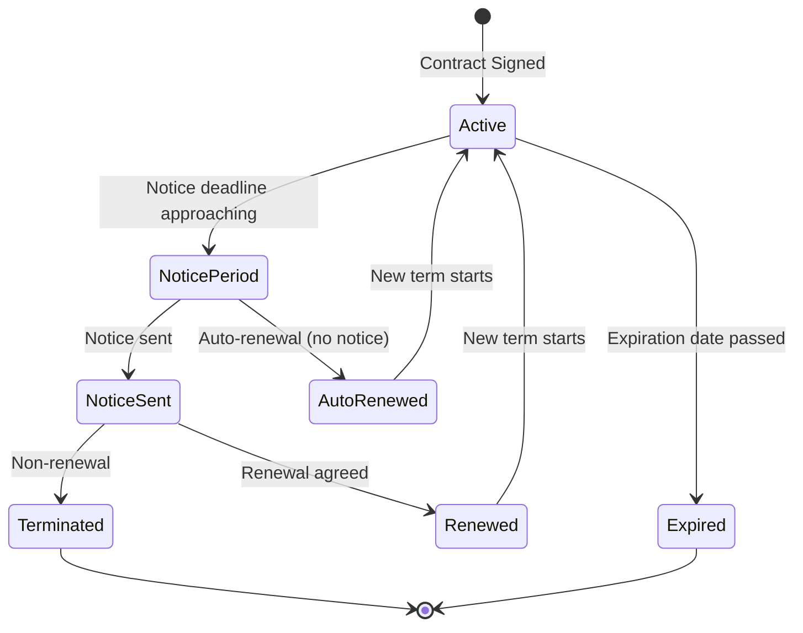
```mermaid
stateDiagram-v2
    [*] --> Active: Contract Signed
    Active --> NoticePeriod: Notice deadline approaching
    NoticePeriod --> NoticeSent: Notice sent
    NoticeSent --> Terminated: Non-renewal
    NoticeSent --> Renewed: Renewal agreed
    NoticePeriod --> AutoRenewed: Auto-renewal (no notice)
    Renewed --> Active: New term starts
    AutoRenewed --> Active: New term starts
    Terminated --> [*]
    Active --> Expired: Expiration date passed
    Expired --> [*]
```

---

## 4. Relationship Governance (Evaluetor Features)

### Organization & Business Relationships

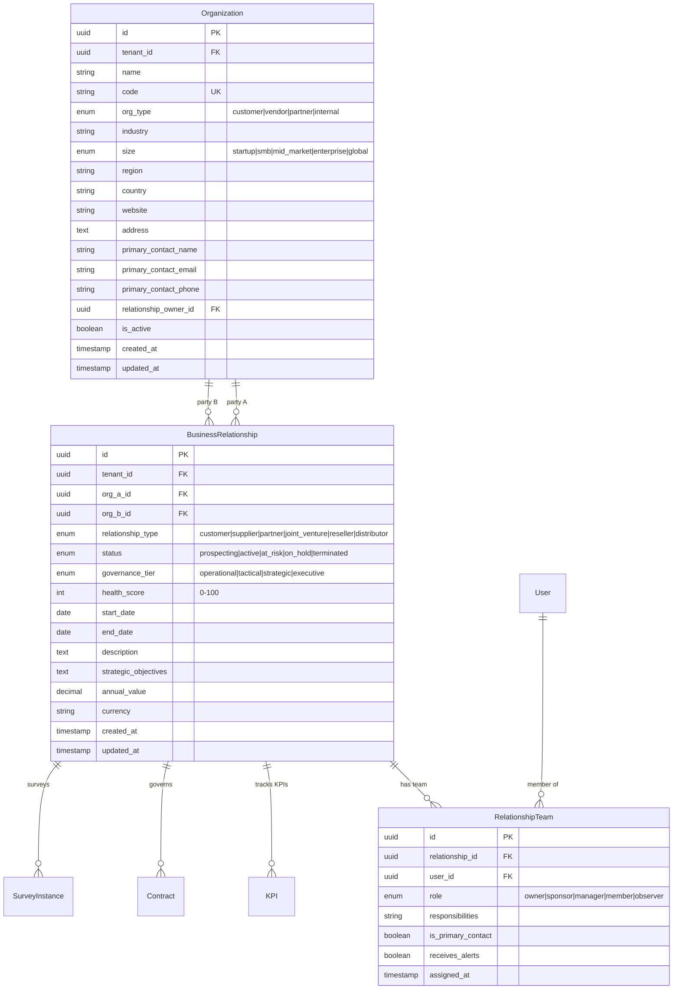
```mermaid
erDiagram
    Organization ||--o{ BusinessRelationship : "party A"
    Organization ||--o{ BusinessRelationship : "party B"
    BusinessRelationship ||--o{ RelationshipTeam : "has team"
    BusinessRelationship ||--o{ KPI : "tracks KPIs"
    BusinessRelationship ||--o{ Contract : "governs"
    BusinessRelationship ||--o{ SurveyInstance : "surveys"
    User ||--o{ RelationshipTeam : "member of"

    Organization {
        uuid id PK
        uuid tenant_id FK
        string name
        string code UK
        enum org_type "customer|vendor|partner|internal"
        string industry
        enum size "startup|smb|mid_market|enterprise|global"
        string region
        string country
        string website
        text address
        string primary_contact_name
        string primary_contact_email
        string primary_contact_phone
        uuid relationship_owner_id FK
        boolean is_active
        timestamp created_at
        timestamp updated_at
    }

    BusinessRelationship {
        uuid id PK
        uuid tenant_id FK
        uuid org_a_id FK
        uuid org_b_id FK
        enum relationship_type "customer|supplier|partner|joint_venture|reseller|distributor"
        enum status "prospecting|active|at_risk|on_hold|terminated"
        enum governance_tier "operational|tactical|strategic|executive"
        int health_score "0-100"
        date start_date
        date end_date
        text description
        text strategic_objectives
        decimal annual_value
        string currency
        timestamp created_at
        timestamp updated_at
    }

    RelationshipTeam {
        uuid id PK
        uuid relationship_id FK
        uuid user_id FK
        enum role "owner|sponsor|manager|member|observer"
        string responsibilities
        boolean is_primary_contact
        boolean receives_alerts
        timestamp assigned_at
    }
```

### KPI & Perception Scoring

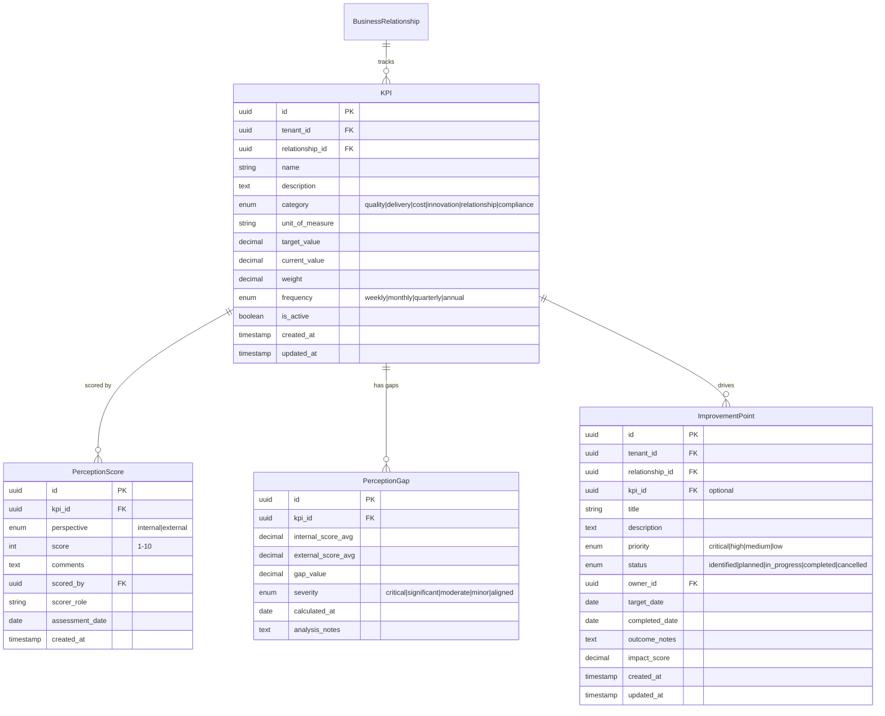
```mermaid
erDiagram
    BusinessRelationship ||--o{ KPI : "tracks"
    KPI ||--o{ PerceptionScore : "scored by"
    KPI ||--o{ PerceptionGap : "has gaps"
    KPI ||--o{ ImprovementPoint : "drives"

    KPI {
        uuid id PK
        uuid tenant_id FK
        uuid relationship_id FK
        string name
        text description
        enum category "quality|delivery|cost|innovation|relationship|compliance"
        string unit_of_measure
        decimal target_value
        decimal current_value
        decimal weight
        enum frequency "weekly|monthly|quarterly|annual"
        boolean is_active
        timestamp created_at
        timestamp updated_at
    }

    PerceptionScore {
        uuid id PK
        uuid kpi_id FK
        enum perspective "internal|external"
        int score "1-10"
        text comments
        uuid scored_by FK
        string scorer_role
        date assessment_date
        timestamp created_at
    }

    PerceptionGap {
        uuid id PK
        uuid kpi_id FK
        decimal internal_score_avg
        decimal external_score_avg
        decimal gap_value
        enum severity "critical|significant|moderate|minor|aligned"
        date calculated_at
        text analysis_notes
    }

    ImprovementPoint {
        uuid id PK
        uuid tenant_id FK
        uuid relationship_id FK
        uuid kpi_id FK "optional"
        string title
        text description
        enum priority "critical|high|medium|low"
        enum status "identified|planned|in_progress|completed|cancelled"
        uuid owner_id FK
        date target_date
        date completed_date
        text outcome_notes
        decimal impact_score
        timestamp created_at
        timestamp updated_at
    }
```

### Perception Gap Analysis

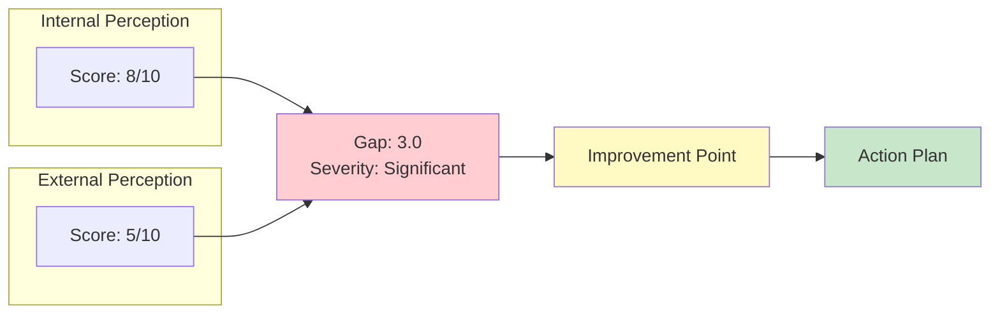
```mermaid
graph LR
    subgraph Internal["Internal Perception"]
        I1[Score: 8/10]
    end

    subgraph External["External Perception"]
        E1[Score: 5/10]
    end

    I1 --> GAP[Gap: 3.0<br/>Severity: Significant]
    E1 --> GAP

    GAP --> IP[Improvement Point]
    IP --> Action[Action Plan]

    style GAP fill:#ffcdd2
    style IP fill:#fff9c4
    style Action fill:#c8e6c9
```

### Survey System

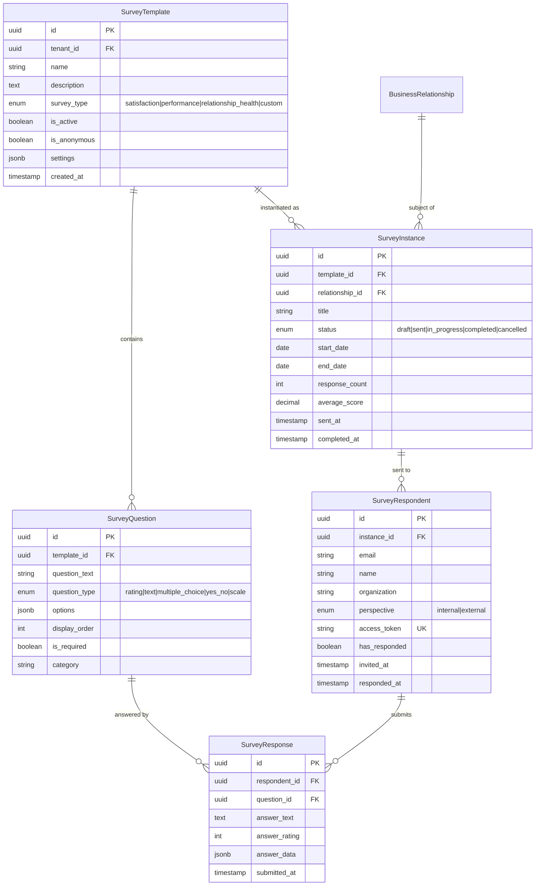
```mermaid
erDiagram
    SurveyTemplate ||--o{ SurveyQuestion : "contains"
    SurveyTemplate ||--o{ SurveyInstance : "instantiated as"
    SurveyInstance ||--o{ SurveyRespondent : "sent to"
    SurveyRespondent ||--o{ SurveyResponse : "submits"
    SurveyQuestion ||--o{ SurveyResponse : "answered by"
    BusinessRelationship ||--o{ SurveyInstance : "subject of"

    SurveyTemplate {
        uuid id PK
        uuid tenant_id FK
        string name
        text description
        enum survey_type "satisfaction|performance|relationship_health|custom"
        boolean is_active
        boolean is_anonymous
        jsonb settings
        timestamp created_at
    }

    SurveyQuestion {
        uuid id PK
        uuid template_id FK
        string question_text
        enum question_type "rating|text|multiple_choice|yes_no|scale"
        jsonb options
        int display_order
        boolean is_required
        string category
    }

    SurveyInstance {
        uuid id PK
        uuid template_id FK
        uuid relationship_id FK
        string title
        enum status "draft|sent|in_progress|completed|cancelled"
        date start_date
        date end_date
        int response_count
        decimal average_score
        timestamp sent_at
        timestamp completed_at
    }

    SurveyRespondent {
        uuid id PK
        uuid instance_id FK
        string email
        string name
        string organization
        enum perspective "internal|external"
        string access_token UK
        boolean has_responded
        timestamp invited_at
        timestamp responded_at
    }

    SurveyResponse {
        uuid id PK
        uuid respondent_id FK
        uuid question_id FK
        text answer_text
        int answer_rating
        jsonb answer_data
        timestamp submitted_at
    }
```

---

## 5. Compliance Module

### Industry Compliance

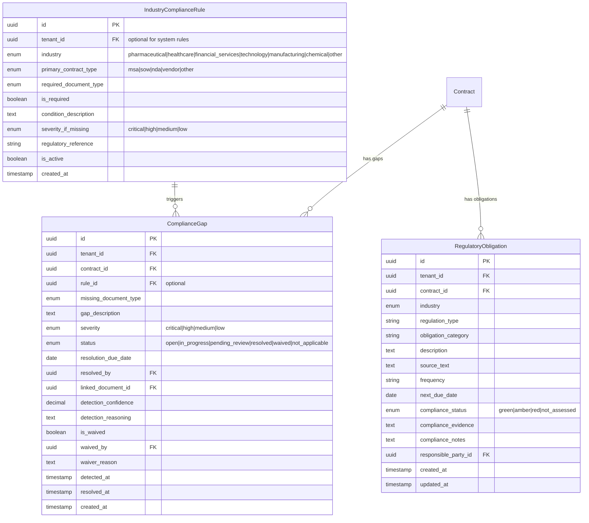
```mermaid
erDiagram
    Contract ||--o{ ComplianceGap : "has gaps"
    Contract ||--o{ RegulatoryObligation : "has obligations"
    IndustryComplianceRule ||--o{ ComplianceGap : "triggers"

    IndustryComplianceRule {
        uuid id PK
        uuid tenant_id FK "optional for system rules"
        enum industry "pharmaceutical|healthcare|financial_services|technology|manufacturing|chemical|other"
        enum primary_contract_type "msa|sow|nda|vendor|other"
        enum required_document_type
        boolean is_required
        text condition_description
        enum severity_if_missing "critical|high|medium|low"
        string regulatory_reference
        boolean is_active
        timestamp created_at
    }

    ComplianceGap {
        uuid id PK
        uuid tenant_id FK
        uuid contract_id FK
        uuid rule_id FK "optional"
        enum missing_document_type
        text gap_description
        enum severity "critical|high|medium|low"
        enum status "open|in_progress|pending_review|resolved|waived|not_applicable"
        date resolution_due_date
        uuid resolved_by FK
        uuid linked_document_id FK
        decimal detection_confidence
        text detection_reasoning
        boolean is_waived
        uuid waived_by FK
        text waiver_reason
        timestamp detected_at
        timestamp resolved_at
        timestamp created_at
    }

    RegulatoryObligation {
        uuid id PK
        uuid tenant_id FK
        uuid contract_id FK
        enum industry
        string regulation_type
        string obligation_category
        text description
        text source_text
        string frequency
        date next_due_date
        enum compliance_status "green|amber|red|not_assessed"
        text compliance_evidence
        text compliance_notes
        uuid responsible_party_id FK
        timestamp created_at
        timestamp updated_at
    }
```

### Required Document Types by Industry

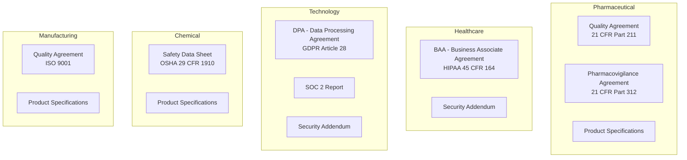
```mermaid
graph TB
    subgraph Pharmaceutical
        P1[Quality Agreement<br/>21 CFR Part 211]
        P2[Pharmacovigilance Agreement<br/>21 CFR Part 312]
        P3[Product Specifications]
    end

    subgraph Healthcare
        H1[BAA - Business Associate Agreement<br/>HIPAA 45 CFR 164]
        H2[Security Addendum]
    end

    subgraph Technology
        T1[DPA - Data Processing Agreement<br/>GDPR Article 28]
        T2[SOC 2 Report]
        T3[Security Addendum]
    end

    subgraph Chemical
        C1[Safety Data Sheet<br/>OSHA 29 CFR 1910]
        C2[Product Specifications]
    end

    subgraph Manufacturing
        M1[Quality Agreement<br/>ISO 9001]
        M2[Product Specifications]
    end
```

---

## 6. Chat

### Chat Sessions & Messages

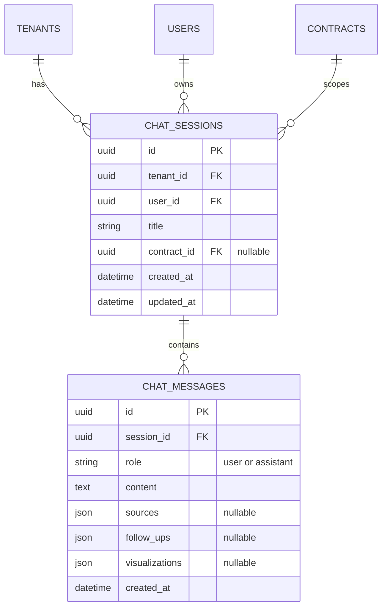
```mermaid
erDiagram
    TENANTS ||--o{ CHAT_SESSIONS : has
    USERS ||--o{ CHAT_SESSIONS : owns
    CONTRACTS ||--o{ CHAT_SESSIONS : scopes
    CHAT_SESSIONS ||--o{ CHAT_MESSAGES : contains

    CHAT_SESSIONS {
        uuid id PK
        uuid tenant_id FK
        uuid user_id FK
        string title
        uuid contract_id FK "nullable"
        datetime created_at
        datetime updated_at
    }

    CHAT_MESSAGES {
        uuid id PK
        uuid session_id FK
        string role "user or assistant"
        text content
        json sources "nullable"
        json follow_ups "nullable"
        json visualizations "nullable"
        datetime created_at
    }
```

**Chat Sessions** - Persistent conversation sessions per user per tenant

| Column | Type | Description |
|--------|------|-------------|
| id | UUID | Primary key |
| tenant_id | UUID | FK to tenants (multi-tenant isolation) |
| user_id | UUID | FK to users (session owner) |
| title | VARCHAR(255) | Auto-generated from first message |
| contract_id | UUID | Optional FK to contracts (scoped queries) |
| created_at | TIMESTAMP | Session creation time |
| updated_at | TIMESTAMP | Last activity time |

**Chat Messages** - Individual messages within a session

| Column | Type | Description |
|--------|------|-------------|
| id | UUID | Primary key |
| session_id | UUID | FK to chat_sessions |
| role | VARCHAR(20) | 'user' or 'assistant' |
| content | TEXT | Message text |
| sources | JSON | Source references for AI answers |
| follow_ups | JSON | Suggested follow-up questions |
| visualizations | JSON | Chart/table visualization specs |
| created_at | TIMESTAMP | Message timestamp |

---

## 7. Supporting Entities

### Client Management

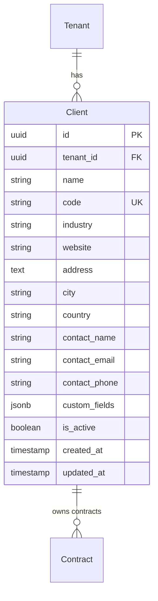
```mermaid
erDiagram
    Tenant ||--o{ Client : "has"
    Client ||--o{ Contract : "owns contracts"

    Client {
        uuid id PK
        uuid tenant_id FK
        string name
        string code UK
        string industry
        string website
        text address
        string city
        string country
        string contact_name
        string contact_email
        string contact_phone
        jsonb custom_fields
        boolean is_active
        timestamp created_at
        timestamp updated_at
    }
```

### Suggested Links & Auto-Detection

```mermaid
erDiagram
    Contract ||--o{ SuggestedLink : "source"
    Contract ||--o{ SuggestedLink : "target"

    SuggestedLink {
        uuid id PK
        uuid tenant_id FK
        uuid source_contract_id FK
        uuid target_contract_id FK
        string suggested_link_type
        string suggested_direction
        decimal confidence_score "0-1 multi-signal score"
        text reasoning
        jsonb matching_signals "counterparty, type, semantic, filename, date"
        enum status "pending|approved|rejected|expired"
        uuid reviewed_by FK
        timestamp reviewed_at
        uuid created_link_id FK "links to ContractLink on approval"
        timestamp created_at
    }
```

```mermaid
flowchart LR
    Upload[Contract Upload] --> Analyze[AutoLinkDetector]
    Analyze --> S1[Counterparty Match 30%]
    Analyze --> S2[Type Hierarchy 25%]
    Analyze --> S3[Semantic Similarity 20%]
    Analyze --> S4[Fuzzy Match 20%]
    Analyze --> S5[Filename Pattern 15%]
    S1 --> Score[Composite Score]
    S2 --> Score
    S3 --> Score
    S4 --> Score
    S5 --> Score
    Score --> Suggest[SuggestedContractLink]
    Suggest --> Review{User Review}
    Review -->|Approve| Create[ContractLink]
    Review -->|Reject| Dismiss[Dismiss]
    Review -->|Modify| ModCreate[ContractLink with modified type]
```

### Scheduler & Background Jobs

```mermaid
erDiagram
    SchedulerJob ||--o{ SchedulerJobHistory : "executes"

    SchedulerJob {
        uuid id PK
        string job_name UK
        string job_type
        text description
        int interval_seconds
        boolean is_enabled
        timestamp last_run_at
        timestamp next_run_at
        enum last_run_status "success|failed|running|skipped"
        int last_run_duration_ms
        text last_run_error
        int total_runs
        int successful_runs
        int failed_runs
        timestamp created_at
    }

    SchedulerJobHistory {
        uuid id PK
        uuid job_id FK
        timestamp started_at
        timestamp completed_at
        int duration_ms
        enum status "success|failed|running|skipped"
        text error_message
        int items_processed
        jsonb run_metadata
    }
```

### Notification System

```mermaid
erDiagram
    User ||--o{ Notification : "receives"

    Notification {
        uuid id PK
        uuid tenant_id FK
        uuid user_id FK
        enum notification_type "alert|reminder|system|workflow"
        string title
        text message
        string link
        enum priority "low|medium|high|critical"
        boolean is_read
        timestamp read_at
        timestamp created_at
    }
```

### Notification Rules

```mermaid
erDiagram
    NotificationRule {
        uuid id PK
        uuid tenant_id FK
        string name
        text description
        enum event_type "contract_expiring|obligation_due|sla_breach|compliance_gap|renewal_notice|custom"
        enum channel "email|teams|in_app|all"
        jsonb conditions
        jsonb recipients
        int days_before
        boolean is_active
        uuid created_by FK
        timestamp created_at
        timestamp updated_at
    }
```

### Business Unit Hierarchy

```mermaid
erDiagram
    Tenant ||--o{ BusinessUnit : "has units"
    BusinessUnit ||--o{ BusinessUnit : "parent of"
    BusinessUnit ||--o{ Contract : "owns"
    BusinessUnit ||--o{ User : "members"

    BusinessUnit {
        uuid id PK
        uuid tenant_id FK
        uuid parent_id FK "optional, self-referencing"
        string name
        string code UK
        text description
        string department_type
        uuid head_user_id FK
        boolean is_active
        int sort_order
        timestamp created_at
        timestamp updated_at
    }
```

### External User Access

```mermaid
erDiagram
    Tenant ||--o{ ExternalUser : "has external users"
    ExternalUser ||--o{ ContractShare : "has shares"
    Contract ||--o{ ContractShare : "shared via"
    ContractShare ||--o{ ContractComment : "has comments"

    ExternalUser {
        uuid id PK
        uuid tenant_id FK
        string email UK
        string name
        string company
        string role
        boolean is_active
        timestamp last_login
        timestamp created_at
        timestamp updated_at
    }

    ContractShare {
        uuid id PK
        uuid tenant_id FK
        uuid contract_id FK
        uuid external_user_id FK
        string access_token UK
        enum permission "view|comment|download"
        date expires_at
        boolean is_active
        uuid shared_by FK
        timestamp created_at
    }

    ContractComment {
        uuid id PK
        uuid tenant_id FK
        uuid contract_id FK
        uuid share_id FK
        uuid external_user_id FK
        text comment_text
        string section_reference
        boolean is_resolved
        uuid resolved_by FK
        timestamp resolved_at
        timestamp created_at
    }
```

### Knowledge Graph

```mermaid
erDiagram
    Contract ||--o{ KGEntity : "contains entities"
    KGEntity ||--o{ KGRelationship : "source"
    KGEntity ||--o{ KGRelationship : "target"

    KGEntity {
        uuid id PK
        uuid tenant_id FK
        uuid contract_id FK
        enum entity_type "party|clause|obligation|sla|date|amount|term|risk|other"
        string name
        text description
        jsonb properties
        decimal confidence
        timestamp created_at
    }

    KGRelationship {
        uuid id PK
        uuid tenant_id FK
        uuid source_entity_id FK
        uuid target_entity_id FK
        enum relationship_type "defines|obligates|modifies|references|depends_on|conflicts_with|supersedes"
        string label
        decimal weight
        jsonb properties
        timestamp created_at
    }
```

### Metric Snapshots

```mermaid
erDiagram
    MetricSnapshot {
        uuid id PK
        uuid tenant_id FK
        string metric_name
        string metric_category
        decimal metric_value
        jsonb dimensions
        jsonb breakdown
        date snapshot_date
        timestamp created_at
    }
```

---

## 8. Complete Entity Relationship Overview

```mermaid
graph TB
    subgraph MultiTenancy["Multi-Tenancy & Access"]
        T[Tenant]
        U[User]
        AL[AuditLog]
        BU[BusinessUnit]
        EU[ExternalUser]
    end

    subgraph ContractIntel["Contract Intelligence"]
        C[Contract]
        CL[Clause]
        O[Obligation]
        CP[ContractParty]
        AM[Amendment]
        KGE[KGEntity]
        KGR[KGRelationship]
    end

    subgraph PostSigning["Post-Signing"]
        SLA[ContractSLA]
        SLAP[SLAPerformance]
        SLAA[SLAAlert]
    end

    subgraph RelGov["Relationship Governance"]
        ORG[Organization]
        BR[BusinessRelationship]
        RT[RelationshipTeam]
        KPI[KPI]
        PS[PerceptionScore]
        PG[PerceptionGap]
        IP[ImprovementPoint]
    end

    subgraph Surveys["Surveys"]
        ST[SurveyTemplate]
        SQ[SurveyQuestion]
        SI[SurveyInstance]
        SR[SurveyRespondent]
        SRESP[SurveyResponse]
    end

    subgraph Compliance["Compliance"]
        ICR[IndustryComplianceRule]
        CG[ComplianceGap]
        RO[RegulatoryObligation]
    end

    subgraph Chat["Chat"]
        CSESS[ChatSession]
        CMSG[ChatMessage]
    end

    subgraph Supporting["Supporting"]
        CLI[Client]
        SL[SuggestedLink]
        CLINK[ContractLink]
        CS[ContractShare]
        CC[ContractComment]
        N[Notification]
        NR[NotificationRule]
        SJ[SchedulerJob]
        MS[MetricSnapshot]
    end

    T --> U
    T --> C
    T --> ORG
    T --> CLI
    T --> BU
    T --> EU
    T --> CSESS

    C --> CL
    C --> O
    C --> CP
    C --> AM
    C --> SLA
    C --> CG
    C --> RO
    C --> KGE
    C --> CS
    C --> CSESS

    KGE --> KGR

    SLA --> SLAP
    SLA --> SLAA

    ORG --> BR
    BR --> RT
    BR --> KPI
    BR --> C
    BR --> SI

    KPI --> PS
    KPI --> PG
    KPI --> IP

    ST --> SQ
    ST --> SI
    SI --> SR
    SR --> SRESP
    SQ --> SRESP

    EU --> CS
    CS --> CC

    U --> RT
    U --> N
    U --> AL
    U --> BU
    U --> CSESS

    CSESS --> CMSG

    C --> SL
    C --> CLINK
```

---

## 9. Data Flow Diagrams

### Contract Processing Pipeline

```mermaid
sequenceDiagram
    participant U as User
    participant API as Upload API
    participant P as Parser
    participant I as Indexer
    participant VS as Vector Store
    participant AI as AI Agents
    participant DB as Database

    U->>API: Upload Contract
    API->>P: Parse Document
    P-->>API: ParsedDocument
    API->>DB: Create Contract (status=processing)
    API->>I: Index Contract
    I->>VS: Store Chunks
    I->>AI: Extract Metadata
    AI-->>I: Metadata, Parties, Dates
    I->>AI: Extract Clauses
    AI-->>I: Clause List
    I->>AI: Extract Obligations
    AI-->>I: Obligation List
    I->>AI: Assess Risk
    AI-->>I: Risk Score, Summary
    I->>AI: Extract SLAs
    AI-->>I: SLA List
    I->>AI: Extract Renewals
    AI-->>I: Renewal Terms
    I->>DB: Update Contract (status=completed)
    I-->>U: Processing Complete
```

### Q&A Query Flow

```mermaid
sequenceDiagram
    participant U as User
    participant API as Query API
    participant VS as Vector Store
    participant QA as Q&A Agent
    participant LLM as OpenAI

    U->>API: Ask Question
    API->>VS: Search Similar Chunks
    VS-->>API: Top-K Chunks (with RBAC)
    API->>QA: Question + Context
    QA->>LLM: Augmented Prompt
    LLM-->>QA: Answer
    QA-->>API: QAResponse
    API-->>U: Answer + Sources + Confidence
```

### Compliance Check Flow

```mermaid
sequenceDiagram
    participant C as Contract
    participant ID as Industry Detector
    participant GD as Gap Detector
    participant DB as Database
    participant AS as Alert Service

    C->>ID: Detect Industry
    ID-->>C: Industry + Confidence
    C->>GD: Check Compliance
    GD->>DB: Load Rules for Industry
    DB-->>GD: Applicable Rules
    GD->>DB: Check Linked Documents
    DB-->>GD: Existing Links
    GD-->>C: Compliance Gaps
    loop For Each Critical Gap
        C->>AS: Create Alert
    end
```

---

## 10. Key Design Decisions

### Files & Documents

| Question | Answer |
|----------|--------|
| Where are files stored? | Local filesystem at `data/uploads/{tenant_id}/` |
| One file per contract? | Yes - main document embedded in Contract |
| Exhibits? | Text extracts, not separate files |

### Organization Model

| Question | Answer |
|----------|--------|
| Org without users? | Yes - Orgs are counterparty records, not accounts |
| Vendor vs Client? | `org_type` enum: vendor, customer, partner, internal |
| Cross-tenant orgs? | No - Orgs are tenant-scoped |

### Custom Fields

| Question | Answer |
|----------|--------|
| Schema location? | `Tenant.custom_field_definitions` (JSONB) |
| Values location? | Entity's `custom_fields` column (JSONB) |
| Per-contract fields? | No - schema is per-tenant, values per-entity |

### Access Control

| Question | Answer |
|----------|--------|
| Super Admin scope? | Platform-wide (tenant_id = NULL) |
| Normal user scope? | Single tenant only |
| Cross-tenant access? | Only via Super Admin with X-Tenant-ID header |

---

## Version History

| Version | Date | Changes |
|---------|------|---------|
| 1.0 | 2024-02-25 | Initial data model with Mermaid diagrams |
| 1.1 | 2026-02-28 | Updated clause types to 31 categories, added AI classification mapping |
| 1.2 | 2026-03-06 | Added Business Unit, External User, Contract Share/Comment, Knowledge Graph, Notification Rules, Metric Snapshots. Updated entity overview diagram. |
| 1.3 | 2026-03-07 | Added Chat Sessions and Chat Messages entities. Updated entity overview diagram. |
| 1.4 | 2026-03-07 | Updated ContractLink (16 link types, parent/child model) and SuggestedContractLink (multi-signal scoring with 6 weighted signals). Added AutoLinkDetector flowchart. |
