# CLM Platform Data Model

Comprehensive data model documentation with Mermaid diagrams for the Contract Lifecycle Management platform.

**55 model files** defining **81 database tables** across multi-tenancy, contract intelligence, post-signing management, relationship governance, compliance, workflows, integrations, industry-aware extraction, and supporting entities.

---

## Table of Contents

1. [Multi-Tenancy & Access Control](#1-multi-tenancy--access-control)
2. [Contract Intelligence Core](#2-contract-intelligence-core)
3. [Contract Extraction Details](#3-contract-extraction-details)
4. [Contract Document Package](#4-contract-document-package)
5. [Post-Signing Management](#5-post-signing-management)
6. [Relationship Governance](#6-relationship-governance-evaluetor-features)
7. [Compliance Module](#7-compliance-module)
8. [Workflows & Approvals](#8-workflows--approvals)
9. [Events & Monitoring](#9-events--monitoring)
10. [Integrations](#10-integrations)
11. [Notifications](#11-notifications)
12. [Chat](#12-chat)
13. [Supporting Entities](#13-supporting-entities)
14. [Industry-Aware Multi-Domain CLM](#14-industry-aware-multi-domain-clm)
15. [Complete Overview](#15-complete-entity-relationship-overview)
16. [Data Flow Diagrams](#16-data-flow-diagrams)
17. [Key Design Decisions](#17-key-design-decisions)

---

## 1. Multi-Tenancy & Access Control

### Tenant & User Model

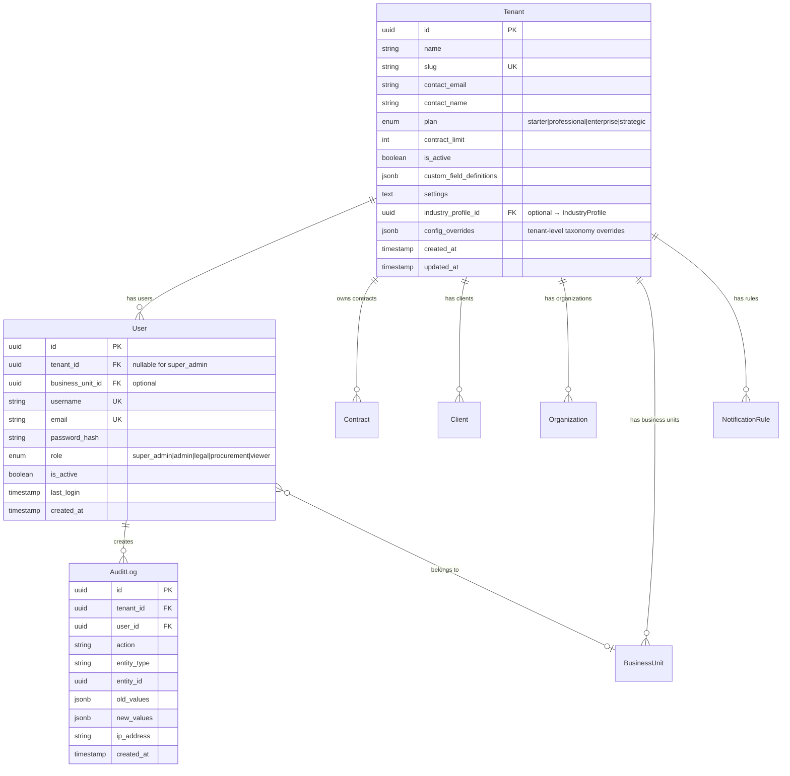
```mermaid
erDiagram
    Tenant ||--o{ User : "has users"
    Tenant ||--o{ Contract : "owns contracts"
    Tenant ||--o{ Client : "has clients"
    Tenant ||--o{ Organization : "has organizations"
    Tenant ||--o{ BusinessUnit : "has business units"
    Tenant ||--o{ NotificationRule : "has rules"
    User ||--o{ AuditLog : "creates"
    User }o--o| BusinessUnit : "belongs to"

    Tenant {
        uuid id PK
        string name
        string slug UK
        string contact_email
        string contact_name
        enum plan "starter|professional|enterprise|strategic"
        int contract_limit
        boolean is_active
        jsonb custom_field_definitions
        text settings
        uuid industry_profile_id FK "optional → IndustryProfile"
        jsonb config_overrides "tenant-level taxonomy overrides"
        timestamp created_at
        timestamp updated_at
    }

    User {
        uuid id PK
        uuid tenant_id FK "nullable for super_admin"
        uuid business_unit_id FK "optional"
        string username UK
        string email UK
        string password_hash
        enum role "super_admin|admin|legal|procurement|viewer"
        boolean is_active
        timestamp last_login
        timestamp created_at
    }

    AuditLog {
        uuid id PK
        uuid tenant_id FK
        uuid user_id FK
        string action
        string entity_type
        uuid entity_id
        jsonb old_values
        jsonb new_values
        string ip_address
        timestamp created_at
    }
```

### Role Hierarchy

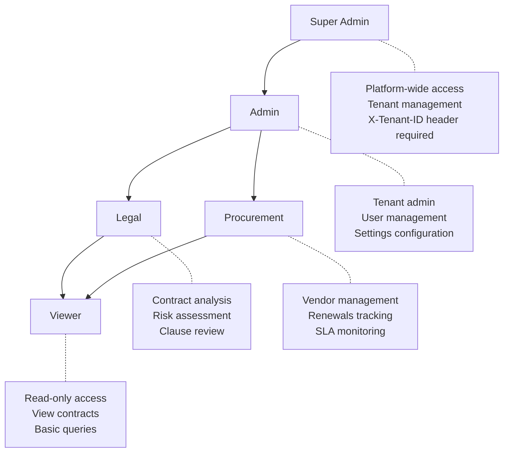
```mermaid
graph TD
    SA[Super Admin] --> A[Admin]
    A --> L[Legal]
    A --> P[Procurement]
    L --> V[Viewer]
    P --> V

    SA -.- SA_DESC["Platform-wide access<br/>Tenant management<br/>X-Tenant-ID header required"]
    A -.- A_DESC["Tenant admin<br/>User management<br/>Settings configuration"]
    L -.- L_DESC["Contract analysis<br/>Risk assessment<br/>Clause review"]
    P -.- P_DESC["Vendor management<br/>Renewals tracking<br/>SLA monitoring"]
    V -.- V_DESC["Read-only access<br/>View contracts<br/>Basic queries"]
```

### Tenant Isolation Architecture

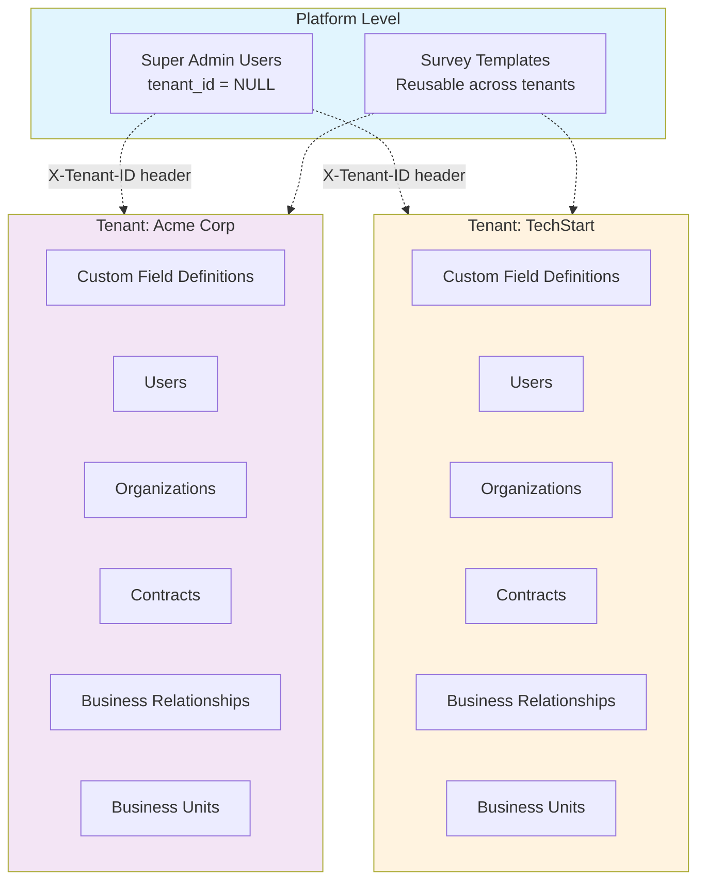
```mermaid
graph TB
    subgraph Platform["Platform Level"]
        SA[Super Admin Users<br/>tenant_id = NULL]
        ST[Survey Templates<br/>Reusable across tenants]
    end

    subgraph TenantA["Tenant: Acme Corp"]
        TA_CFD[Custom Field Definitions]
        TA_U[Users]
        TA_O[Organizations]
        TA_C[Contracts]
        TA_BR[Business Relationships]
        TA_BU[Business Units]
    end

    subgraph TenantB["Tenant: TechStart"]
        TB_CFD[Custom Field Definitions]
        TB_U[Users]
        TB_O[Organizations]
        TB_C[Contracts]
        TB_BR[Business Relationships]
        TB_BU[Business Units]
    end

    SA -.->|X-Tenant-ID header| TenantA
    SA -.->|X-Tenant-ID header| TenantB
    ST -.-> TenantA
    ST -.-> TenantB

    style Platform fill:#e1f5fe
    style TenantA fill:#f3e5f5
    style TenantB fill:#fff3e0
```

### Business Unit Hierarchy

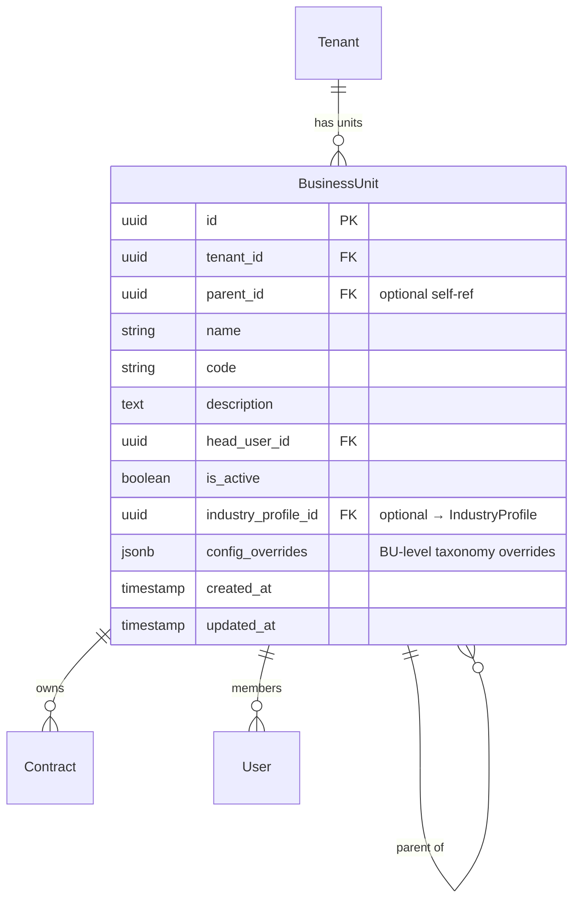
```mermaid
erDiagram
    Tenant ||--o{ BusinessUnit : "has units"
    BusinessUnit ||--o{ BusinessUnit : "parent of"
    BusinessUnit ||--o{ Contract : "owns"
    BusinessUnit ||--o{ User : "members"

    BusinessUnit {
        uuid id PK
        uuid tenant_id FK
        uuid parent_id FK "optional self-ref"
        string name
        string code
        text description
        uuid head_user_id FK
        boolean is_active
        uuid industry_profile_id FK "optional → IndustryProfile"
        jsonb config_overrides "BU-level taxonomy overrides"
        timestamp created_at
        timestamp updated_at
    }
```

### External User Access

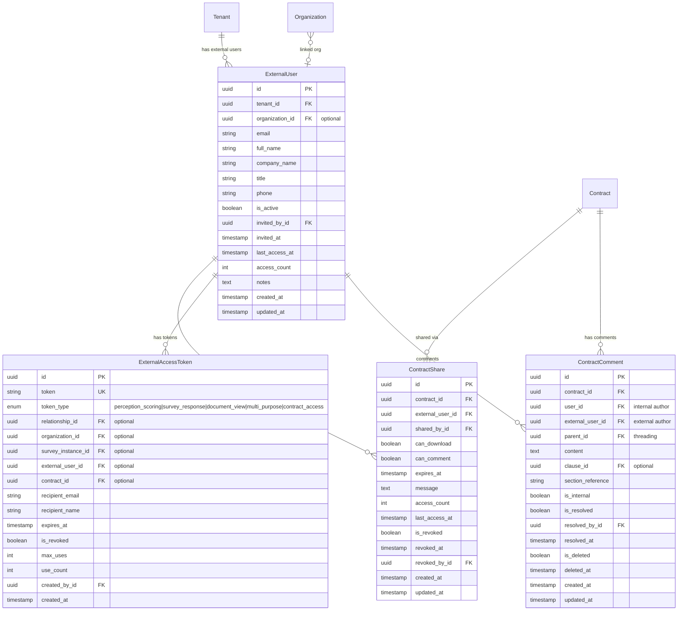
```mermaid
erDiagram
    Tenant ||--o{ ExternalUser : "has external users"
    Organization }o--o| ExternalUser : "linked org"
    ExternalUser ||--o{ ContractShare : "has shares"
    ExternalUser ||--o{ ExternalAccessToken : "has tokens"
    Contract ||--o{ ContractShare : "shared via"
    Contract ||--o{ ContractComment : "has comments"
    ExternalUser ||--o{ ContractComment : "comments"

    ExternalUser {
        uuid id PK
        uuid tenant_id FK
        uuid organization_id FK "optional"
        string email
        string full_name
        string company_name
        string title
        string phone
        boolean is_active
        uuid invited_by_id FK
        timestamp invited_at
        timestamp last_access_at
        int access_count
        text notes
        timestamp created_at
        timestamp updated_at
    }

    ContractShare {
        uuid id PK
        uuid contract_id FK
        uuid external_user_id FK
        uuid shared_by_id FK
        boolean can_download
        boolean can_comment
        timestamp expires_at
        text message
        int access_count
        timestamp last_access_at
        boolean is_revoked
        timestamp revoked_at
        uuid revoked_by_id FK
        timestamp created_at
        timestamp updated_at
    }

    ContractComment {
        uuid id PK
        uuid contract_id FK
        uuid user_id FK "internal author"
        uuid external_user_id FK "external author"
        uuid parent_id FK "threading"
        text content
        uuid clause_id FK "optional"
        string section_reference
        boolean is_internal
        boolean is_resolved
        uuid resolved_by_id FK
        timestamp resolved_at
        boolean is_deleted
        timestamp deleted_at
        timestamp created_at
        timestamp updated_at
    }

    ExternalAccessToken {
        uuid id PK
        string token UK
        enum token_type "perception_scoring|survey_response|document_view|multi_purpose|contract_access"
        uuid relationship_id FK "optional"
        uuid organization_id FK "optional"
        uuid survey_instance_id FK "optional"
        uuid external_user_id FK "optional"
        uuid contract_id FK "optional"
        string recipient_email
        string recipient_name
        timestamp expires_at
        boolean is_revoked
        int max_uses
        int use_count
        uuid created_by_id FK
        timestamp created_at
    }
```

### Alert Configurations

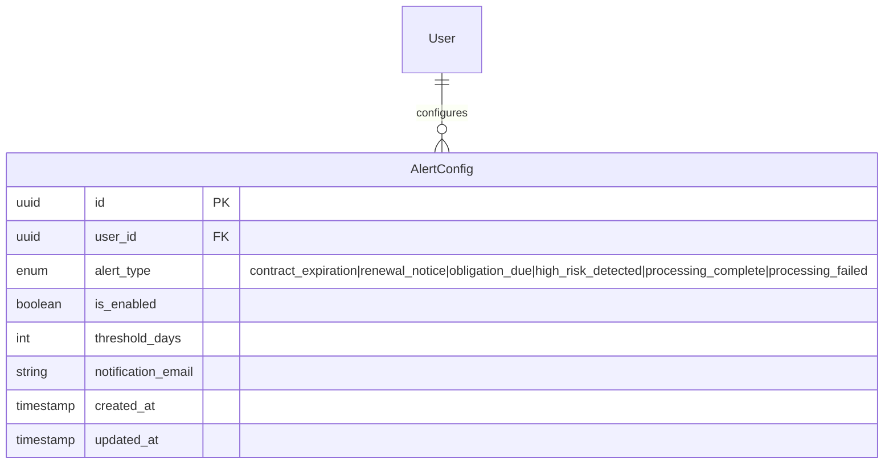
```mermaid
erDiagram
    User ||--o{ AlertConfig : "configures"

    AlertConfig {
        uuid id PK
        uuid user_id FK
        enum alert_type "contract_expiration|renewal_notice|obligation_due|high_risk_detected|processing_complete|processing_failed"
        boolean is_enabled
        int threshold_days
        string notification_email
        timestamp created_at
        timestamp updated_at
    }
```

---

## 2. Contract Intelligence Core

### Contract & Extraction Model

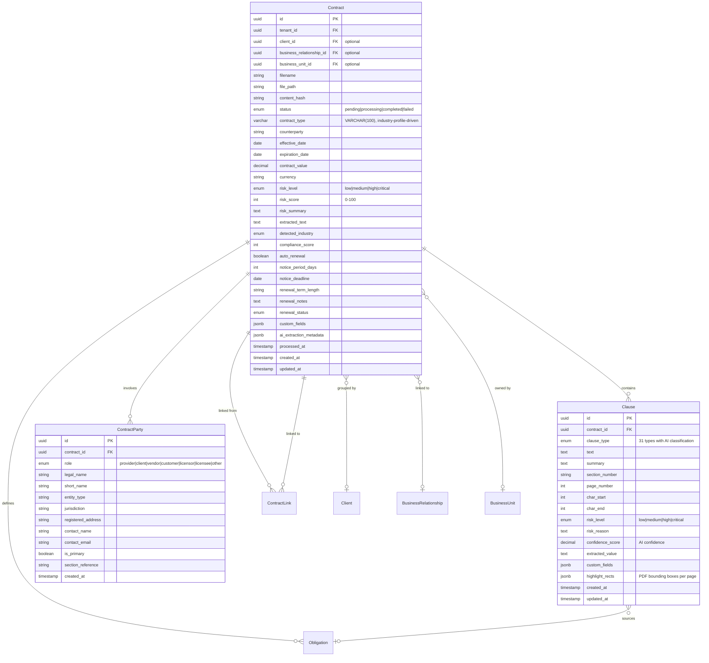
```mermaid
erDiagram
    Contract ||--o{ Clause : "contains"
    Contract ||--o{ Obligation : "defines"
    Contract ||--o{ ContractParty : "involves"
    Contract ||--o{ ContractLink : "linked from"
    Contract ||--o{ ContractLink : "linked to"
    Contract }o--o| Client : "grouped by"
    Contract }o--o| BusinessRelationship : "linked to"
    Contract }o--o| BusinessUnit : "owned by"
    Clause }o--o| Obligation : "sources"

    Contract {
        uuid id PK
        uuid tenant_id FK
        uuid client_id FK "optional"
        uuid business_relationship_id FK "optional"
        uuid business_unit_id FK "optional"
        string filename
        string file_path
        string content_hash
        enum status "pending|processing|completed|failed"
        varchar contract_type "VARCHAR(100), industry-profile-driven"
        string counterparty
        date effective_date
        date expiration_date
        decimal contract_value
        string currency
        enum risk_level "low|medium|high|critical"
        int risk_score "0-100"
        text risk_summary
        text extracted_text
        enum detected_industry
        int compliance_score
        boolean auto_renewal
        int notice_period_days
        date notice_deadline
        string renewal_term_length
        text renewal_notes
        enum renewal_status
        jsonb custom_fields
        jsonb ai_extraction_metadata
        timestamp processed_at
        timestamp created_at
        timestamp updated_at
    }

    Clause {
        uuid id PK
        uuid contract_id FK
        enum clause_type "31 types with AI classification"
        text text
        text summary
        string section_number
        int page_number
        int char_start
        int char_end
        enum risk_level "low|medium|high|critical"
        text risk_reason
        decimal confidence_score "AI confidence"
        text extracted_value
        jsonb custom_fields
        jsonb highlight_rects "PDF bounding boxes per page"
        timestamp created_at
        timestamp updated_at
    }

    ContractParty {
        uuid id PK
        uuid contract_id FK
        enum role "provider|client|vendor|customer|licensor|licensee|other"
        string legal_name
        string short_name
        string entity_type
        string jurisdiction
        string registered_address
        string contact_name
        string contact_email
        boolean is_primary
        string section_reference
        timestamp created_at
    }
```

### Clause Types (31 Types with AI Classification)

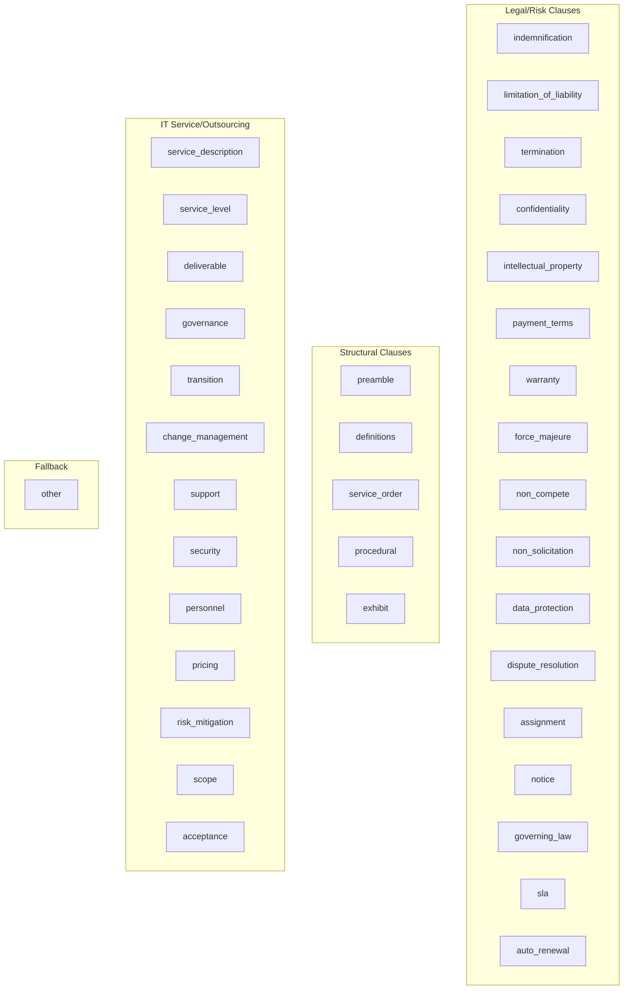
```mermaid
graph TB
    subgraph LegalRisk["Legal/Risk Clauses"]
        L1[indemnification]
        L2[limitation_of_liability]
        L3[termination]
        L4[confidentiality]
        L5[intellectual_property]
        L6[payment_terms]
        L7[warranty]
        L8[force_majeure]
        L9[non_compete]
        L10[non_solicitation]
        L11[data_protection]
        L12[dispute_resolution]
        L13[assignment]
        L14[notice]
        L15[governing_law]
        L16[sla]
        L17[auto_renewal]
    end

    subgraph Structural["Structural Clauses"]
        S1[preamble]
        S2[definitions]
        S3[service_order]
        S4[procedural]
        S5[exhibit]
    end

    subgraph ITService["IT Service/Outsourcing"]
        IT1[service_description]
        IT2[service_level]
        IT3[deliverable]
        IT4[governance]
        IT5[transition]
        IT6[change_management]
        IT7[support]
        IT8[security]
        IT9[personnel]
        IT10[pricing]
        IT11[risk_mitigation]
        IT12[scope]
        IT13[acceptance]
    end

    subgraph Fallback["Fallback"]
        O1[other]
    end
```

### AI Section Classification Mapping

Clauses are classified using GPT-4o-mini semantic analysis. The AI section types map to ClauseType as follows:

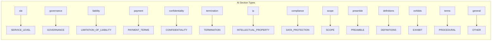
```mermaid
graph LR
    subgraph AISection["AI Section Types"]
        A1[sla] --> CT1[SERVICE_LEVEL]
        A2[governance] --> CT2[GOVERNANCE]
        A3[liability] --> CT3[LIMITATION_OF_LIABILITY]
        A4[payment] --> CT4[PAYMENT_TERMS]
        A5[confidentiality] --> CT5[CONFIDENTIALITY]
        A6[termination] --> CT6[TERMINATION]
        A7[ip] --> CT7[INTELLECTUAL_PROPERTY]
        A8[compliance] --> CT8[DATA_PROTECTION]
        A9[scope] --> CT9[SCOPE]
        A10[preamble] --> CT10[PREAMBLE]
        A11[definitions] --> CT11[DEFINITIONS]
        A12[exhibits] --> CT12[EXHIBIT]
        A13[terms] --> CT13[PROCEDURAL]
        A14[general] --> CT14[OTHER]
    end
```

### Obligation Model

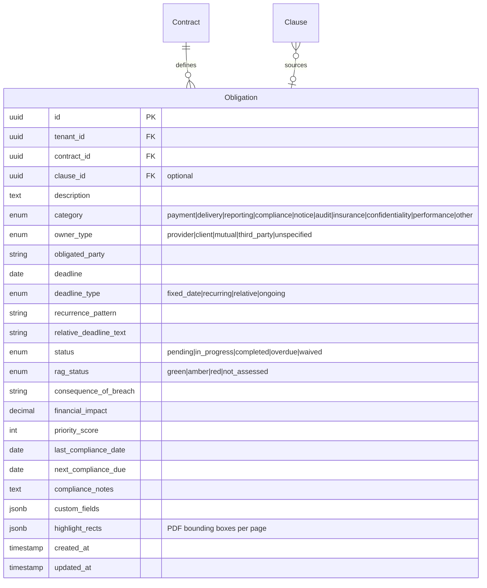
```mermaid
erDiagram
    Contract ||--o{ Obligation : "defines"
    Clause }o--o| Obligation : "sources"

    Obligation {
        uuid id PK
        uuid tenant_id FK
        uuid contract_id FK
        uuid clause_id FK "optional"
        text description
        enum category "payment|delivery|reporting|compliance|notice|audit|insurance|confidentiality|performance|other"
        enum owner_type "provider|client|mutual|third_party|unspecified"
        string obligated_party
        date deadline
        enum deadline_type "fixed_date|recurring|relative|ongoing"
        string recurrence_pattern
        string relative_deadline_text
        enum status "pending|in_progress|completed|overdue|waived"
        enum rag_status "green|amber|red|not_assessed"
        string consequence_of_breach
        decimal financial_impact
        int priority_score
        date last_compliance_date
        date next_compliance_due
        text compliance_notes
        jsonb custom_fields
        jsonb highlight_rects "PDF bounding boxes per page"
        timestamp created_at
        timestamp updated_at
    }
```

### Contract Links & Suggested Links

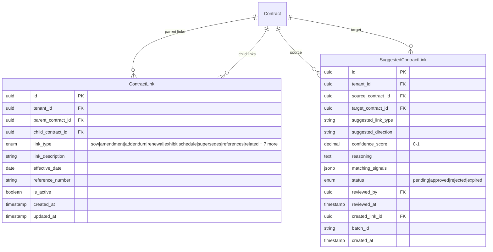
```mermaid
erDiagram
    Contract ||--o{ ContractLink : "parent links"
    Contract ||--o{ ContractLink : "child links"
    Contract ||--o{ SuggestedContractLink : "source"
    Contract ||--o{ SuggestedContractLink : "target"

    ContractLink {
        uuid id PK
        uuid tenant_id FK
        uuid parent_contract_id FK
        uuid child_contract_id FK
        enum link_type "sow|amendment|addendum|renewal|exhibit|schedule|supersedes|references|related + 7 more"
        string link_description
        date effective_date
        string reference_number
        boolean is_active
        timestamp created_at
        timestamp updated_at
    }

    SuggestedContractLink {
        uuid id PK
        uuid tenant_id FK
        uuid source_contract_id FK
        uuid target_contract_id FK
        string suggested_link_type
        string suggested_direction
        decimal confidence_score "0-1"
        text reasoning
        jsonb matching_signals
        enum status "pending|approved|rejected|expired"
        uuid reviewed_by FK
        timestamp reviewed_at
        uuid created_link_id FK
        string batch_id
        timestamp created_at
    }
```

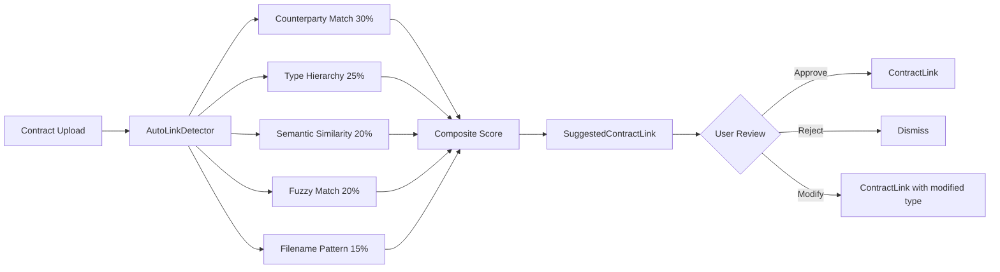
```mermaid
flowchart LR
    Upload[Contract Upload] --> Analyze[AutoLinkDetector]
    Analyze --> S1[Counterparty Match 30%]
    Analyze --> S2[Type Hierarchy 25%]
    Analyze --> S3[Semantic Similarity 20%]
    Analyze --> S4[Fuzzy Match 20%]
    Analyze --> S5[Filename Pattern 15%]
    S1 --> Score[Composite Score]
    S2 --> Score
    S3 --> Score
    S4 --> Score
    S5 --> Score
    Score --> Suggest[SuggestedContractLink]
    Suggest --> Review{User Review}
    Review -->|Approve| Create[ContractLink]
    Review -->|Reject| Dismiss[Dismiss]
    Review -->|Modify| ModCreate[ContractLink with modified type]
```

---

## 3. Contract Extraction Details

### Preamble & Party Details

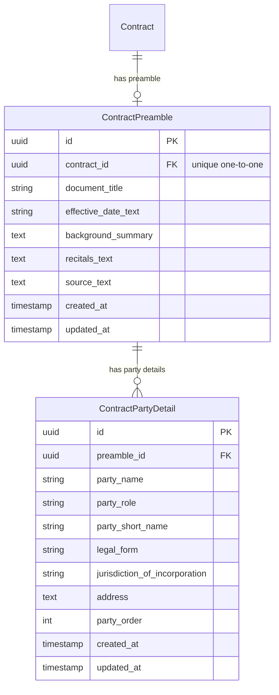
```mermaid
erDiagram
    Contract ||--o| ContractPreamble : "has preamble"
    ContractPreamble ||--o{ ContractPartyDetail : "has party details"

    ContractPreamble {
        uuid id PK
        uuid contract_id FK "unique one-to-one"
        string document_title
        string effective_date_text
        text background_summary
        text recitals_text
        text source_text
        timestamp created_at
        timestamp updated_at
    }

    ContractPartyDetail {
        uuid id PK
        uuid preamble_id FK
        string party_name
        string party_role
        string party_short_name
        string legal_form
        string jurisdiction_of_incorporation
        text address
        int party_order
        timestamp created_at
        timestamp updated_at
    }
```

### Definitions

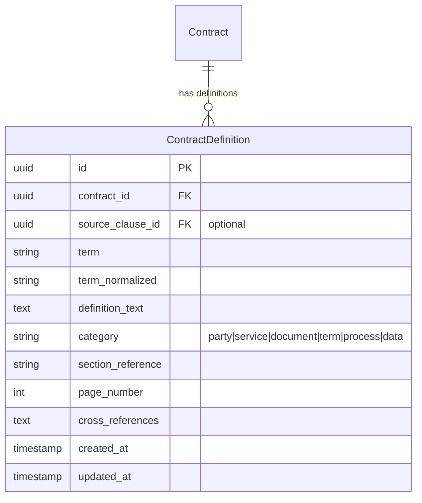
```mermaid
erDiagram
    Contract ||--o{ ContractDefinition : "has definitions"

    ContractDefinition {
        uuid id PK
        uuid contract_id FK
        uuid source_clause_id FK "optional"
        string term
        string term_normalized
        text definition_text
        string category "party|service|document|term|process|data"
        string section_reference
        int page_number
        text cross_references
        timestamp created_at
        timestamp updated_at
    }
```

### Exhibits & Fee Items

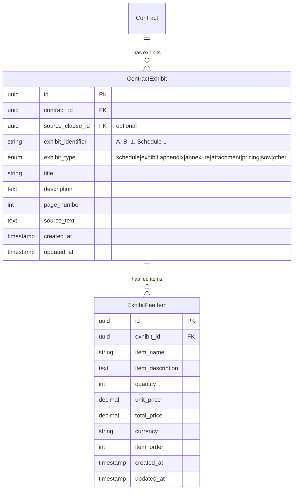
```mermaid
erDiagram
    Contract ||--o{ ContractExhibit : "has exhibits"
    ContractExhibit ||--o{ ExhibitFeeItem : "has fee items"

    ContractExhibit {
        uuid id PK
        uuid contract_id FK
        uuid source_clause_id FK "optional"
        string exhibit_identifier "A, B, 1, Schedule 1"
        enum exhibit_type "schedule|exhibit|appendix|annexure|attachment|pricing|sow|other"
        string title
        text description
        int page_number
        text source_text
        timestamp created_at
        timestamp updated_at
    }

    ExhibitFeeItem {
        uuid id PK
        uuid exhibit_id FK
        string item_name
        text item_description
        int quantity
        decimal unit_price
        decimal total_price
        string currency
        int item_order
        timestamp created_at
        timestamp updated_at
    }
```

### Process Steps

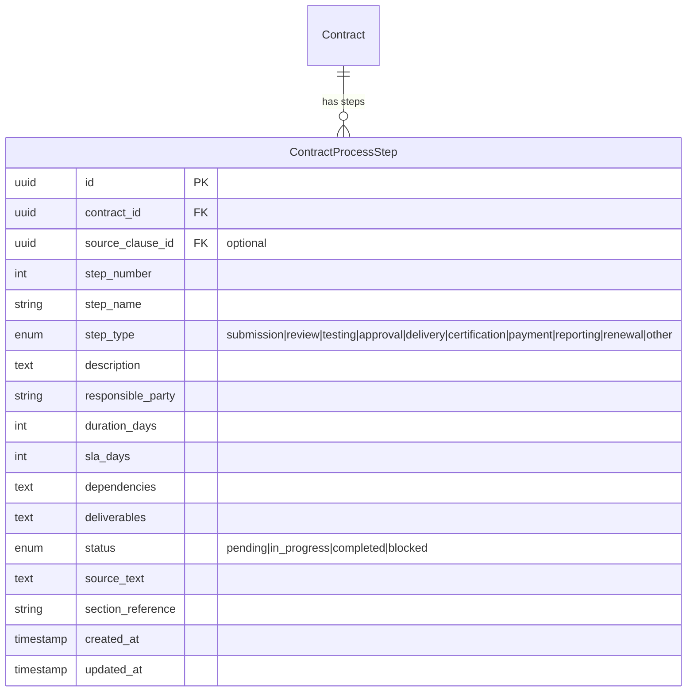
```mermaid
erDiagram
    Contract ||--o{ ContractProcessStep : "has steps"

    ContractProcessStep {
        uuid id PK
        uuid contract_id FK
        uuid source_clause_id FK "optional"
        int step_number
        string step_name
        enum step_type "submission|review|testing|approval|delivery|certification|payment|reporting|renewal|other"
        text description
        string responsible_party
        int duration_days
        int sla_days
        text dependencies
        text deliverables
        enum status "pending|in_progress|completed|blocked"
        text source_text
        string section_reference
        timestamp created_at
        timestamp updated_at
    }
```

### Financial Terms

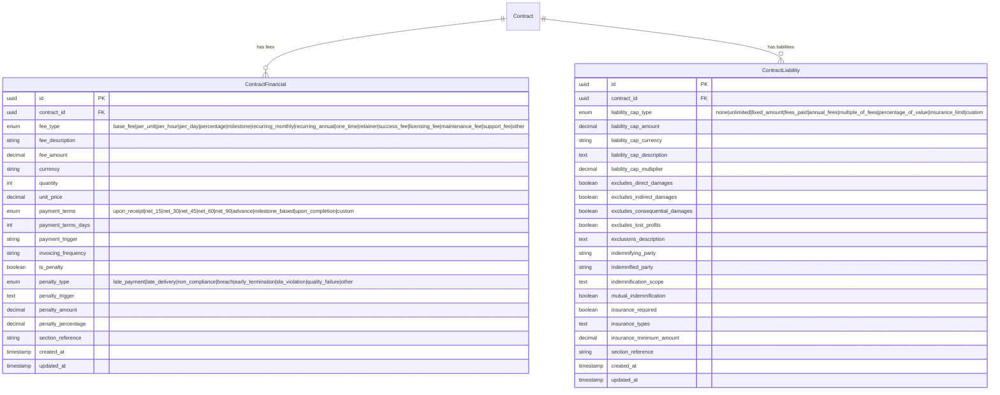
```mermaid
erDiagram
    Contract ||--o{ ContractFinancial : "has fees"
    Contract ||--o{ ContractLiability : "has liabilities"

    ContractFinancial {
        uuid id PK
        uuid contract_id FK
        enum fee_type "base_fee|per_unit|per_hour|per_day|percentage|milestone|recurring_monthly|recurring_annual|one_time|retainer|success_fee|licensing_fee|maintenance_fee|support_fee|other"
        string fee_description
        decimal fee_amount
        string currency
        int quantity
        decimal unit_price
        enum payment_terms "upon_receipt|net_15|net_30|net_45|net_60|net_90|advance|milestone_based|upon_completion|custom"
        int payment_terms_days
        string payment_trigger
        string invoicing_frequency
        boolean is_penalty
        enum penalty_type "late_payment|late_delivery|non_compliance|breach|early_termination|sla_violation|quality_failure|other"
        text penalty_trigger
        decimal penalty_amount
        decimal penalty_percentage
        string section_reference
        timestamp created_at
        timestamp updated_at
    }

    ContractLiability {
        uuid id PK
        uuid contract_id FK
        enum liability_cap_type "none|unlimited|fixed_amount|fees_paid|annual_fees|multiple_of_fees|percentage_of_value|insurance_limit|custom"
        decimal liability_cap_amount
        string liability_cap_currency
        text liability_cap_description
        decimal liability_cap_multiplier
        boolean excludes_direct_damages
        boolean excludes_indirect_damages
        boolean excludes_consequential_damages
        boolean excludes_lost_profits
        text exclusions_description
        string indemnifying_party
        string indemnified_party
        text indemnification_scope
        boolean mutual_indemnification
        boolean insurance_required
        text insurance_types
        decimal insurance_minimum_amount
        string section_reference
        timestamp created_at
        timestamp updated_at
    }
```

### Key Dates

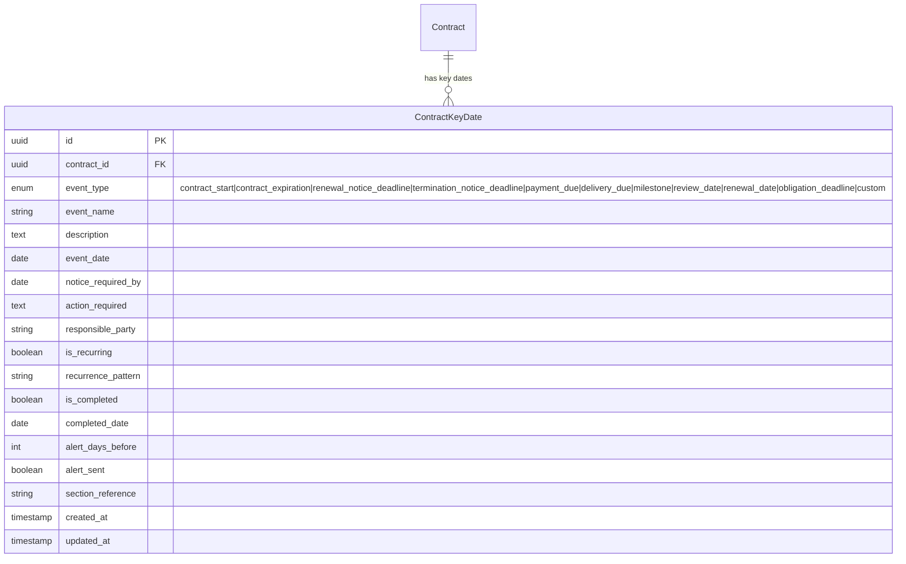
```mermaid
erDiagram
    Contract ||--o{ ContractKeyDate : "has key dates"

    ContractKeyDate {
        uuid id PK
        uuid contract_id FK
        enum event_type "contract_start|contract_expiration|renewal_notice_deadline|termination_notice_deadline|payment_due|delivery_due|milestone|review_date|renewal_date|obligation_deadline|custom"
        string event_name
        text description
        date event_date
        date notice_required_by
        text action_required
        string responsible_party
        boolean is_recurring
        string recurrence_pattern
        boolean is_completed
        date completed_date
        int alert_days_before
        boolean alert_sent
        string section_reference
        timestamp created_at
        timestamp updated_at
    }
```

### Clause Indicators

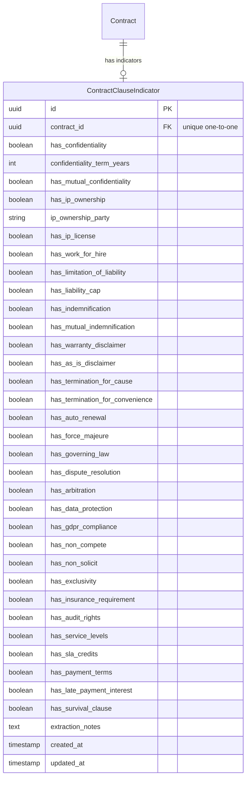
```mermaid
erDiagram
    Contract ||--o| ContractClauseIndicator : "has indicators"

    ContractClauseIndicator {
        uuid id PK
        uuid contract_id FK "unique one-to-one"
        boolean has_confidentiality
        int confidentiality_term_years
        boolean has_mutual_confidentiality
        boolean has_ip_ownership
        string ip_ownership_party
        boolean has_ip_license
        boolean has_work_for_hire
        boolean has_limitation_of_liability
        boolean has_liability_cap
        boolean has_indemnification
        boolean has_mutual_indemnification
        boolean has_warranty_disclaimer
        boolean has_as_is_disclaimer
        boolean has_termination_for_cause
        boolean has_termination_for_convenience
        boolean has_auto_renewal
        boolean has_force_majeure
        boolean has_governing_law
        boolean has_dispute_resolution
        boolean has_arbitration
        boolean has_data_protection
        boolean has_gdpr_compliance
        boolean has_non_compete
        boolean has_non_solicit
        boolean has_exclusivity
        boolean has_insurance_requirement
        boolean has_audit_rights
        boolean has_service_levels
        boolean has_sla_credits
        boolean has_payment_terms
        boolean has_late_payment_interest
        boolean has_survival_clause
        text extraction_notes
        timestamp created_at
        timestamp updated_at
    }
```

---

## 4. Contract Document Package

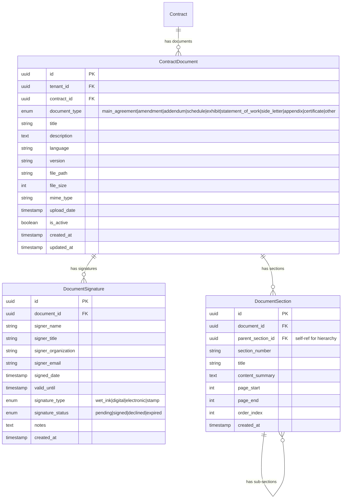
```mermaid
erDiagram
    Contract ||--o{ ContractDocument : "has documents"
    ContractDocument ||--o{ DocumentSignature : "has signatures"
    ContractDocument ||--o{ DocumentSection : "has sections"
    DocumentSection ||--o{ DocumentSection : "has sub-sections"

    ContractDocument {
        uuid id PK
        uuid tenant_id FK
        uuid contract_id FK
        enum document_type "main_agreement|amendment|addendum|schedule|exhibit|statement_of_work|side_letter|appendix|certificate|other"
        string title
        text description
        string language
        string version
        string file_path
        int file_size
        string mime_type
        timestamp upload_date
        boolean is_active
        timestamp created_at
        timestamp updated_at
    }

    DocumentSignature {
        uuid id PK
        uuid document_id FK
        string signer_name
        string signer_title
        string signer_organization
        string signer_email
        timestamp signed_date
        timestamp valid_until
        enum signature_type "wet_ink|digital|electronic|stamp"
        enum signature_status "pending|signed|declined|expired"
        text notes
        timestamp created_at
    }

    DocumentSection {
        uuid id PK
        uuid document_id FK
        uuid parent_section_id FK "self-ref for hierarchy"
        string section_number
        string title
        text content_summary
        int page_start
        int page_end
        int order_index
        timestamp created_at
    }
```

---

## 5. Post-Signing Management

### SLA & Performance Tracking

```mermaid
erDiagram
    Contract ||--o{ ContractSLA : "has SLAs"
    ContractSLA ||--o{ SLAPerformance : "tracked by"
    ContractSLA ||--o{ SLAAlert : "triggers"
    ContractSLA ||--o{ SLAMeasurement : "measured by"
    ContractSLA ||--o{ SnowSLAMapping : "mapped from SNOW"
    Clause }o--o| ContractSLA : "sources"

    ContractSLA {
        uuid id PK
        uuid tenant_id FK
        uuid contract_id FK
        uuid source_clause_id FK "optional"
        string sla_name
        enum metric_type "uptime_percentage|response_time|resolution_time|delivery_time|throughput|error_rate|availability|quality_score|custom"
        decimal target_value
        string target_operator
        string unit_of_measure
        decimal warning_threshold
        decimal critical_threshold
        enum severity "critical|high|medium|low"
        string measurement_period "monthly|quarterly|annual"
        boolean has_penalty
        string penalty_type "percentage|fixed|credit"
        decimal penalty_value
        decimal max_penalty_cap
        decimal at_risk_percentage
        boolean earnback_eligible
        text earnback_conditions
        decimal minimum_service_level
        decimal current_compliance_rate
        int consecutive_breaches
        boolean is_active
        jsonb highlight_rects "PDF bounding boxes per page"
        timestamp created_at
    }

    SLAPerformance {
        uuid id PK
        uuid sla_id FK
        decimal actual_value
        timestamp measured_at
        date measurement_period_start
        date measurement_period_end
        boolean is_compliant
        decimal deviation_percentage
        enum breach_severity "none|minor|major|critical"
        boolean penalty_applied
        decimal penalty_amount
        decimal credit_issued
        text notes
        string recorded_by
        timestamp created_at
        timestamp updated_at
    }

    SLAAlert {
        uuid id PK
        uuid tenant_id FK
        uuid contract_id FK "optional"
        uuid sla_id FK "optional"
        uuid obligation_id FK "optional"
        enum category
        enum priority "critical|high|medium|low"
        string title
        text description
        enum status "open|acknowledged|in_progress|resolved|dismissed"
        timestamp detected_at
        timestamp acknowledged_at
        timestamp resolved_at
        text resolution_notes
        boolean is_escalated
        int escalation_level
        jsonb notification_history
        timestamp created_at
    }

    SLAMeasurement {
        uuid id PK
        uuid sla_id FK
        timestamp measurement_date
        timestamp period_start
        timestamp period_end
        float actual_value
        float target_value
        boolean is_breach
        float deviation_percent
        string source "synthetic|servicenow|manual|api"
        string source_reference
        boolean event_generated
        uuid event_id FK "optional"
        timestamp created_at
        timestamp updated_at
    }

    SnowSLAMapping {
        uuid id PK
        uuid tenant_id FK
        uuid integration_config_id FK
        string snow_sys_id
        string snow_sla_name
        string snow_metric_type
        string snow_target
        uuid platform_sla_id FK "nullable until mapped"
        string mapping_status "pending|mapped|ignored|error"
        timestamp last_synced_at
        jsonb sync_metadata
        timestamp created_at
        timestamp updated_at
    }
```

### Alert Categories

```mermaid
graph TD
    subgraph AlertCategories["Alert Categories"]
        A1[sla_breach]
        A2[sla_warning]
        A3[sla_improvement]
        A4[milestone_delayed]
        A5[milestone_at_risk]
        A6[fx_threshold]
        A7[service_credit]
        A8[contract_expiry]
        A9[obligation_due]
        A10[compliance_gap]
    end

    A1 --> CRIT[Critical Priority]
    A2 --> HIGH[High Priority]
    A3 --> LOW[Low Priority]
    A4 --> HIGH
    A5 --> MED[Medium Priority]
    A8 --> HIGH
    A10 --> CRIT
```

### Renewal Management

```mermaid
erDiagram
    Contract {
        uuid id PK
        date expiration_date
        boolean auto_renewal
        int notice_period_days
        date notice_deadline
        string renewal_term_length
        text renewal_notes
        enum renewal_status "not_applicable|active|notice_sent|renewed|expired|terminated"
    }
```

```mermaid
stateDiagram-v2
    [*] --> Active: Contract Signed
    Active --> NoticePeriod: Notice deadline approaching
    NoticePeriod --> NoticeSent: Notice sent
    NoticeSent --> Terminated: Non-renewal
    NoticeSent --> Renewed: Renewal agreed
    NoticePeriod --> AutoRenewed: Auto-renewal (no notice)
    Renewed --> Active: New term starts
    AutoRenewed --> Active: New term starts
    Terminated --> [*]
    Active --> Expired: Expiration date passed
    Expired --> [*]
```

---

## 6. Relationship Governance (Evaluetor Features)

### Organization & Business Relationships

```mermaid
erDiagram
    Organization ||--o{ BusinessRelationship : "party A"
    Organization ||--o{ BusinessRelationship : "party B"
    Organization ||--o{ OrganizationOfficer : "has officers"
    Organization ||--o{ ServicePortfolio : "provides services"
    Organization ||--o{ ExternalUser : "has external users"
    BusinessRelationship ||--o{ RelationshipTeam : "has team"
    BusinessRelationship ||--o{ KPI : "tracks KPIs"
    BusinessRelationship ||--o{ Contract : "governs"
    BusinessRelationship ||--o{ SurveyInstance : "surveys"
    BusinessRelationship ||--o{ RelationshipStatusHistory : "status history"
    BusinessRelationship ||--o{ ImprovementPoint : "improvements"
    BusinessRelationship ||--o{ RelationshipService : "has services"
    User ||--o{ RelationshipTeam : "member of"

    Organization {
        uuid id PK
        uuid tenant_id FK
        string name
        string code UK
        enum org_type "customer|vendor|partner|internal"
        string industry
        enum size "startup|smb|mid_market|enterprise|global"
        string region
        string country
        string website
        text address
        string primary_contact_name
        string primary_contact_email
        string primary_contact_phone
        uuid relationship_owner_id FK
        boolean is_active
        timestamp created_at
        timestamp updated_at
    }

    BusinessRelationship {
        uuid id PK
        uuid tenant_id FK
        uuid org_a_id FK
        uuid org_b_id FK
        enum relationship_type "customer|supplier|partner|joint_venture|reseller|distributor"
        enum status "prospecting|active|at_risk|on_hold|terminated"
        string name "optional friendly name"
        text description
        int health_score "0-100"
        timestamp last_health_calculation
        enum governance_tier "operational|tactical|strategic|executive"
        json governance_config
        timestamp start_date
        int review_frequency_days
        timestamp next_review_date
        timestamp created_at
        timestamp updated_at
    }

    RelationshipTeam {
        uuid id PK
        uuid relationship_id FK
        uuid user_id FK
        enum role "relationship_manager|account_manager|executive_sponsor|technical_lead|operations_lead|finance_lead|member"
        json responsibilities
        boolean is_primary
        boolean is_active
        timestamp joined_at
        timestamp left_at
        timestamp created_at
        timestamp updated_at
    }
```

### Organization Officers

```mermaid
erDiagram
    Organization ||--o{ OrganizationOfficer : "has officers"

    OrganizationOfficer {
        uuid id PK
        uuid tenant_id FK
        uuid organization_id FK
        string name
        string title
        string email
        string phone
        string department
        enum governance_role "account_manager|service_delivery_manager|relationship_owner|executive_sponsor|commercial_manager|technical_lead|operations_lead|compliance_officer|other"
        enum side "internal|external"
        boolean is_primary
        boolean is_active
        text notes
        timestamp created_at
        timestamp updated_at
    }
```

### Relationship Status History

```mermaid
erDiagram
    BusinessRelationship ||--o{ RelationshipStatusHistory : "status over time"

    RelationshipStatusHistory {
        uuid id PK
        uuid tenant_id FK
        uuid relationship_id FK
        enum status "excellent|good|acceptable|concerning|poor|critical"
        enum previous_status
        decimal overall_score "0-100"
        string period "e.g. 2024-Q1"
        timestamp recorded_date
        uuid recorded_by FK
        text notes
        string trigger "kpi_evaluation_cycle|manual|health_score_recalc"
        timestamp created_at
    }
```

### Service Portfolio

```mermaid
erDiagram
    Organization ||--o{ ServicePortfolio : "has services"
    ServicePortfolio ||--o{ RelationshipService : "linked to relationships"
    BusinessRelationship ||--o{ RelationshipService : "uses services"

    ServicePortfolio {
        uuid id PK
        uuid tenant_id FK
        uuid organization_id FK
        string name
        string code
        text description
        enum service_type "it_services|consulting|legal|financial|logistics|manufacturing|marketing|hr|procurement|other"
        enum status "active|inactive|planned|deprecated"
        timestamp created_at
        timestamp updated_at
    }

    RelationshipService {
        uuid id PK
        uuid relationship_id FK
        uuid service_portfolio_id FK
        text scope
        timestamp start_date
        timestamp end_date
        boolean is_active
        timestamp created_at
        timestamp updated_at
    }
```

### KPI & Perception Scoring

```mermaid
erDiagram
    BusinessRelationship ||--o{ KPI : "tracks"
    KPI ||--o{ PerceptionScore : "scored by"
    KPI ||--o{ PerceptionGap : "has gaps"
    KPI ||--o{ ImprovementPoint : "drives"

    KPI {
        uuid id PK
        uuid tenant_id FK
        uuid relationship_id FK
        string name
        text description
        enum category "quality|delivery|cost|innovation|relationship|compliance"
        string unit_of_measure
        decimal target_value
        decimal current_value
        decimal weight
        enum frequency "weekly|monthly|quarterly|annual"
        boolean is_active
        timestamp created_at
        timestamp updated_at
    }

    PerceptionScore {
        uuid id PK
        uuid kpi_id FK
        enum perspective "internal|external"
        int score "1-10"
        text comments
        uuid scored_by FK
        string scorer_role
        date assessment_date
        timestamp created_at
    }

    PerceptionGap {
        uuid id PK
        uuid kpi_id FK
        decimal internal_score_avg
        decimal external_score_avg
        decimal gap_value
        enum severity "critical|significant|moderate|minor|aligned"
        date calculated_at
        text analysis_notes
    }
```

### Improvement Points & Actions

```mermaid
erDiagram
    BusinessRelationship ||--o{ ImprovementPoint : "has improvements"
    KPI }o--o| ImprovementPoint : "triggers"
    PerceptionGap }o--o| ImprovementPoint : "triggers"
    ImprovementPoint ||--o{ ImprovementAction : "has actions"

    ImprovementPoint {
        uuid id PK
        uuid relationship_id FK
        uuid kpi_id FK "optional"
        uuid gap_id FK "optional"
        string title
        text description
        enum source "perception_gap|sla_breach|review_meeting|customer_feedback|internal_audit|manual|contract_risk"
        enum priority "low|medium|high|critical"
        enum status "open|in_progress|blocked|completed|cancelled"
        uuid owner_id FK
        uuid assigned_org_id FK
        date due_date
        timestamp started_at
        timestamp completed_at
        text target_outcome
        text actual_outcome
        int impact_score "1-10"
        timestamp created_at
        timestamp updated_at
    }

    ImprovementAction {
        uuid id PK
        uuid improvement_id FK
        text description
        enum status "todo|in_progress|completed|blocked|cancelled"
        int sequence
        uuid owner_id FK
        date due_date
        timestamp started_at
        timestamp completed_at
        text notes
        text blocker_reason
        timestamp created_at
        timestamp updated_at
    }
```

### Perception Gap Analysis

```mermaid
graph LR
    subgraph Internal["Internal Perception"]
        I1[Score: 8/10]
    end

    subgraph External["External Perception"]
        E1[Score: 5/10]
    end

    I1 --> GAP[Gap: 3.0<br/>Severity: Significant]
    E1 --> GAP

    GAP --> IP[Improvement Point]
    IP --> Action[Action Plan]

    style GAP fill:#ffcdd2
    style IP fill:#fff9c4
    style Action fill:#c8e6c9
```

### Survey System

```mermaid
erDiagram
    SurveyTemplate ||--o{ SurveyQuestion : "contains"
    SurveyTemplate ||--o{ SurveyInstance : "instantiated as"
    SurveyInstance ||--o{ SurveyResponse : "has responses"
    SurveyQuestion }o--o| KPI : "linked to"
    BusinessRelationship ||--o{ SurveyInstance : "subject of"
    Organization }o--o| SurveyResponse : "respondent org"

    SurveyTemplate {
        uuid id PK
        string name
        text description
        enum frequency "one_time|monthly|quarterly|semi_annual|annual"
        text introduction_text
        text closing_text
        boolean allow_anonymous
        boolean require_all_questions
        boolean is_active
        int version
        timestamp created_at
        timestamp updated_at
    }

    SurveyQuestion {
        uuid id PK
        uuid template_id FK
        text text
        text help_text
        enum question_type "rating|rating_5|multiple_choice|single_choice|text|text_long|yes_no|nps"
        json options
        string rating_min_label
        string rating_max_label
        uuid kpi_id FK "optional"
        int sequence
        boolean is_required
        boolean is_active
        timestamp created_at
    }

    SurveyInstance {
        uuid id PK
        uuid template_id FK
        uuid relationship_id FK
        string period "e.g. 2024-Q1"
        enum status "draft|scheduled|sent|in_progress|completed|expired|cancelled"
        date scheduled_send_date
        timestamp sent_at
        date due_date
        timestamp closed_at
        int target_respondent_count
        int actual_respondent_count
        text notes
        timestamp created_at
        timestamp updated_at
    }

    SurveyResponse {
        uuid id PK
        uuid survey_instance_id FK
        string respondent_email
        string respondent_name
        uuid respondent_org_id FK "optional"
        boolean is_anonymous
        json answers "question_id to answer_value map"
        int completion_time_seconds
        boolean is_complete
        timestamp submitted_at
        string access_token UK
        timestamp first_accessed_at
        timestamp last_accessed_at
        timestamp created_at
    }
```

---

## 7. Compliance Module

### Industry Compliance

```mermaid
erDiagram
    Contract ||--o{ ComplianceGap : "has gaps"
    Contract ||--o{ RegulatoryObligation : "has obligations"
    IndustryComplianceRule ||--o{ ComplianceGap : "triggers"

    IndustryComplianceRule {
        uuid id PK
        uuid tenant_id FK "optional for system rules"
        enum industry "pharmaceutical|healthcare|financial_services|technology|manufacturing|chemical|other"
        enum primary_contract_type "msa|sow|nda|vendor|other"
        enum required_document_type
        boolean is_required
        text condition_description
        enum severity_if_missing "critical|high|medium|low"
        string regulatory_reference
        boolean is_active
        timestamp created_at
    }

    ComplianceGap {
        uuid id PK
        uuid tenant_id FK
        uuid contract_id FK
        uuid rule_id FK "optional"
        enum missing_document_type
        text gap_description
        enum severity "critical|high|medium|low"
        enum status "open|in_progress|pending_review|resolved|waived|not_applicable"
        date resolution_due_date
        uuid resolved_by FK
        uuid linked_document_id FK
        decimal detection_confidence
        text detection_reasoning
        boolean is_waived
        uuid waived_by FK
        text waiver_reason
        timestamp detected_at
        timestamp resolved_at
        timestamp created_at
    }

    RegulatoryObligation {
        uuid id PK
        uuid tenant_id FK
        uuid contract_id FK
        enum industry
        string regulation_type
        string obligation_category
        text description
        text source_text
        string frequency
        date next_due_date
        enum compliance_status "green|amber|red|not_assessed"
        text compliance_evidence
        text compliance_notes
        uuid responsible_party_id FK
        timestamp created_at
        timestamp updated_at
    }
```

### Required Document Types by Industry

```mermaid
graph TB
    subgraph Pharmaceutical
        P1[Quality Agreement<br/>21 CFR Part 211]
        P2[Pharmacovigilance Agreement<br/>21 CFR Part 312]
        P3[Product Specifications]
    end

    subgraph Healthcare
        H1[BAA - Business Associate Agreement<br/>HIPAA 45 CFR 164]
        H2[Security Addendum]
    end

    subgraph Technology
        T1[DPA - Data Processing Agreement<br/>GDPR Article 28]
        T2[SOC 2 Report]
        T3[Security Addendum]
    end

    subgraph Chemical
        C1[Safety Data Sheet<br/>OSHA 29 CFR 1910]
        C2[Product Specifications]
    end

    subgraph Manufacturing
        M1[Quality Agreement<br/>ISO 9001]
        M2[Product Specifications]
    end
```

---

## 8. Workflows & Approvals

### Workflow Engine

```mermaid
erDiagram
    WorkflowDefinition ||--o{ WorkflowStep : "has steps"
    WorkflowDefinition ||--o{ Approver : "has approvers"
    Event ||--o{ ActionExecution : "triggers"
    WorkflowStep }o--o| ActionExecution : "executes"
    ActionExecution ||--o| ApprovalRequest : "may require"

    WorkflowDefinition {
        uuid id PK
        string name
        text description
        enum event_type "sla_breach|sla_warning|milestone_approaching|renewal_approaching|obligation_due|contract_expiring|custom + more"
        int version
        boolean is_active
        boolean is_default
        int max_retries
        int retry_delay_seconds
        int timeout_seconds
        jsonb trigger_conditions
        timestamp created_at
        timestamp updated_at
    }

    WorkflowStep {
        uuid id PK
        uuid workflow_id FK
        string name
        text description
        int step_order
        enum action_type "send_email|send_slack|create_snow_incident|update_snow_incident|update_sfdc_account|create_sfdc_task|calculate_service_credit|calculate_penalty|update_contract_status|update_obligation_status|create_approval_request|escalate|webhook|custom"
        jsonb action_config
        boolean requires_approval
        int approval_timeout_hours
        boolean auto_approve_after_timeout
        boolean is_optional
        boolean continue_on_failure
        int max_retries
        jsonb condition
        timestamp created_at
        timestamp updated_at
    }

    ActionExecution {
        uuid id PK
        uuid event_id FK
        uuid workflow_step_id FK "optional"
        enum action_type
        jsonb action_config
        enum status "pending|pending_approval|approved|rejected|executing|completed|failed|skipped|cancelled"
        int attempts
        int max_attempts
        timestamp scheduled_at
        timestamp started_at
        timestamp completed_at
        jsonb result
        text error_message
        string external_id
        string trace_id
        timestamp created_at
        timestamp updated_at
    }

    Approver {
        uuid id PK
        uuid workflow_id FK
        uuid user_id FK
        boolean is_primary
        boolean can_delegate
        int approval_order
        boolean notify_email
        boolean notify_slack
        boolean is_active
        boolean out_of_office
        uuid delegate_to FK
        timestamp created_at
        timestamp updated_at
    }

    ApprovalRequest {
        uuid id PK
        uuid action_execution_id FK
        string title
        text description
        jsonb context_data
        uuid approver_id FK
        uuid original_approver_id FK "if delegated"
        enum status "pending|approved|rejected|expired|escalated|delegated"
        timestamp requested_at
        timestamp expires_at
        timestamp decided_at
        text decision_notes
        text rejection_reason
        boolean notification_sent
        int reminder_count
        timestamp created_at
        timestamp updated_at
    }
```

---

## 9. Events & Monitoring

```mermaid
erDiagram
    Contract ||--o{ Event : "generates"
    Event ||--o{ ActionExecution : "triggers actions"

    Event {
        uuid id PK
        enum event_type "sla_breach|sla_warning|milestone_approaching|milestone_overdue|renewal_approaching|renewal_overdue|obligation_due|obligation_overdue|contract_expiring|contract_expired|benchmark_window|cola_adjustment|custom"
        enum severity "info|warning|critical"
        uuid contract_id FK
        uuid obligation_id FK "optional"
        uuid sla_id FK "optional"
        string title
        text description
        jsonb details
        timestamp detected_at
        string detected_by
        enum status "pending|processing|awaiting_approval|executing|completed|failed|cancelled"
        uuid workflow_id FK "optional"
        timestamp started_at
        timestamp completed_at
        text error_message
        boolean is_duplicate
        uuid original_event_id FK "optional"
        timestamp created_at
        timestamp updated_at
    }
```

---

## 10. Integrations

### Integration Configs & Logs

```mermaid
erDiagram
    IntegrationConfig ||--o{ IntegrationLog : "logs calls"
    IntegrationConfig ||--o{ SnowSLAMapping : "maps SLAs"

    IntegrationConfig {
        uuid id PK
        uuid tenant_id FK "optional"
        enum system "servicenow|salesforce|sendgrid|smtp|slack|teams|webhook"
        string name
        text description
        string base_url
        string auth_type "oauth2|basic|api_key|bearer"
        jsonb credentials "encrypted"
        jsonb config
        boolean is_active
        boolean is_default
        enum health_status "healthy|degraded|unhealthy|unknown"
        timestamp last_health_check
        text last_health_message
        timestamp last_used_at
        int total_requests
        int failed_requests
        timestamp created_at
        timestamp updated_at
    }

    IntegrationLog {
        uuid id PK
        uuid integration_id FK
        uuid action_execution_id FK "optional"
        string operation
        string method "GET|POST|PUT|PATCH|DELETE"
        string endpoint
        jsonb request_payload
        int status_code
        jsonb response_payload
        string external_id
        timestamp started_at
        timestamp completed_at
        int duration_ms
        boolean is_success
        text error_message
        int retry_count
        timestamp created_at
        timestamp updated_at
    }
```

---

## 11. Notifications

### Notification Templates & Logs

```mermaid
erDiagram
    NotificationTemplate ||--o{ NotificationLog : "generates"
    Event }o--o| NotificationLog : "triggers"

    NotificationTemplate {
        uuid id PK
        string name UK
        text description
        enum event_type
        enum channel "email|slack|teams|webhook"
        string subject_template
        text body_template
        boolean is_html
        text html_template
        enum default_recipient_type "contract_owner|vendor_contact|approver|escalation_contact|custom"
        boolean is_active
        int version
        jsonb available_variables
        timestamp created_at
        timestamp updated_at
    }

    NotificationLog {
        uuid id PK
        uuid template_id FK "optional"
        uuid event_id FK "optional"
        uuid action_execution_id FK "optional"
        enum channel "email|slack|teams|webhook"
        string recipient_email
        string recipient_name
        enum recipient_type
        string subject
        text body
        jsonb variables_used
        enum status "pending|sent|delivered|failed|bounced"
        timestamp sent_at
        timestamp delivered_at
        int attempts
        text error_message
        string external_id
        timestamp created_at
        timestamp updated_at
    }
```

### Notification Rules

```mermaid
erDiagram
    Tenant ||--o{ NotificationRule : "has rules"

    NotificationRule {
        uuid id PK
        uuid tenant_id FK
        string name
        text description
        boolean is_active
        enum event_type "contract_expiration|notice_deadline|obligation_due|sla_breach|sla_warning|renewal_reminder|key_date|compliance_overdue"
        int days_before
        int repeat_interval_days
        int max_repeats
        json channels "list of email|in_app|slack|webhook"
        boolean notify_contract_owner
        boolean notify_admin
        json additional_recipients
        json contract_types "filter"
        float min_contract_value "filter"
        json risk_levels "filter"
        string priority "low|normal|high|critical"
        boolean respect_business_hours
        time business_hours_start
        time business_hours_end
        string email_template
        timestamp last_triggered
        int trigger_count
        timestamp created_at
        timestamp updated_at
    }
```

---

## 12. Chat

### Chat Sessions & Messages

```mermaid
erDiagram
    TENANTS ||--o{ CHAT_SESSIONS : has
    USERS ||--o{ CHAT_SESSIONS : owns
    CONTRACTS ||--o{ CHAT_SESSIONS : scopes
    CHAT_SESSIONS ||--o{ CHAT_MESSAGES : contains

    CHAT_SESSIONS {
        uuid id PK
        uuid tenant_id FK
        uuid user_id FK
        string title
        uuid contract_id FK "nullable"
        datetime created_at
        datetime updated_at
    }

    CHAT_MESSAGES {
        uuid id PK
        uuid session_id FK
        string role "user or assistant"
        text content
        json sources "nullable"
        json follow_ups "nullable"
        json visualizations "nullable"
        datetime created_at
    }
```

**Chat Sessions** - Persistent conversation sessions per user per tenant

| Column | Type | Description |
|--------|------|-------------|
| id | UUID | Primary key |
| tenant_id | UUID | FK to tenants (multi-tenant isolation) |
| user_id | UUID | FK to users (session owner) |
| title | VARCHAR(255) | Auto-generated from first message |
| contract_id | UUID | Optional FK to contracts (scoped queries) |
| created_at | TIMESTAMP | Session creation time |
| updated_at | TIMESTAMP | Last activity time |

**Chat Messages** - Individual messages within a session

| Column | Type | Description |
|--------|------|-------------|
| id | UUID | Primary key |
| session_id | UUID | FK to chat_sessions |
| role | VARCHAR(20) | 'user' or 'assistant' |
| content | TEXT | Message text |
| sources | JSON | Source references for AI answers |
| follow_ups | JSON | Suggested follow-up questions |
| visualizations | JSON | Chart/table visualization specs |
| created_at | TIMESTAMP | Message timestamp |

---

## 13. Supporting Entities

### Client Management

```mermaid
erDiagram
    Tenant ||--o{ Client : "has"
    Client ||--o{ Contract : "owns contracts"

    Client {
        uuid id PK
        uuid tenant_id FK
        string name
        string code UK
        string industry
        string website
        text address
        string city
        string country
        string contact_name
        string contact_email
        string contact_phone
        jsonb custom_fields
        boolean is_active
        timestamp created_at
        timestamp updated_at
    }
```

### Knowledge Graph

```mermaid
erDiagram
    Contract ||--o{ KGEntity : "contains entities"
    KGEntity ||--o{ KGRelationship : "source"
    KGEntity ||--o{ KGRelationship : "target"

    KGEntity {
        uuid id PK
        uuid tenant_id FK
        uuid contract_id FK
        enum entity_type "party|clause|obligation|term|date|amount|jurisdiction|sla_metric"
        string name
        string normalized_name
        jsonb properties
        text source_text
        string source_section
        int source_page
        float confidence "0.0-1.0"
        timestamp created_at
        timestamp updated_at
    }

    KGRelationship {
        uuid id PK
        uuid tenant_id FK
        uuid contract_id FK
        uuid source_entity_id FK
        uuid target_entity_id FK
        enum relationship_type "has_party|has_obligation|benefits_from|references|limited_by|defined_as|triggered_by|governed_by|amends|expires_on"
        jsonb properties
        text source_text
        float confidence "0.0-1.0"
        timestamp created_at
    }
```

### Scheduler & Background Jobs

```mermaid
erDiagram
    SchedulerJob ||--o{ SchedulerJobHistory : "executes"

    SchedulerJob {
        uuid id PK
        string job_name UK
        string job_type
        text description
        int interval_seconds
        boolean is_enabled
        timestamp last_run_at
        timestamp next_run_at
        enum last_run_status "success|failed|running|skipped"
        int last_run_duration_ms
        text last_run_error
        int total_runs
        int successful_runs
        int failed_runs
        timestamp created_at
    }

    SchedulerJobHistory {
        uuid id PK
        uuid job_id FK
        timestamp started_at
        timestamp completed_at
        int duration_ms
        enum status "success|failed|running|skipped"
        text error_message
        int items_processed
        jsonb run_metadata
    }
```

### Contract Processing Queue

```mermaid
erDiagram
    Tenant ||--o{ ContractProcessingJob : "has jobs"
    Contract ||--o{ ContractProcessingJob : "processed by"
    User ||--o{ ContractProcessingJob : "initiated by"

    ContractProcessingJob {
        uuid id PK
        uuid tenant_id FK
        uuid contract_id FK
        uuid user_id FK
        string batch_id "optional group key"
        string file_path
        enum status "queued|processing|completed|failed|stuck"
        string stage "current processing stage"
        int progress_percent "0-100"
        text message
        text error
        int retry_count
        int max_retries "default 3"
        int priority "higher = first"
        timestamp started_at
        timestamp completed_at
        jsonb details "extraction results"
        timestamp created_at
        timestamp updated_at
    }
```

```mermaid
stateDiagram-v2
    [*] --> Queued: Job created
    Queued --> Processing: Worker picks up
    Processing --> Completed: All stages pass
    Processing --> Failed: Error (retryable)
    Failed --> Queued: Retry (count < max)
    Failed --> Stuck: Retries exhausted
    Completed --> [*]
    Stuck --> [*]
```

### Master Data

```mermaid
erDiagram
    SLAMasterData {
        uuid id PK
        string reference_code UK
        string name
        text description
        decimal target_value
        decimal minimum_value
        decimal typical_performance
        decimal volatility
        string category
        string service_tower
        boolean is_active
        timestamp created_at
        timestamp updated_at
    }

    MilestoneMasterData {
        uuid id PK
        string milestone_code UK
        string name
        text description
        int baseline_days_from_start
        jsonb dependencies
        decimal credit_at_risk
        boolean is_active
        timestamp created_at
        timestamp updated_at
    }
```

### Metric Snapshots

```mermaid
erDiagram
    MetricSnapshot {
        uuid id PK
        date snapshot_date UK
        int total_contracts
        int contracts_at_risk
        decimal total_contract_value
        decimal compliance_rate
        int obligations_total
        int obligations_completed
        int obligations_overdue
        decimal sla_compliance_rate
        int slas_total
        int slas_breached
        int renewals_due_30_days
        int renewals_due_60_days
        int renewals_due_90_days
        int total_vendors
        int vendors_at_risk
        timestamp created_at
    }
```

### Project Tracking

```mermaid
erDiagram
    ProjectPhase ||--o{ ProjectTask : "has tasks"
    ProjectTask ||--o| ProjectNote : "has notes"

    ProjectPhase {
        uuid id PK
        int phase_number
        string name
        text description
        int estimated_days
        enum status "not_started|in_progress|blocked|completed|cancelled"
        timestamp started_at
        timestamp completed_at
        timestamp created_at
        timestamp updated_at
    }

    ProjectTask {
        uuid id PK
        uuid phase_id FK
        string task_id "e.g. 1.1 or 2.3"
        string name
        text description
        enum status "not_started|in_progress|blocked|completed|cancelled"
        enum priority "low|medium|high|critical"
        string dependencies
        timestamp started_at
        timestamp completed_at
        text notes
        text files_created
        text files_modified
        timestamp created_at
        timestamp updated_at
    }

    ProjectNote {
        uuid id PK
        uuid task_id FK "optional"
        string category "decision|blocker|learning"
        string title
        text content
        timestamp created_at
        timestamp updated_at
    }
```

---

## 14. Industry-Aware Multi-Domain CLM

### Industry Profiles & Taxonomy Configuration

Defines per-industry extraction taxonomies (contract types, clause types, risk categories, SLA metrics) that drive AI agent behavior. Tenants and Business Units reference profiles and can apply config overrides.

```mermaid
erDiagram
    IndustryProfile ||--o{ Tenant : "used by"
    IndustryProfile ||--o{ BusinessUnit : "used by"
    Tenant ||--o{ TaxonomySuggestion : "has suggestions"
    Contract ||--o{ TaxonomySuggestion : "sourced from"
    BusinessUnit ||--o{ TaxonomySuggestion : "scoped to"

    IndustryProfile {
        uuid id PK
        string name UK "e.g. IT Services, Healthcare"
        string code UK "e.g. it_services, healthcare"
        text description
        jsonb contract_types "list of type definitions"
        jsonb clause_types "list of clause definitions"
        jsonb risk_categories "list of risk definitions"
        jsonb sla_metrics "list of SLA metric definitions"
        jsonb field_definitions "custom field schemas"
        jsonb extraction_hints "AI extraction guidance"
        jsonb ui_config "frontend display config"
        boolean is_active
        timestamp created_at
        timestamp updated_at
    }

    TaxonomySuggestion {
        uuid id PK
        uuid tenant_id FK
        uuid contract_id FK "optional — source contract"
        uuid business_unit_id FK "optional"
        string category "contract_type|clause_type|risk_category|sla_metric|obligation_type"
        string code "machine-readable key"
        string label "human-readable name"
        jsonb details "additional context"
        string source_agent "metadata_extraction|clause_extraction|quality_feedback|..."
        float confidence "0.0–1.0"
        text source_text "excerpt that triggered suggestion"
        enum status "pending|approved|rejected"
        timestamp created_at
        timestamp updated_at
    }
```

### Extraction Quality (Golden Set)

Golden set contracts are benchmarks for measuring AI extraction accuracy. Verifications mark individual extracted items (clauses, obligations, SLAs, metadata fields) as correct, incorrect, or partial. Scores roll up per-contract and per-taxonomy-item.

```mermaid
erDiagram
    Contract ||--o| GoldenSetContract : "benchmarked by"
    GoldenSetContract ||--o{ ExtractionVerification : "has verifications"

    GoldenSetContract {
        uuid id PK
        uuid contract_id FK UK
        uuid tenant_id FK "nullable for global"
        boolean is_global "platform-wide benchmark"
        string added_by "user ID"
        text notes
        float metadata_score "0–100"
        float clause_score "0–100"
        float obligation_score "0–100"
        float sla_score "0–100"
        float overall_score "0–100"
        timestamp created_at
        timestamp updated_at
    }

    ExtractionVerification {
        uuid id PK
        uuid golden_set_id FK
        string entity_type "metadata_field|clause|obligation|sla"
        string entity_id "UUID of verified entity"
        enum status "correct|incorrect|partial"
        string verified_by "user ID"
        jsonb corrected_value "human-corrected data"
        text notes
        timestamp created_at
        timestamp updated_at
    }
```

### Config Resolution Hierarchy

Industry profile configuration resolves with a cascading override pattern:

```mermaid
graph TB
    IP[IndustryProfile defaults] --> TO[Tenant config_overrides]
    TO --> BO[BusinessUnit config_overrides]
    BO --> MC[Merged Config used by AI agents]

    IP -.- IPD["Base taxonomy: contract types, clause types,<br/>risk categories, SLA metrics, extraction hints"]
    TO -.- TOD["Tenant adds/removes/modifies items<br/>Stored in tenants.config_overrides JSONB"]
    BO -.- BOD["BU adds/removes/modifies items<br/>Stored in business_units.config_overrides JSONB"]
    MC -.- MCD["get_merged_config() resolves at runtime<br/>Used by all 9 AI extraction agents"]

    style MC fill:#e8f5e9
```

### Quality Feedback Loop

```mermaid
graph LR
    subgraph Configure["1. Configure"]
        IP2[Industry Profile]
        OV[Config Overrides]
    end

    subgraph Extract["2. Extract"]
        AI2[AI Agents]
        CL2[Clauses/Obligations/SLAs]
    end

    subgraph Measure["3. Measure"]
        GS[Golden Set]
        VER[Verifications]
        ACC[Per-Taxonomy Accuracy]
    end

    subgraph Refine["4. Refine"]
        TS[Taxonomy Suggestions]
        HNT[Quality-Driven Hints]
    end

    Configure --> Extract --> Measure --> Refine --> Configure

    style Configure fill:#e3f2fd
    style Extract fill:#fff3e0
    style Measure fill:#f3e5f5
    style Refine fill:#e8f5e9
```

---

## 15. Complete Entity Relationship Overview

```mermaid
graph TB
    subgraph MultiTenancy["Multi-Tenancy & Access"]
        T[Tenant]
        U[User]
        AL[AuditLog]
        BU[BusinessUnit]
        EU[ExternalUser]
        EAT[ExternalAccessToken]
        AC[AlertConfig]
    end

    subgraph ContractIntel["Contract Intelligence"]
        C[Contract]
        CL[Clause]
        O[Obligation]
        CP[ContractParty]
        CCI[ClauseIndicator]
        KGE[KGEntity]
        KGR[KGRelationship]
    end

    subgraph ContractExtract["Contract Extraction"]
        CPR[Preamble]
        CPD[PartyDetail]
        CDef[Definition]
        CEX[Exhibit]
        EFI[ExhibitFeeItem]
        CPS[ProcessStep]
        CF[Financial]
        CLB[Liability]
        CKD[KeyDate]
    end

    subgraph DocPkg["Document Package"]
        CD[ContractDocument]
        DS[DocumentSignature]
        DSec[DocumentSection]
    end

    subgraph PostSigning["Post-Signing"]
        SLA[ContractSLA]
        SLAP[SLAPerformance]
        SLAA[SLAAlert]
        SLAM[SLAMeasurement]
        SSM[SnowSLAMapping]
    end

    subgraph WorkflowEngine["Workflows"]
        WD[WorkflowDefinition]
        WS[WorkflowStep]
        AE[ActionExecution]
        APR[Approver]
        ARQ[ApprovalRequest]
    end

    subgraph EventMon["Events"]
        EVT[Event]
    end

    subgraph Integrations["Integrations"]
        IC[IntegrationConfig]
        IL[IntegrationLog]
    end

    subgraph RelGov["Relationship Governance"]
        ORG[Organization]
        OO[OrgOfficer]
        BR[BusinessRelationship]
        RT[RelationshipTeam]
        RSH[RelStatusHistory]
        KPI[KPI]
        PS[PerceptionScore]
        PG[PerceptionGap]
        IP[ImprovementPoint]
        IA[ImprovementAction]
        SP[ServicePortfolio]
        RS[RelationshipService]
    end

    subgraph Surveys["Surveys"]
        ST[SurveyTemplate]
        SQ[SurveyQuestion]
        SI[SurveyInstance]
        SRESP[SurveyResponse]
    end

    subgraph Compliance["Compliance"]
        ICR[ComplianceRule]
        CG[ComplianceGap]
        RO[RegulatoryObligation]
    end

    subgraph Chat["Chat"]
        CSESS[ChatSession]
        CMSG[ChatMessage]
    end

    subgraph Notifications["Notifications"]
        NT[NotificationTemplate]
        NL[NotificationLog]
        NR[NotificationRule]
    end

    subgraph IndustryAware["Industry-Aware Extraction"]
        IPRO[IndustryProfile]
        TSUG[TaxonomySuggestion]
        GSC[GoldenSetContract]
        EVER[ExtractionVerification]
    end

    subgraph Supporting["Supporting"]
        CLI[Client]
        SL[SuggestedLink]
        CLINK[ContractLink]
        CS[ContractShare]
        CC[ContractComment]
        CPJ[ProcessingJob]
        SJ[SchedulerJob]
        SJH[SchedulerJobHistory]
        MS[MetricSnapshot]
        SLMD[SLAMasterData]
        MMD[MilestoneMasterData]
        PP[ProjectPhase]
        PT[ProjectTask]
    end

    T --> U
    T --> C
    T --> ORG
    T --> CLI
    T --> BU
    T --> EU
    T --> CSESS
    T --> NR

    U --> AL
    U --> AC
    U --> BU
    U --> RT
    U --> CSESS

    C --> CL
    C --> O
    C --> CP
    C --> CCI
    C --> SLA
    C --> CG
    C --> RO
    C --> KGE
    C --> CS
    C --> CSESS
    C --> CD
    C --> CPR
    C --> CDef
    C --> CEX
    C --> CPS
    C --> CF
    C --> CLB
    C --> CKD
    C --> EVT
    C --> SL
    C --> CLINK

    CPR --> CPD
    CEX --> EFI
    CD --> DS
    CD --> DSec

    KGE --> KGR

    SLA --> SLAP
    SLA --> SLAA
    SLA --> SLAM
    SLA --> SSM

    EVT --> AE
    WD --> WS
    WD --> APR
    AE --> ARQ

    IC --> IL
    IC --> SSM

    ORG --> BR
    ORG --> OO
    ORG --> SP
    ORG --> EU

    BR --> RT
    BR --> KPI
    BR --> C
    BR --> SI
    BR --> RSH
    BR --> IP
    BR --> RS

    SP --> RS

    KPI --> PS
    KPI --> PG
    KPI --> IP
    IP --> IA

    ST --> SQ
    ST --> SI
    SI --> SRESP

    EU --> CS
    EU --> CC
    EU --> EAT

    C --> CPJ
    U --> CPJ

    SJ --> SJH

    CSESS --> CMSG

    NT --> NL

    IPRO --> T
    IPRO --> BU
    T --> TSUG
    C --> TSUG
    C --> GSC
    GSC --> EVER
```

---

## 16. Data Flow Diagrams

### Tenant Creation Flow

```mermaid
sequenceDiagram
    participant SA as Super Admin
    participant API as Tenants API
    participant DB as Database
    participant PROV as Provisioner

    SA->>API: POST /api/tenants
    API->>DB: Create Tenant record
    API->>PROV: Provision integration configs
    PROV->>DB: Create IntegrationConfig records (ServiceNow, Teams, etc.)
    API->>DB: Create internal Organization (org_type=internal)
    Note over DB: Internal org enables GovernanceBridge<br/>to auto-create relationships on contract upload
    API-->>SA: Tenant ready (with internal org)
```

### Contract Processing Pipeline

```mermaid
sequenceDiagram
    participant U as User
    participant API as Upload API
    participant P as Parser
    participant I as Indexer
    participant VS as Vector Store
    participant AI as AI Agents
    participant DB as Database

    U->>API: Upload Contract
    API->>P: Parse Document
    P-->>API: ParsedDocument
    API->>DB: Create Contract (status=processing)
    API->>I: Index Contract
    I->>VS: Store Chunks (with semantic classification)
    I->>AI: Extract Metadata (with excluded parties)
    AI-->>I: Metadata, Parties, Dates
    I->>AI: Extract Custom Fields (if tenant has definitions)
    AI-->>I: Custom Field Values
    Note over I,DB: Flush metadata before optional stages
    I->>AI: Assess Risk
    AI-->>I: Risk Score, Summary
    Note over I: KG extraction deferred to deep_analysis
    I->>DB: Update Contract (status=completed)
    I->>I: Auto-Link Detection (multi-signal scoring)
    I-->>U: Processing Complete
    Note over API: Deep analysis runs async (clauses, obligations, SLAs, KG)
```

### Governance Bridge Flow (runs after deep analysis)

```mermaid
sequenceDiagram
    participant DA as Deep Analysis
    participant GB as GovernanceBridge
    participant AI as GPT-4o-mini
    participant DB as Database

    DA->>GB: bridge_contract_to_governance(contract_id, tenant_id)

    Note over GB: Automation 1: Counterparty → Organization
    GB->>DB: Exact match on counterparty name?
    alt No match
        GB->>DB: Fuzzy match (substring)?
        alt No match
            GB->>DB: Determine org type (4 signals)
            GB->>AI: Extract org details (industry, country)
            GB->>DB: Create Organization
        end
    end

    Note over GB: Automation 2: Contract → Relationship
    GB->>DB: Find internal org (org_type=internal)
    GB->>DB: Existing relationship (either direction)?
    alt No match
        GB->>DB: Create BusinessRelationship (internal ↔ counterparty)
    end
    GB->>DB: Link contract to relationship

    Note over GB: Automation 3-6
    GB->>DB: Create KPIs from extracted SLAs
    GB->>DB: Create ImprovementPoints from high-risk clauses
    GB->>DB: Calculate health score (risk 30% + SLA 40% + obligation 30%)
    GB->>DB: Link SOW services to ServicePortfolio
    GB->>DB: Commit all governance data
```

### Q&A Query Flow

```mermaid
sequenceDiagram
    participant U as User
    participant API as Query API
    participant VS as Vector Store
    participant QA as Q&A Agent
    participant LLM as OpenAI

    U->>API: Ask Question
    API->>VS: Search Similar Chunks
    VS-->>API: Top-K Chunks (with RBAC)
    API->>QA: Question + Context
    QA->>LLM: Augmented Prompt
    LLM-->>QA: Answer
    QA-->>API: QAResponse
    API-->>U: Answer + Sources + Confidence
```

### Compliance Check Flow

```mermaid
sequenceDiagram
    participant C as Contract
    participant ID as Industry Detector
    participant GD as Gap Detector
    participant DB as Database
    participant AS as Alert Service

    C->>ID: Detect Industry
    ID-->>C: Industry + Confidence
    C->>GD: Check Compliance
    GD->>DB: Load Rules for Industry
    DB-->>GD: Applicable Rules
    GD->>DB: Check Linked Documents
    DB-->>GD: Existing Links
    GD-->>C: Compliance Gaps
    loop For Each Critical Gap
        C->>AS: Create Alert
    end
```

### Event-Driven Workflow Flow

```mermaid
sequenceDiagram
    participant M as Monitor Service
    participant DB as Database
    participant WE as Workflow Engine
    participant AP as Approver
    participant EXT as External System

    M->>DB: Detect Event (SLA breach, deadline, etc.)
    M->>DB: Create Event record
    DB->>WE: Match Workflow for Event Type
    WE->>WE: Evaluate trigger conditions
    WE->>DB: Create ActionExecution records
    loop For Each Workflow Step
        alt Requires Approval
            WE->>DB: Create ApprovalRequest
            WE->>AP: Send notification
            AP-->>WE: Approve/Reject
        end
        WE->>EXT: Execute Action (email, SNOW, SFDC)
        EXT-->>WE: Result
        WE->>DB: Update execution status
    end
```

---

## 17. Key Design Decisions

### Files & Documents

| Question | Answer |
|----------|--------|
| Where are files stored? | Local filesystem at `data/uploads/{tenant_id}/` |
| One file per contract? | Yes - main document embedded in Contract |
| Multiple documents? | Yes - ContractDocument table supports amendments, addenda, SOWs per contract |
| Exhibits? | Text extracts stored in ContractExhibit, not separate files |

### Organization Model

| Question | Answer |
|----------|--------|
| Org without users? | Yes - Orgs are counterparty records, not accounts |
| Vendor vs Client? | `org_type` enum: vendor, customer, partner, internal |
| Cross-tenant orgs? | No - Orgs are tenant-scoped |
| Org officers? | OrganizationOfficer tracks key contacts with governance roles |

### Custom Fields

| Question | Answer |
|----------|--------|
| Schema location? | `Tenant.custom_field_definitions` (JSONB) |
| Values location? | Entity's `custom_fields` column (JSONB) |
| Per-contract fields? | No - schema is per-tenant, values per-entity |

### Access Control

| Question | Answer |
|----------|--------|
| Super Admin scope? | Platform-wide (tenant_id = NULL) |
| Normal user scope? | Single tenant only |
| Cross-tenant access? | Only via Super Admin with X-Tenant-ID header |
| External users? | Token-based access via ExternalAccessToken, scoped to specific contracts |
| Business units? | Hierarchical with parent_id self-reference, users and contracts assigned to BUs |

---

## Complete Table Inventory (81 tables from 55 model files)

| # | Table Name | Model File | Section |
|---|-----------|------------|---------|
| 1 | tenants | tenant.py | Multi-Tenancy |
| 2 | users | user.py | Multi-Tenancy |
| 3 | audit_logs | audit.py | Multi-Tenancy |
| 4 | business_units | business_unit.py | Multi-Tenancy |
| 5 | external_users | external_user.py | Multi-Tenancy |
| 6 | external_access_tokens | external_access.py | Multi-Tenancy |
| 7 | alert_configs | alert.py | Multi-Tenancy |
| 8 | contracts | contract.py | Contract Core |
| 9 | clauses | clause.py | Contract Core |
| 10 | obligations | obligation.py | Contract Core |
| 11 | contract_parties | party.py | Contract Core |
| 12 | contract_links | contract_link.py | Contract Core |
| 13 | suggested_contract_links | suggested_link.py | Contract Core |
| 14 | contract_preambles | preamble.py | Extraction |
| 15 | contract_party_details | preamble.py | Extraction |
| 16 | contract_definitions | definition.py | Extraction |
| 17 | contract_exhibits | exhibit.py | Extraction |
| 18 | exhibit_fee_items | exhibit.py | Extraction |
| 19 | contract_process_steps | process_step.py | Extraction |
| 20 | contract_financials | financial.py | Extraction |
| 21 | contract_liabilities | financial.py | Extraction |
| 22 | contract_key_dates | key_date.py | Extraction |
| 23 | contract_clause_indicators | clause_indicator.py | Extraction |
| 24 | contract_documents | contract_document.py | Document Package |
| 25 | document_signatures | contract_document.py | Document Package |
| 26 | document_sections | contract_document.py | Document Package |
| 27 | contract_shares | contract_share.py | External Access |
| 28 | contract_comments | contract_comment.py | External Access |
| 29 | contract_slas | sla.py | Post-Signing |
| 30 | sla_performances | sla.py | Post-Signing |
| 31 | sla_alerts | sla_alert.py | Post-Signing |
| 32 | sla_measurements | integration.py | Post-Signing |
| 33 | snow_sla_mappings | snow_sla_mapping.py | Post-Signing |
| 34 | organizations | organization.py | Governance |
| 35 | organization_officers | organization_officer.py | Governance |
| 36 | business_relationships | relationship.py | Governance |
| 37 | relationship_teams | relationship.py | Governance |
| 38 | relationship_status_history | relationship_history.py | Governance |
| 39 | kpis | kpi.py | Governance |
| 40 | perception_scores | kpi.py | Governance |
| 41 | perception_gaps | kpi.py | Governance |
| 42 | improvement_points | improvement.py | Governance |
| 43 | improvement_actions | improvement.py | Governance |
| 44 | service_portfolios | service_portfolio.py | Governance |
| 45 | relationship_services | service_portfolio.py | Governance |
| 46 | survey_templates | survey.py | Surveys |
| 47 | survey_questions | survey.py | Surveys |
| 48 | survey_instances | survey.py | Surveys |
| 49 | survey_responses | survey.py | Surveys |
| 50 | industry_compliance_rules | compliance_rule.py | Compliance |
| 51 | compliance_gaps | compliance_gap.py | Compliance |
| 52 | regulatory_obligations | regulatory_obligation.py | Compliance |
| 53 | workflow_definitions | workflow.py | Workflows |
| 54 | workflow_steps | workflow.py | Workflows |
| 55 | action_executions | workflow.py | Workflows |
| 56 | approvers | approval.py | Workflows |
| 57 | approval_requests | approval.py | Workflows |
| 58 | events | event.py | Events |
| 59 | integration_configs | integration.py | Integrations |
| 60 | integration_logs | integration.py | Integrations |
| 61 | notification_templates | notification.py | Notifications |
| 62 | notification_logs | notification.py | Notifications |
| 63 | notification_rules | notification_rule.py | Notifications |
| 64 | chat_sessions | chat_session.py | Chat |
| 65 | chat_messages | chat_session.py | Chat |
| 66 | clients | client.py | Supporting |
| 67 | kg_entities | knowledge_graph.py | Supporting |
| 68 | kg_relationships | knowledge_graph.py | Supporting |
| 69 | contract_processing_jobs | processing_job.py | Supporting |
| 70 | scheduler_jobs | scheduler.py | Supporting |
| 71 | scheduler_job_history | scheduler.py | Supporting |
| 72 | sla_master_data | master_data.py | Supporting |
| 73 | milestone_master_data | master_data.py | Supporting |
| 74 | metric_snapshots | metric_snapshot.py | Supporting |
| 75 | project_phases | project_task.py | Supporting |
| 76 | project_tasks | project_task.py | Supporting |
| 77 | project_notes | project_task.py | Supporting |
| 78 | industry_profiles | industry_profile.py | Industry-Aware |
| 79 | taxonomy_suggestions | taxonomy_suggestion.py | Industry-Aware |
| 80 | golden_set_contracts | extraction_quality.py | Industry-Aware |
| 81 | extraction_verifications | extraction_quality.py | Industry-Aware |

---

## Version History

| Version | Date | Changes |
|---------|------|---------|
| 1.0 | 2024-02-25 | Initial data model with Mermaid diagrams |
| 1.1 | 2026-02-28 | Updated clause types to 31 categories, added AI classification mapping |
| 1.2 | 2026-03-06 | Added Business Unit, External User, Contract Share/Comment, Knowledge Graph, Notification Rules, Metric Snapshots. Updated entity overview diagram. |
| 1.3 | 2026-03-07 | Added Chat Sessions and Chat Messages entities. Updated entity overview diagram. |
| 1.4 | 2026-03-07 | Updated ContractLink (16 link types, parent/child model) and SuggestedContractLink (multi-signal scoring with 6 weighted signals). Added AutoLinkDetector flowchart. |
| 1.5 | 2026-03-09 | Updated Contract Processing Pipeline: KG extraction deferred to deep_analysis, auto-link detection runs in indexer pipeline, metadata flush before optional stages, excluded parties in metadata extraction. |
| 2.0 | 2026-03-29 | Comprehensive update: 53 models, ~77 tables. Added Contract Extraction Details (preambles, definitions, exhibits, process steps, financials, liabilities, key dates, clause indicators), Document Package (contract_documents, signatures, sections), Workflows & Approvals (workflow_definitions, workflow_steps, action_executions, approvers, approval_requests), Events, Integrations (integration_configs, integration_logs, sla_measurements), Notification templates/logs, External Access Tokens, Snow SLA Mappings, Organization Officers, Relationship Status History, Service Portfolio, Improvement Actions, Alert Configs, Project Tracking, Master Data. Fixed ExternalUser/ContractShare/ContractComment/NotificationRule/MetricSnapshot fields to match actual models. Added complete 77-table inventory. Added event-driven workflow flow diagram. |
| 2.1 | 2026-04-08 | Accuracy audit against codebase. Added ContractProcessingJob (DB-backed processing queue). Fixed Survey section: removed phantom SurveyRespondent table, updated SurveyTemplate/Question/Instance/Response fields to match code. Fixed Knowledge Graph: entity types (party→sla_metric), relationship types (has_party→expires_on), table names (kg_entities, kg_relationships). Fixed BusinessRelationship fields (added name, governance_config, review_frequency_days). Fixed RelationshipTeam role enum and fields. Fixed SLAPerformance fields. Fixed 3 wrong table names in inventory (relationship_teams, kg_entities, kg_relationships). Added Tenant Creation Flow, Governance Bridge Flow diagrams to data flow section. |
| 2.2 | 2026-04-29 | Industry-Aware Multi-Domain CLM: Added IndustryProfile, TaxonomySuggestion, GoldenSetContract, ExtractionVerification tables (section 14). Added industry_profile_id FK and config_overrides JSONB to Tenant and BusinessUnit. Changed Contract.contract_type from enum to VARCHAR(100). Added highlight_rects JSONB to Clause, Obligation, ContractSLA for PDF bounding-box highlighting. Added config resolution hierarchy and quality feedback loop diagrams. Updated table count from 77→81. |
